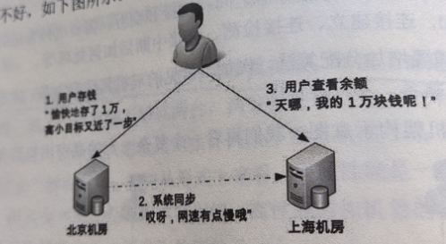
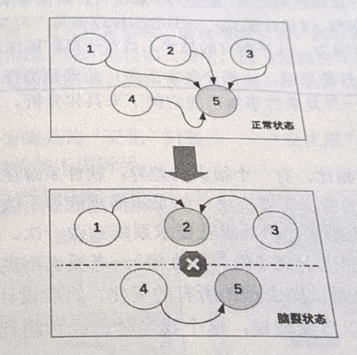
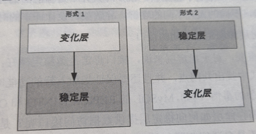

# 第1章 架构基础
## 1.1 架构到底是什么
软件架构指软件系统的顶层结构
## 1.2 架构设计的真正目的
整个软件技术发展的历史，其实就是一部与“复杂度”斗争的历史，架构的出现也不例外

架构设计的主要目的是为了解决复杂度带来的问题。
## 1.3 复杂度来源
### 1.3.1 高性能
高性能带来的复杂度主要体现在2方面
1. 单台计算机内部为了高性能带来的复杂度
2. 多台计算机集群为了高性能带来的复杂度

### 1.3.2 高可用
高可用指系统无中断地执行其功能的能力，代表系统的可用性程度，时进行系统设计的准则之一

系统高可用方案本质上都是通过“冗余”来实现高可用

一. 计算高可用

二. 存储高可用

存储与计算相比，有一个本质上的区别：将数据从一台机器搬到另一台机器，需要经过线路进行传输。

同一机房内部能够做到几毫秒，分布在不同地方的机房传输耗时需要几十甚至上百毫秒。

存储高可用的难点不在于如何备份数据，而在于如何减少或规避数据不一致对业务造成的影响。

数据延迟导致的问题

三. 高可用状态决策

a. 独裁式

独裁式决策指的是存在一个独立的决策主体，负责收集信息然后进行决策，所有冗余的个体
都将状态信息发送给决策者。

优点：不会出现决策混乱问题

缺点：当决策者本身故障时，振哥系统就无法实现准确的状态决策

b. 协商式

协商式决策指的是两个独立的个体通过交流信息，然后根据规则进行决策，最常用的是主备决策

决策步骤
1. 2台服务器启动时都是备机
2. 2台服务器建立连接
3. 2台服务器交换状态信息
4. 某1台服务器做出决策，成为主机；另一台继续保持备机身份

难点在于如果两台服务器建信息交换出现问题，如何做出正确决策
1. 如果备机在连接中断情况下任务主机故障，备机升级为主机，但如果主机并没有故障，则系统会出现2个主机
2. 如果备机在连接中断情况下不升级为主机，如果主机真的故障，那就没有主机了
3. 如果为了降低连接中断对状态决策带来的影响，可以增加更多连接，例如双连接、三连接但不能彻底解决

c. 民主式

民主式决策指的是多个独立的个体通过投票方式进行决策。例如zookeeper的选举。

缺点：算法复杂，可能会形成脑裂。

脑裂的根本原因是原来统一的集群因为连接中断，造成了2个独立分离的子集群，每个子集群单独进行选举，
于是选出了2个主机。为了解决脑裂问题，民主式决策的系统一般采用“投票节点数必须超过系统总节点数
一半”规则来处理，但会降低系统整体的可用性。

### 1.3.3 可扩展性
可扩展性指系统为了应对将来需求变化而提供的一种扩展能力，当有新的需求出现时，系统不需要
或仅需要少量修改就可以支持，无须整个系统重构或重建

一. 预测变化

预测变化的复杂性在于
1. 不能为每个设计点都考虑可扩展性
2. 不能完全不考虑可扩展性
3. 所有的预测都存在出错的可能性

二. 应对变化

方案一. 

将“变化”封窗在一个变化层，将不变的部分封装在一个独立的稳定层。

该方案带来复杂性
1. 系统需要拆分出变化层和稳定层
2. 需要设计变化层和稳定层之间的接口

方案二. 

提炼出一个抽象层和一个实现层，抽象层是稳定的，实现层可以根据业务需要定制开发，当引入新功能
时，只需要增加新的实现，无需修改抽象层。如策略模式。

### 1.3.4 低成本
低成本很多时候不会是架构设计的首要目标，而是附加约束，需要在一定成本内进行高性能、高可用的架构设计。

低成本给架构设计带来的主要复杂度体现在：往往只有创新才能达到低成本目标。包括开创一个全新的
技术领域，还有引入新技术。

### 1.3.5 安全
1. 功能安全

例如XSS攻击、SQL注入等。形象的说，功能安全更多的和具体的编码相关，其实是“防小偷”。

2. 架构安全

架构安全是防强盗。防止强行破坏，如DDOS攻击等。

可以通过防火墙控制不同区域间传送的数据流。依靠运营商和云服务商的安全能力。

### 1.3.6 规模
规模带来复杂度的主要原因就是“量变引起质变”，当数量超过一定阈值后，复杂度会发生质变

1. 功能越来越多，导致系统复杂度指数级上升
2. 数据越来越多，系统复杂度质变

# 第2章 架构设计原则
相比编程来说，架构设计并没有像编程语言那样的语法来进行约束，更多的是面对多种可能性时进行选择。

架构设计的原则
1. 合适
2. 简单
3. 演化

## 2.1 合适原则
合适优于业界领先。

1. 将军难打无兵之仗。 团队规模较小，不要挑战太高难度。
2. 罗马不是一天建成的。 要有一定的积累，无法一步登天
3. 冰山下面才是关键。 没有天才方案，要符合业务场景

## 2.2 简单原则
简单优于复杂。

软件领域的复杂性体现在
1. 结构的复杂性
   1. 系统组件越多，出现故障概率越高
   2. 某个组件改动，会影响关联的所有组件。
2. 逻辑复杂性

## 2.3 演化原则
演化优于一步到位。

对于建筑来说，永恒是主题；对于软件来说，变化才是主题。软件架构需要根据业务发展不断变化。

# 第3章 架构设计流程
## 3.1 有的放矢--识别复杂度
架构设计的本质目的是为了解决软件系统的复杂性，所以首先要分析系统的复杂性。

正确的做法是将主要的复杂度问题列出来，然后根据业务、技术、团队等综合情况进行排序，优先解决
当前面临的最主要的复杂度问题。

## 3.2 按图索骥--设计备选方案
成熟的架构师首先对已经存在的技术非常熟悉，对已经经过验证的架构模式烂熟于心，然后根据自己
对业务的理解，挑选合适的架构模式进行组合，再对组合后的方案进行修改和调整。

常见错误
1. 设计最优秀的方案
2. 只做一个方案
   1. 备选方案数量以3-5个为最佳
   2. 备选方案差异要比较明显
   3. 备选方案不要只局限于已熟悉的技术
3. 备选方案过于详细

## 3.3 深思熟虑--评估和选择备选方案
“360度环评”：列出我们需要关注的质量属性点，然后分别从这些质量属性的维度去评估每个方案，再
综合挑选合适当时情况的最优方案。

常见的方案质量属性点有：性能、可用性、硬件成本、项目投入、复杂度、安全性、扩展性等

而且需要遵循架构设计原则 合适、简单、演进的原则

对比完成后“按优先级选择”，设计师综合当前的业务发展情况、团队人员规模和技能等因素，将质量
属性按照优先级排序，首先挑选满足第一优先级的，如果都满足，那就再看第二优先级，以此类推

## 3.4 精雕细琢--详细方案设计
详细方案设计就是将方案涉及的关键技术细节确定下来。

通过如下方式进行避坑
1. 对方案的关键细节有较深入的理解。
2. 通过分步骤、分阶段、分系统等方式尽量降低方案复杂度
3. 如果方案本身很复杂，就采取设计团队的方式进行设计，博采众长，汇集大家的智慧和经验

