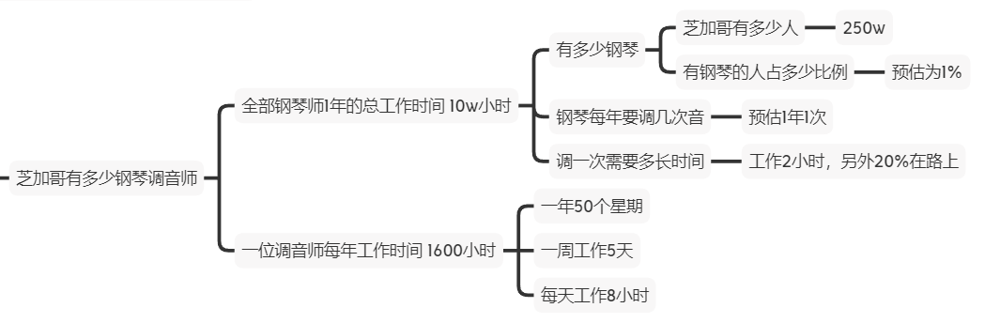

# 1.业务指标
## 1.2常用指标
### 什么是指标
如果不能衡量，那么就不能有效增长

用某个统一标准去衡量业务，这个统一标准就是指标
### 1.2.1用户数据指标

1. 日新增用户数
2. 活跃率:日活、周活、月活
3. 留存率  留存可以评估产品功能对用户的黏性
4. 40-20-10法则  新用户次日留存率40%，第七日留存率20￥%，30日留存率10%，是很好的表现了
### 1.2.2行为数据指标
PV、UV
1. 一定时间内某个页面的浏览次数，用户每打开一个网页看作一个PV
2. 一定时间内访问某个页面的人数，人要去重

转发率

转化率

K因子
1. 可用来衡量推荐效果，即一个发起推荐的用户可以带来多少新用户
2. 当K>1时新增用户数会像滚雪球，K<1时新增用户数到某个规模时就会停止通过自传播增长

### 1.2.3产品数据指标
衡量业务总量的指标
1. 成交总额GMV
2. 成交数量
3. 访问时长

衡量人均情况的指标
1. 人均付费
2. 付费用户人均付费
3. 人均访问时长

衡量付费情况的指标
1. 付费率
2. 复购率

产品
1. 热销产品数
2. 好评产品数
3. 差评产品数
### 1.2.3推广付费指标
展示位广告

搜索广告

信息流广告
## 1.3如何选择指标
好的指标应该是比例

根据目前的业务重点，找到北极星指标（第一关键指标）

### 1.4指标体系和报表

从不同维度梳理业务，把指标有系统的组织起来

作用
1. 监控业务情况
2. 通过拆解指标寻找当前业务问题
3. 评估业务可改进的地方，找出下一步工作的方向

如何建立指标体系
1. 明确部门KPI，找到一级指标
2. 了解业务运营情况，找到二级指标
3. 梳理业务流程，找到三级指标
4. 通过报表监控指标，不断更新指标体系

建立指标体系的注意事项
1. 没有一级指标，抓不住重点
2. 指标之间没有逻辑关系
3. 拆解的指标没有业务意义
4. 建立指标体系不是一个人能够完成，需要多部门协作进行
# 2.分析方法
## 2.1 5W2H
what
when
where
why
who
how
how much
## 2.2 逻辑树
把复杂问题拆解成若干个简单的子问题，像树那样逐步展开

费米问题
例如 芝加哥有多少钢琴调音师

## 2.3 行业分析方法
PEST
1. 政策Policy
2. 经济Economy
3. 社会Society
4. 技术Tecknology
## 2.4 多维度拆解
辛普森悖论：在有些情况下，考察数据整体和部分会有相反的结论

如何使用多维度拆解
1. 从指标构成拆解
2. 从业务流程拆解
## 2.5 对比分析
价格锚定：通过和价格锚点对比，一些商品会卖的更好
### 2.5.2如何使用
和谁比
1. 和自己比
2. 和行业比

如何比较
1. 数据整体大小  平均值、中位数
2. 数据整体波动
3. 趋势变化
   1. 环比是和上一个时间段对比，如本周和上周 
   2. 同比是与去年同一个时段对比

### 2.5.3注意
进行比较的时候要注意比较对象的规模要一致

A/B测试 为同一目标制定两个版本进行对照试验
## 2.6 假设检验分析
使用数据来做决策
### 如何使用 
从业务流程出发
1. 提出假设
   1. 用户问题
   2. 产品问题
   3. 竞品问题
2. 收集证据
3. 得出结论
### 4P营销理论
1. 产品Product
2. 价格Price
3. 渠道Place
4. 促销Promotion
### 注意事项
1. 结论不是主观猜测出来的，需要依靠找到的证据去证明
2. 提出假设、收集证据、得出结论是需要不断重复的过程
3. 在使用假设检验分析过程中，还要用到其他分析方法
4. 开始分析前，为了理清思路，可以做一个假设检验分析图，类似思维导图
## 2.7 相关分析方法
### 定义
当我们研究两种或两种以上数据之间关系的时候，就会用到相关分析，例如身高和体重有相关性
### 作用
1. 研究两种及以上数据之间的关系，或者某个事情收到其他因素影响的问题
2. 在解决问题过程中，该方法帮助我们扩大思路，将视野从一种数据扩大到多种数据
3. 通俗易懂
### 如何使用
相关系数
1. 系数大小可以表示两种数据的相关程度
2. 系数的正负可以反映数据之间的相关方向，也就是同方向变化还是反方向变化
3. 相关程度
低度相关 相关系数绝对值0~0.3
中度相关 相关系数绝对值0.3~0.6
高度相关 相关系数绝对值0.6~1
## 2.8 群组分析方法
定义
按照某个特征，将数据分为不同组，然后对比各组数据
## 2.9 RFM分析方法
### 定义
通过3个指标对用户分类的方法：最近一次消费时间间隔(Recency)、消费频率(Frequency)、消费金额(Money)
### 用户分类
0. 按RFM值分类
R、F、M
1. 重要价值用户
高、高、高
2. 重要发展用户
高、低、高
3. 重要保持用户
低、高、高
4. 重要挽留用户
低、低、高
5. 一般价值用户
高、高、低
6. 一般发展用户
高、低、低
7. 一般保持用户
低、高、低
8. 一般挽留用户
低、低、低
### 使用方法
1. 使用原始数据计算出R、F、M值
2. 给RFM值按价值打分，例如价值从低到高分为1~5分
3. 计算价值的平均值，高于平均值记为高，否则记为低
4. 和用户分类规则表比较，得出用户分类
## 2.10 AARRR模型分析方法
### 1.获取用户Acquisition：用户如何找到我们
#### 重点指标
1. 渠道曝光量
多少人看到产品推广信息
2. 渠道转换率
多少人因为看到广告转换成用户
3. 日新增用户数
4. 日应用下载量
5. 获客成本
获取一个客户所花费的成本
#### 低成本获客
1. 语言
优秀的广告文案
2. 渠道
   1. 搜索引擎
   2. 应用市场
   3. 付费渠道
   4. 口碑渠道
### 2.激活用户Activation：用户首次体验如何
#### 重点指标
活跃度
#### 激活用户，让用户真正地使用产品
啊哈时刻： 让用户情不自禁地喜欢上产品亮点、发出赞叹的时刻

绘制通往啊哈时刻的路径图
1. 计算每个节点用户转化率
2. 看用户在哪个阶段流失，以此优化产品
### 3.提高留存Retention：用户会回来吗
#### 重点指标
1.留存率
#### 留存率低可以用群组分析方法来找原因
### 4.增加收入Revenue：如何赚到更多钱
#### 重点指标
1. 衡量业务总量的指标
成交总额、成交数量等
2. 衡量每个人平均情况的指标
例如客单价
3. 衡量付费情况的指标
例如付费率，复购率
#### 夹点
定义：指的是损失潜在收益的地方

例如电商购物中，用户从选择商品到支付之间，很多人会中途放弃付费

要评估常见的夹点，分析用户在关键环节放弃的原因
### 5.推荐Referral：用户会告诉其他人吗
坚持把每一次营销当做一种产品体验理念的实现，让用户分享的奖励不能华而不实，要能真正为消费者带来好处

奖励要与产品的核心价值相关
## 2.11 漏斗分析方法
作用
1. 从业务流程起点开始到最后目标完成的每个环节都会有用户流失，通过漏斗分析法衡量业务流程每一步的转化效率
2. 定位问题节点

注意
不同行业的业务流程不同，漏斗分析图也不一样

# 3.用数据分析解决问题
## 3.1 数据分析解决问题的过程
### 1.明确问题
明确数据来源和准确性
1. 时间
2. 地点
3. 数据来源

业务指标理解
1. 指标含义
2. 和谁比

注意不要加入分析者的主观猜测
### 2.分析原因
优先分析哪些关键的因素
1. 使用多维度拆解分析方法对问题进行拆解，将复杂问题细化成各个子问题
2. 对拆解的每个部分，使用假设检验分析方法找到哪里出了问题
3. 使用相关分析方法进行深入分析
### 3.提出建议
回归分析
# 4.国内电商行业
## 4.1 业务知识
### 4.1.1 业务模式
流量运营
不断吸引流量，通过 店铺访客*购买转化率 可以估算买家数，通过 买家数*客单价 可以估算成交额

用户运营越来越重要的原因
1. 流量下滑，单纯靠流量与转化率，也不能维持和过去相同的销售增长了
2. 市场下沉，小城市用户需要新的洞察
3. 电商行业重视打造会员概念，培养核心用户

用户运营关注每个消费者，细化为以下状态
1. 认知
看到产品推荐，有了印象
2. 兴趣
经过多次曝光积累对产品的好感
3. 购买
4. 忠诚
对产品满意，可能还会复购
### 4.1.2 业务指标
一. 新老用户
1. 用户占比
2. 成交金额占比

二. 复购率和回购率
1. 复购率
反应用户忠诚度
2. 平均复购周期
用户重复购买的平均时间间隔
3. 回购率
回购率是分析短期促销活动对用户吸引力的指标

三. 人与货两类指标

a. 用户交易指标
1. 进店浏览指标
访客数UV
加购数
收藏数
2. 购买指标
成交总额GMV
客单价：人均付费=总收入/总用户数
支付转化率：付款用户/访客数
折扣率：GMV/吊牌总额
3. 退货指标
拒退量：拒收和退货的总数量
拒退额：拒退总金额
实销额：GMV减去拒退额

b. 商品管理常用指标
1. 备货指标
SPU数量
SKU数量
备货值=吊牌价*库存数
2. 发货售后指标
售卖比：又称售罄率=GMV/备货值，用来看商品流转情况，用来优化库存
动销率：有销量的SKU数量/在售SKU数量