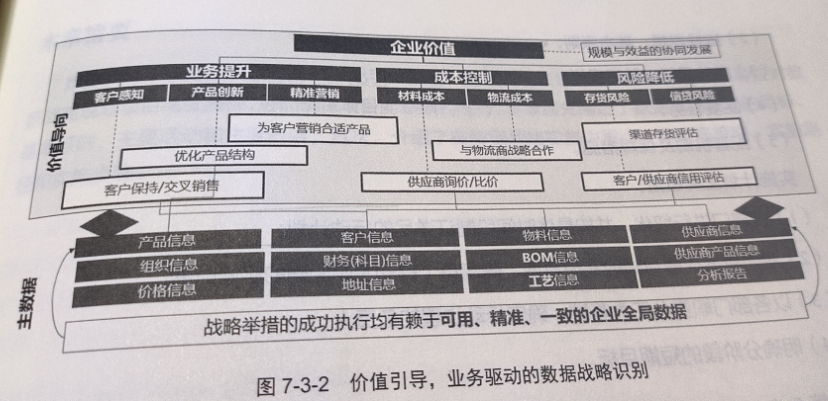

# 第1篇 概述篇
## 1. 工业企业需要数据治理
### 各国工业大数据战略
1. 既要构建工业大数据采集、汇聚、流通、分析、应用的价值闭环，推动创新发展，也要提升数据治理和安全防护能力，保障发展安全
2. 既要在宏观层面加强体系化布局，建立全面、系统的工业大数据生态，也要在微观层面务实着力，提升企业的数据管理能力
3. 既要重视在需求侧促进大数据与实际业务深度融合，也要在供给侧推动大数据技术和产业创新发展
### 工业企业数据的核心价值
#### 以价值创造为核心的工业企业转型
#### 数据驱动下的智能制造
核心三要素
1. 智能设备
2. 先进的数据分析工具
3. 人与设备的交互接口

工业互联网的3个层级
1. 从联网的智能设备中获得数据，通过分析工具得到智能信息，供决策使用
2. 智能系统，包括整合广泛的机器、仪器仪表及系统网络上部署的软件，以及运营网络优化、预测性维护、系统快速回复、机器学习等
3. 智能决策，智能设备和系统收集到足够的信息以促进数据驱动的学习
#### 数据是企业的核心资产
### 我国各行业数据治理现状
#### 金融行业
1. 强调顶层设计，把数据规划好
2. 健全治理体系，把数据管理好
3. 坚强安全管控。，把数据保护好
4. 强化科技赋能，把数据应用好
#### 电信行业
1. 加快完善网络数据安全制度标准
2. 开展合规性评估和专项治理
3. 推进App违法违规收集使用个人信息专项治理行动
4. 强化行业网络数据安全管理
### 数据治理是工业大数据的基础
工业大数据特点
1. 数据来源多样
2. 数据的实时性，生产现场的数据具有连续性、实时性、数据海量的特点
3. 工业机理的复杂性对知识图谱的构建提出了很高的要求，数据之间的相关性分析非常重要
4. 从技术层面讲，工业大数据中以非结构化数据、时序数据居多，对存储和处理能力有更高要求
####工业企业数据治理面临的挑战
1. 数据基础薄弱
2. 数据治理滞后
3. 数据交易法规尚不完善
4. 数据价值难以量化评估
## 2.工业企业数据治理概述
### 数据管理的11个管理职能
1. 数据治理
2. 数据架构
3. 数据建模与设计
4. 数据安全
5. 数据存储与操作
6. 数据集成与互操性
7. 文件和内容管理
8. 参考数据和主数据管理
9. 数据仓库和商务智能
10. 元数据管理
11. 数据质量管理
### 数据资产
是指由企业拥有或控制的，能够为企业未来带来经济利益的，以物理或电子的方式记录的数据资源
### 数据的分类
按照数据对象划分
1. 参考数据 对其他数据进行分类和规范的数据，如货币、计量单位等，相对稳定、静态的数据
2. 主数据 满足跨部门业务协同需要的、反映核心业务实体状态属性的基础信息
3. 业务活动数据
4. 分析数据
5. 时序数据

按照存储形式划分
1. 结构化数据
2. 非结构化数据
3. 半结构化数据

数据库类型划分
1. 关系型数据库
2. 非关系型数据库
3. 图数据库
4. 时序数据库

### 数据治理的顶层架构

1. 管控域
制定企业数据治理组织，明确组织的责、权、利、岗位编制及技能要求

2. 过程域
是数据治理的方法论，包括评估与分析、规划与设计、实施的循环

3. 治理域
是数据治理的主体，明确数据治理的对象和目标

4. 技术域
提供数据治理所需的数据架构、治理工具平台，包括元数据管理、主数据管理、数据指标管理、数据模型管理、数据质量管理、数据安全管理等功能

5. 价值域
通过对数据资产的管控，挖掘数据资产的价值，通过数据的流动、共享、交易，实现数据资产的变现

### 数据治理的核心内容
1. 战略
2. 组织
3. 制度
4. 流程
5. 绩效
6. 标准
7. 工具
8. 数据价值
9. 数据共享
10. 数据变现
## 3.主流数据治理标准及框架介绍
### 国际标准

### 国内标准及模型
#### 数据管理能力成熟度评估模型（DCMM）

		

#### 数据治理规范

### 国际数据管理协会（DAMA）

	

## 4.数据治理的发展趋势
### 4.2 数据隐私保护政策
### 4.3 区块链与数据共享
### 4.4 5G技术域数据安全
### 4.5 新技术与数据治理
### 4.6 数据文化与伦理道德
### 4.7 工业企业数据的运营
目标
1. 客户管理
2. 产品管理
3. 营销管理
4. 风险管理
5. 组织管理

主要内容

				
## 5.本书阅读导引

# 第二篇 体系篇
## 6. 数据管控
### 6.1 概述
数据管控是一套以数据治理相关组织和人员为核心的，涵盖企业数据治理制度、流程、考核等各个方面的执行保障机制，其本质是通过建立高质量的人才队伍和严明的制度体系来确保数据战略被正确落实

数据管控是企业开展数据治理的正要基础性保障，为企业实施数据治理各项职能活动提供人才团队、制度规范、文化氛围等基础资源，是企业数据治理得以开展的重要基石。
### 6.2 组织架构
#### 6.2.1 数据治理组织架构
1. 决策层

决策层是企业数据治理各项重大事项的决策机构，负责制定企业数据战略，审批或授权审批数据治理相关重大事项，全面协调、指导和推进企业数据治理工作，督促管理层不断提升数据治理有效性，对企业数据治理承担最终责任

2. 管理层

主要负责建立企业数据治理的完整体系，制定企业数据治理的实施计划，统筹资源配置，建立数据质量常态化控制机制，组织评估数据治理工作的有效性和执行情况，制定并实施问责和激励机制，定期向董事会报告

3. 执行层

根据数据治理相关制度规范的要求，具体执行各项数据治理工作。负责落实数据治理体系建设和运行机制，推动数据治理各项流程与日常工作相结合，并根据数据治理各职能域的管理要求承担具体执行工作

4. 监督层

主要行使除决策、管理和执行外的监督职责，负责对企业开展的数据治理工作的战略符合度、行为合规性等进行内部审计、检查，可对重大事项出具监督意见。

#### 6.2.2 数据治理组织模式

1. 分散模式
2. 归口模式
3. 半集中模式
4. 全集中模式

#### 6.2.3 数据治理职责分工

描述各层职责

### 6.3 制度规范
#### 制度框架

1. 政策
2. 制度
3. 细则
4. 手册

				
#### 制度修订
原则
1. 辩证统一，坚持稳与变的辩证统一
2. 先立后破，新制度正式建立后再废除旧的制度，保持制度的连贯性、稳定性
3. 消除例外原则

过程
1. 明确修订目标
2. 补充必要数据及信息，补充日常工作中积累的相关数据、材料信息
3. 起草修订稿
4. 征求意见
5. 签审发布
### 6.4 执行流程
总体流程
1. 定义
2. 发现
3. 实施
4. 衡量与检测

典型场景的流程
1. 数据标准管理

2. 数据质量管理

					
3. 数据安全分级和授权流程

					
### 6.5 设计机制
1. 决策机制
    
决策层审批各项规划、裁决重大争议、审批各职能的管理办法

3. 监督机制

对执行过程和结果进行监督

5. 保障机制
    
技术平台和技术规范将为数据管控的有效运行提供强有力的保障机制

7. 认责机制 
   1. 责任内容
      + 数据提供者负责保障提供数据的高质量、维护数据供应目录、分配合理的数据权限等
      + 业务管理方作为专业领域数据的责任主体，其数据责任主要是明确统一的数据定义，制定数据标准、安全保障要求和规则，监控业务系统相关数据问题并及时解决
      + 数据操作方主要负责为数据管理提供技术支持，推动数据架构、标准和规则等内容的落地，对因技术工具缺陷、性能缺陷等问题造成的数据问题负有直接责任
   2. 认责工作开展的通用步骤
      + 梳理认责数据范围
      + 建立数据认责矩阵，维护好各项职责与机构、岗位、人员间的对应关系
      + 责任落实与数据质量政治工作结合进行
8. 激励机制
    
运用多种激励手段使各岗位员工的行为规范化和标准化

10. 沟通机制

### 6.6 绩效体系
#### 前提条件
     1.高层对考核工作予以高度重视和支持
     2.必须要有清晰明确并可量化的数据治理目标，自上往下逐层传递，使各部门、各岗位目标统一，共同实现目标
     3.合理的组织结构，清晰的责权，流畅的业务流程也是考核体系成功构建的关键因素
#### 注意事项
     1.以数据质量提升目标为根本，以结果为导向
     2.考核指标尽量量化，并且能有客观的数据和技术支撑
     3.所有与数据治理相关的人员都应积极参与
     4.结果与过程考核相结合，既要看结果，又要看努力程度
     5.多种考核方法综合运用，例如KPI+关键事件法+360°综合评价
     6.考核结果与薪酬挂钩，达到激励作用
     7.加强沟通和培训，引导员工积极主动地改进数据治理工作
#### 制定步骤
     1.制定考核方案
         基本原则
         考核形式
         考核内容
         考核分工
         考核程序
         考核周期
         考核数据来源
         数据审核部门
         统计人员、考核组成员的纪律要求
     2.确定考核指标
         原则：量化为主、定性为辅
     3.明确考核标准
     4.开展考核评估
         对考核结果进行审议，对考核问题进行研究决策
         结果文件
            下发考核通报文件，通报绩效考核结果，明确改进意见，对下一次重点事项提出要求
            下发考核通知单，把具体的奖金数额，惩罚事项，分别发给被考核单位
### 6.7 标准体系

#### 技术标准
     大数据术语、总则、参考架构、技术架构等基础标准，以及描述大数据集、进行数据全生命周期操作的技术标准，如描述模型、质量模型、分类方法等
#### 数据标准
     包含元数据、数据指标、主数据、数据代码、数据规范、时序数据、数据交易与数据共享等标准
#### 应用标准
     按照业务特点与需求来编制
#### 管理标准
     包括数据管理制度与规范、数据安全与隐私保护、数据质量管理与认责体系、数据资产目录管理及全生命周期管理等

## 7. 数据战略
### 7.1概述
企业数据管理不可或缺的基础，是整个数据治理体系的首要任务，是根据选择和决策的集合绘制出一个高层次的行动方案，以实现高层次的目标

### 7.2数据战略规划
核心在于如何从数据中获取有价值的信息

#### 7.2.1愿景和目标
愿景是制定企业战略的起点，愿景的实现是企业的长期战略

目标是企业短期内要达成的明确任务，目标的实现是企业的短期战略

企业数据战略目标三个层次
1. 短期目标
满足基本的管理决策和业务协同，解决信息孤岛
2. 中期目标
基于数据实现企业管理的升级和业务的创新，通过数据拓展新业务、构建新业态、探索新模式
3. 长期目标
定义企业在数据字画竞争生态中的角色和地位
要将数据战略愿景融入企业行动方针和核心价值观中，勾勒企业未来的蓝图
#### 7.2.2基本原则
1. 数据战略与企业的业务战略保持一致
2. 企业各级领导高度重视
3. 业务全面配合
    数据战略规划不只是IT部门的技术实现，而是一次业务管理上的革新
4. 加强规范管理
    战略规划应做到统一领导、职责清洗、制度规范、流程优化
#### 7.2.3战略举措选择
数据治理范围和内容如何选择
1. 企业数据管理的痛点需求
2. 希望实现的目标
3. 实施数据治理能解决那些痛点问题
4. 数据治理项目的投资计划，期望的投资回报率
#### 7.2.4模型工具
1. 战略一致性模型

2. 阿姆斯特丹信息模型

### 7.3数据战略实施
#### 7.3.1实施策略
确定怎么做、由谁做、做的条件、成功原因

数据治理项目涉及的业务范围广、系统范围大、参与人员多，而且是一个需要不断迭代、持续优化的过程，不能一蹴而就
#### 7.3.2实施路径
是落实战略目标或指导方针而采取的具有协调性的计划安排
#### 7.3.3实施步骤
1. 企业战略环境的分析和预测
   + 内部环境
   
         企业的业务战略、相关政策，业务部门的现状和未来的发展方向
   
         企业数据治理的成熟度，以及现行的数据治理对业务的支撑程度，要找出茶几，明确改进和提升方向
   + 外部环境
   
         社会、经济、政治、文化、技术等各领域现在或将来可能发生的变化情况

2. 识别数据战略

					
3. 制定数据战略目标

         数据是企业各部门共同拥有的资源和资产，应对数据资产进行集中管理，统一治理，按需使用，从而使数据资产的效用最大化。
         制定数据目标要以业务应用为目标，数据管理为手段，在实现数据标准化管理的同时提升数据的应用效率，并确保数据的合规应用

4. 编制数据战略实施纲要和实施计划
5. 落实实施战略的举措
6. 回顾和考核
				
## 8.数据架构
### 完整的企业架构
1. 业务架构

         描述企业各业务之间相互作用的关系结构和贯彻企业业务战略的基本业务运作模式

2. 数据架构

         将企业业务实体抽象为信息对象，将企业的业务运作模式抽象为信息对象的属性和方法，建立面向对象的企业数据模型，数据架构实现从业务模式想数据模型的转变，业务需求想信息功能的映射，企业基础数据向企业信息的抽象

3. 应用架构

         以数据架构为基础，建立支撑企业业务运行的各个业务系统，通过应用系统的集成运行，实现企业信息自动化流动
### 8.1数据架构概述
1. 架构
    架构是某些事物的基本组织，体现在其组成部分、他们彼此的关系、它们和环境的关系，以及他们的设计原则和演进

2. 数据架构
    基本组织/架构元素是：数据组件、数据组件之间的关系、数据组件和环境的关系，以及数据组件的设计原则和演进记录

3. 数据组件
    数据实体、逻辑数据组件和物理数据组件。

4. 数据模型
    是数据组件、组件之间的连接关系和关系基数的图形呈现
### 8.2框架设计
#### 8.2.1数据分布
1. 数据目录
        作为数据共享交换的基础数据，对促进企业内部数据共享与交换、对外上报和公示相关信息都非常重要
2. 数据资源全景图

		
3. 数据地图分布应用
        是指站在数据资产全景图的视角查看企业各数据域，在每个数据域下，可以识别企业各项业务的核心数据主题，明确各个主题间的交互关系，将数据实体分类，形成企业级数据地图
#### 8.2.2数据主题域
数据主题域是最高层级的，以各个主题概念及其之间的关系为基本构成单元的数据主题集合

#### 8.2.3数据关联关系
1. 基本概念

        实体、属性、主键、外键、关系
        一对一、一对多、多对多
2. 数据血缘关系

        表级血缘关系
        字段级血缘关系
3. 数据流转关系

### 8.3数据建模
#### 8.3.1概念数据模型
    主要工作是发现核心流程（产生客户价值的流程）使用的数据实体（人、事、物），将他们以清单的方式列出，并分组到对应的主题域
#### 8.3.2逻辑数据模型
    从概念数据模型中选取某些相关实体，分析每个实体的属性、主键和外键，可以得到简化的逻辑数据模型
#### 8.3.3物理数据模型
    物理表
#### 8.3.4数据模型开发方法

## 9.主数据管理
### 9.1主数据和主数据管理
#### 9.1.1主数据的特征
1. 定义

        满足跨部门业务协同需要的、反映核心业务实体状态属性的基础信息。主数据属性相对稳定，准确度要求更高，且可唯一识别
2. 特征

        跨部门
        跨流程
        跨主题
        跨系统
        跨技术
#### 9.1.2主数据管理基本概念
定义

        主数据管理是一系列规则、应用和技术，用以协调和管理与企业的核心业务实体相关的系统记录数据
### 9.2主数据标准管理
目标

    通过统一的标准制定和发布，结合制度约束、系统控制等手段为主数据的唯一性、完整性、有效性、一致性、规范性管理提供支持和保障
1.业务标准

    编码规则、分类规则、描述规则
2.模型标准

    逻辑模型（ER图）、物理模型（存储结构表）
3.代码体系表

    企业信息代码体系表的框架结构及分类、分类下的信息代码标准明细及建设情况
#### 9.3主数据全生命周期管理
定义

    采用必要的管理工具，邮局管理职责，按照规范的流程对主数据生命周期各环节实施管理行为，通常包括申请、校验、审核、创建、发布、变更、冻结、归档等
管理模式

    集中管理
        全生命周期都在主数据管理系统内完成，不依赖其他业务系统的支持和协同，如物料代码主数据
    源头托管模式
        全生命周期管理全部委托给业务系统
    协同共管模式
        两种模式结合
#### 9.4主数据应用管理
作用

    确保主数据被准确、便捷的使用；在有效满足各业务系统主数据共享需求的同时，确保应用过程中的隐私保护和数据安全
1. 统一源头集中共享
2. 应用需求管理
3. 应用服务管理
4. 应用质量管理
## 10.元数据管理
### 10.1元数据定义
描述数据的数据
### 10.2分类
业务元数据

    数据中业务语义的描述
    如业务名称、业务定义、业务描述等
技术元数据

    关注技术实现
    如数据库表名、字段名、字段属性、键、索引等
操作元数据

    关注数据处理的过程与关系
    如执行日志、数据抽取历史和结果、调度异常处理、错误日志等
### 10.3元数据核心能力
1.元数据采集能力

    从错综复杂的企业环境中自动实时解析和采集各种元数据的能力
2.元数据存储能力

3.元数据查找能力

4.血缘分析/关系分析能力

5.基于角色的访问权限控制和分层能力

6.业务元数据管理能力
				
7.元数据变更控制能力

8.元数据对比分析能力

9.数据生命周期管理能力
				
10.与其他系统的集成能力

### 10.4元数据的价值
1.自动采集企业元数据，全面梳理企业信息资产

2.分析数据流向，迅速响应业务数据问题

3.通过多场景对比分析，消除系统上线隐患

## 11.数据指标管理
### 11.1概述
#### 11.1.1数据指标应用和管理中的挑战
    1.指标口径不统一
    2.指标体系不完整
    3.指标问题追溯难
#### 11.1.2设计目的
    横向协同
        拉通各平级部门
    纵向贯通
        拉通上下级部门
#### 11.1.3设计思路
1.指标体系框架设计原则

        系统性 充分承接整个企业的战略目标，形成以战略目标为核心的指标体系
        全面性 全面覆盖企业管理相关因素，含外部环境、核心资源、业务活动、产品服务与经营业绩等，推动整体优化运行
        结构性 以数据和信息为基础，将指标划分为战略层、管理层相互支撑的结构
        差异性 有针对性的建立
        重要性 选取核心业务，明确与之相关的关联业务，关注管理瓶颈与重点，推动管理协同
2.指标工作的目标和内容

        建立指标体系 建立指标涉及的业务域划分、数据指标字典元数据等
        定义指标内容 整理指标的业务、技术、管理属性，构建指标关系体系和分析体系
        建立指标规划 持续发展
        制定相关规范 建立指标搜集、整理、维护流程，为各类数据应用夯实坚实基础
3. 指标体系框架设计原理

### 11.2体系框架
#### 11.2.1典型的数据指标定义框架

#### 11.2.2指标选取原则及方法
    选取原则
        正确性
        唯一性
        完整性
    选取方法
        1.借鉴行业最佳管理实践，建立总体框架，保证指标体系框架的完整性
        2.通过对企业战略、企业业务全面梳理，识别企业生产运作中关键和主要业务环节的要素，初步形成企业级指标体系框架
        3.进一步筛选、合并同类指标，去除重复和不重要的指标，通过专家法调整指标，使指标体系框架更加科学、合理
    指标体系框架示例

#### 11.2.3指标体系层级设计
    通常划分为三级
        1.一级指标为战略决策和规划发展类
        2.二级指标为集团管控类
        3.三级指标为具体业务类
        11.3找指标

### 11.3找指标

### 11.4理指标
步骤

    1.访谈高层管理者和各职能部门，理解战略愿景
    2.逐步分解战略价值因素，并设计关键KPI体系
    3.基于业务能力模型设计指标框架，并实现KPI指标归集
    4.设计符合企业管理决策需求的指标分析体系
    5.将指标以图形化、多维化、互动性展示
指标体系梳理

全面衡量指标

定义业务主题域

				
指标树示例

### 11.5管指标
通过制定指标管控制度和流程，明确指标责任人、指标用户、指标管控团队在各项管控活动中应遵循的管理要求和工作流程
### 11.6用指标

## 12.时序数据管理
### 12.2特点
1. 一定带有时间戳
2. 一般是结构化，数值型的
3. 数据极少有更新操作
4. 数据源是惟一的
5. 相对于互联网应用，写多读少
6. 用户关注的是一段时间的趋势
7. 数据是有保留期限的
8. 数据的查询和分析往往是基于时间段和某一组设备
9. 除存储查询外，往往需要实时分析计算操作
10. 流量平稳、可预测
11. 数据处理具有特殊性，有很多场景需要基于采集量进行复杂的数学函数计算
12. 数据量巨大
### 12.3时序数据的应用
让生产现场完全透明，可以提高生产效率、降低安全风险、增强决策的科学性
#### 12.3.1技术挑战
    1.高并发、高吞吐量的写入能力
    2.数据高速聚合
    3.降低存储成本
    4.多维度的查询能力
#### 12.3.2典型技术架构及特点

#### 12.3.3系统核心功能
    1.生产线状态监控：故障及瓶颈告警；实时监控指标执行情况；实时主动告知生产中的异常状况；采集、发布生产线的实时生产数据
    2.生产环节监控
    3.智能生产排程：向导式生产计划排程；可按订单、批次等进行生产设置；监控订单生产过程，并溯源
    4.生产配置管理：建立生产数据档案；产品溯源，提高质量和稳定性
## 13.数据质量管理
### 13.2数据质量检查
检查内容

    1.数据内容及背景分析
    2.数据结构及路径分析
    3.数据成分及业务规则合规分析
    4.数据间的关系及相关资源匹配
    5.识别数据转化机制
    6.建立数据有效性及准确性规则
    7.检验数据间的依赖性
### 13.3数据质量分析
脏数据

    1.缺失值
    2.异常值（离群点）
    3.不一致的值
    4.内容未知的值
    5.无效值
数据质量分析

    1.准确性
    2.一致性
    3.完整性
    4.唯一性
    5.有效性
    6.及时性
### 13.4数据质量提升
1. 数据清洗与标准化
2. 数据匹配

    
    1.在系统集成时进行数据合并与编码统一，保证系统的一致性
    2.防止企业重复采购外界数据，减少采购成本
    3.提取合适的数据用于企业营销项目，最大化营销效果
    4.通过对新导入的数据与现存数据匹配，减少重复数据的产生
    5.帮助客户发现数据关联组织，最大限度地控制风险
3. 数据校验和补充
4. 查找和删除重复数据
5. 关联与统一服务
### 13.5数据质量评估
0.数据管理能力成熟度评估模型

1.质量问题的起因

    1.系统建设调整，技术平台升级
    2.表单设计不科学，数据描述不一致
    3.企业操作人员水平不一
    4.缺少有效的审核纠错机制
    5.数据完整性要求被忽略，缺乏全面校验流程
    6.数据量大，各系统对数据的标准不一致
				
2.数据质量管理技术指标

3.数据质量管理业务指标

## 14.数据安全管理
### 14.1工业互联网安全体系架构

### 14.2数据安全体系框架

### 14.3数据安全防护策略
1. 数据识别与分类打标
2. 数据访问控制策略：对接LDAP等第三方身份管理系统
3. 数据库审计策略：主要对用户的数据库操作行为、网络行为监控、网络传输内容进行审计
4. 数据脱敏与加密
5. 数据防泄密（泄露）防护
    分类分级，按不同级别制定不同的管控措施
### 14.4数据安全审计

1. 账号审计
    在安全管理平台实现对应用与系统账号的集中管理
2. 授权审计
    实现最小化授权控制、保证账号授权到账号责任人，防止账号权限滥用和责任人缺失等问题
3. 认证审计
4. 访问控制审计
5. 重要操作审计
6. 敏感信息审计
### 14.5数据安全风险评估
1. 系统漏洞扫描
2. web漏洞扫描
3. 数据库漏洞扫描
4. 基线扫描
    全面覆盖操作系统、数据库、中间件、防火墙、路由器、交换机等设备
### 14.6数据应急保障
1. 制定应急预案，指定应急负责人
2. 将第三方机构也纳入应急处理范围，建立与第三方机构之间的应急处理流程
3. 有计划、有重点地组织进行应急预案演练，不断完善应急处理流程
4. 处理完成后复盘、整改

## 15.数据交换与服务
### 15.1 数据交换与服务的意义
意义：连接各业务系统的信息孤岛，将各业务单元中自有的数据共享处理啊，供其他业务单元使用，从而将各业务系统的能力进行整合，为企业新的管理模式和业务模式提供灵活、可靠的数据支撑
### 15.2 数据交换与服务技术演进
1. 文件共享技术
2. 数据库中间表技术
3. 点对点接口技术，优点：简单，缺点：接口越来越多后，接口间调用存在不透明、不规范操作，
   1. web service
   2. SOAP（Simple Object Access Protocol，简单对象访问协议）
   3. REST（Representation State Transfer，表述性状态转移协议）
   

4. 消息队列
5. 企业服务总线交换技术

服务总线技术是基于消息队列而产生的，是消息队列技术的扩展。目的是解决接口快速开发和接口泛滥的管理问题。
通过服务总线的协议转换、路由分发等技术，可以很好地控制接口的泛滥，保证接口的重用。

6. ETL数据交换技术 

在数据仓库项目、数据分析项目中被大量使用，应用场景主要是从业务系统的数据库到数据仓库
7. 物联网数据采集交换技术

物联网设备、自动化系统进行的实时数据采集、加工、交换，常见数据采集传输协议有MQTT和OPCUA，MQTT使用比较广泛

由于物联网数据的采样频率高，所以需要及时处理和转换，不能先存储后处理，因此也就出现了“边缘计算”的概念

边缘计算也是基于消息的流式数据计算处理逻辑，类似ESB的消息流。常见的物联网流式数据处理引擎是NODE-RED

### 15.3 工业企业数据交换与服务标准体系架构

#### 15.3.2. 设备互联总线

#### 15.3.3 应用互联总线
服务总线目标是解决业务数据交换与服务中的服务管理、服务开发、服务监控等问题，为企业的业务集成及整合，提供标准化的服务管理及运行平台。

1. 服务全生命管理

3. 服务开发
4. 服务监控
#### 15.3.4 数据总线
数据总线是数据层面的定时或者实时的数据交换和共享平台。
作用是通过数据总线解决企业中各业务系统数据库层面的数据整合，加强数据管理，提高数据质量，
最终为企业的智能分析和综合决策提供精确的数据支撑。架构图如下：

#### 15.3.5 开放互联API网关

## 16.数据共享与开放
### 16.1 概述

### 16.2 数据资源目录
通过编目形成的数据资源目录中含有各种数据资源的描述信息，便于用户对数据资源的检索、定位、获取，
并提供数据资源显性化的应用入口，整整实现数据的可见、可管、可用。

### 16.3 数据资源准备
1. 数据采集
2. 数据加工
   1. 数据清洗
   2. 数据转换
   3. 数据比对
   4. 质量检查
3. 数据保密
   1. 数据权限控制
   2. 数据脱敏处理
   3. 数据加密
4. 数据入库
5. 数据发布

### 16.4 数据服务
主要方式
1. 数据集  数据库批量导出数据
2. API接口
3. 数据报表
4. 数据报告  对数据进行深加工，将数据反映出来的规律和问题展示出来。数据报告提供的是一种知识
5. 数据标签
6. 数据订阅 
7. 数据组件 具备特定数据处理逻辑的工具，可以根据需要直接处理数据或作为数据应用的调用对象
8. 数据应用 将数据通过功能、程序进行处理后，通过自身的界面展示出来

### 16.5 共享与开放评价
1. 对数据资源目录的编制过程进行评价，主要从数据资源目录的业务覆盖率、完整性、规范性来评价
2. 对数据资源目录的内容和应用效果进行评价
3. 对数据共享与开放的组织管理能力进行评价
4. 对共享与开放数据资源的应用效果进行评价

## 17.数据管理成熟度评估（DMMA）
### 17.1 数据管理成熟度评估模型

8大领域，可以被进一步细化为30个评估的核心要素
1. 数据管控
   1. 数据管理战略
   2. 数据管理组织
   3. 数据管理制度
   4. 数据管理绩效
2. 数据架构
   1. 数据标准管理
   2. 数据模型
   3. 主数据管理
   4. 元数据管理
   5. 数据分布
   6. 数据集成与共享
3. 数据质量
   1. 数据质量需求
   2. 数据质量检查
   3. 数据质量评估
   4. 数据质量提升
4. 数据生命周期
   1. 数据需求
   2. 数据设计和开发
   3. 数据运维
   4. 数据销毁
5. 数据安全
   1. 数据安全策略
   2. 数据安全保护
   3. 数据安全审计
6. 数据价值挖掘
   1. 数据分析
   2. 数据融合
   3. 数据应用
   4. 数据资产价值管理
7. 数据资产运营
   1. 数据服务
   2. 数据共享与开放
   3. 数据资产变现
8. 支撑平台
   1. 数据治理工具集
   2. 数据管理平台

### 17.2 数据管理成熟度等级定义

### 17.4 数据管理成熟度评估实施

