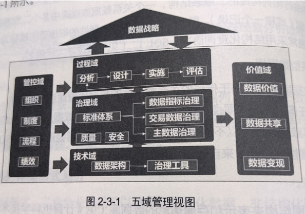
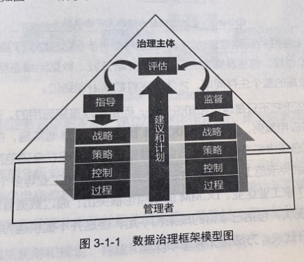

# 第1篇 概述篇
## 1. 工业企业需要数据治理
### 各国工业大数据战略
1. 既要构建工业大数据采集、汇聚、流通、分析、应用的价值闭环，推动创新发展，也要提升数据治理和安全防护能力，保障发展安全
2. 既要在宏观层面加强体系化布局，建立全面、系统的工业大数据生态，也要在微观层面务实着力，提升企业的数据管理能力
3. 既要重视在需求侧促进大数据与实际业务深度融合，也要在供给侧推动大数据技术和产业创新发展
### 工业企业数据的核心价值
#### 以价值创造为核心的工业企业转型
#### 数据驱动下的智能制造
核心三要素
1. 智能设备
2. 先进的数据分析工具
3. 人与设备的交互接口

工业互联网的3个层级
1. 从联网的智能设备中获得数据，通过分析工具得到智能信息，供决策使用
2. 智能系统，包括整合广泛的机器、仪器仪表及系统网络上部署的软件，以及运营网络优化、预测性维护、系统快速回复、机器学习等
3. 智能决策，智能设备和系统收集到足够的信息以促进数据驱动的学习
#### 数据是企业的核心资产
### 我国各行业数据治理现状
#### 金融行业
1. 强调顶层设计，把数据规划好
2. 健全治理体系，把数据管理好
3. 坚强安全管控。，把数据保护好
4. 强化科技赋能，把数据应用好
#### 电信行业
1. 加快完善网络数据安全制度标准
2. 开展合规性评估和专项治理
3. 推进App违法违规收集使用个人信息专项治理行动
4. 强化行业网络数据安全管理
### 数据治理是工业大数据的基础
工业大数据特点
1. 数据来源多样
2. 数据的实时性，生产现场的数据具有连续性、实时性、数据海量的特点
3. 工业机理的复杂性对知识图谱的构建提出了很高的要求，数据之间的相关性分析非常重要
4. 从技术层面讲，工业大数据中以非结构化数据、时序数据居多，对存储和处理能力有更高要求
####工业企业数据治理面临的挑战
1. 数据基础薄弱
2. 数据治理滞后
3. 数据交易法规尚不完善
4. 数据价值难以量化评估
## 2.工业企业数据治理概述
### 数据管理的11个管理职能
1. 数据治理
2. 数据架构
3. 数据建模与设计
4. 数据安全
5. 数据存储与操作
6. 数据集成与互操性
7. 文件和内容管理
8. 参考数据和主数据管理
9. 数据仓库和商务智能
10. 元数据管理
11. 数据质量管理
### 数据资产
是指由企业拥有或控制的，能够为企业未来带来经济利益的，以物理或电子的方式记录的数据资源
### 数据的分类
按照数据对象划分
1. 参考数据 对其他数据进行分类和规范的数据，如货币、计量单位等，相对稳定、静态的数据
2. 主数据 满足跨部门业务协同需要的、反映核心业务实体状态属性的基础信息
3. 业务活动数据
4. 分析数据
5. 时序数据

按照存储形式划分
1. 结构化数据
2. 非结构化数据
3. 半结构化数据

数据库类型划分
1. 关系型数据库
2. 非关系型数据库
3. 图数据库
4. 时序数据库

### 数据治理的顶层架构

1. 管控域
制定企业数据治理组织，明确组织的责、权、利、岗位编制及技能要求

2. 过程域
是数据治理的方法论，包括评估与分析、规划与设计、实施的循环

3. 治理域
是数据治理的主体，明确数据治理的对象和目标

4. 技术域
提供数据治理所需的数据架构、治理工具平台，包括元数据管理、主数据管理、数据指标管理、数据模型管理、数据质量管理、数据安全管理等功能

5. 价值域
通过对数据资产的管控，挖掘数据资产的价值，通过数据的流动、共享、交易，实现数据资产的变现

### 数据治理的核心内容
1. 战略
2. 组织
3. 制度
4. 流程
5. 绩效
6. 标准
7. 工具
8. 数据价值
9. 数据共享
10. 数据变现
## 3.主流数据治理标准及框架介绍
### 国际标准

### 国内标准及模型
#### 数据管理能力成熟度评估模型（DCMM）

		

#### 数据治理规范

### 国际数据管理协会（DAMA）

	

## 4.数据治理的发展趋势
### 4.2 数据隐私保护政策
### 4.3 区块链与数据共享
### 4.4 5G技术域数据安全
### 4.5 新技术与数据治理
### 4.6 数据文化与伦理道德
### 4.7 工业企业数据的运营
目标
1. 客户管理
2. 产品管理
3. 营销管理
4. 风险管理
5. 组织管理

主要内容

				
## 5.本书阅读导引
