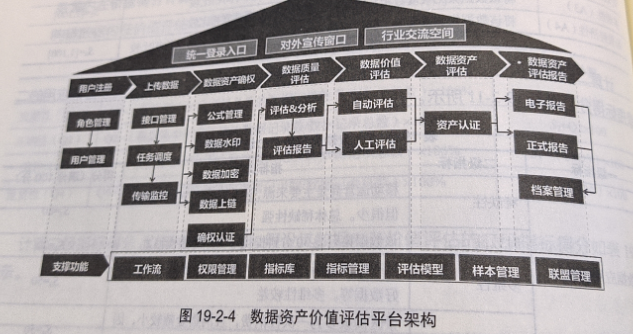
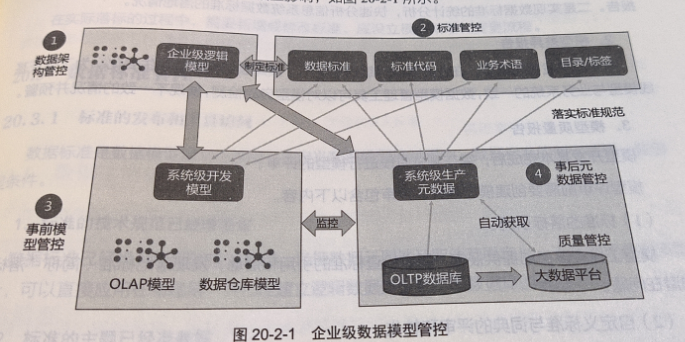
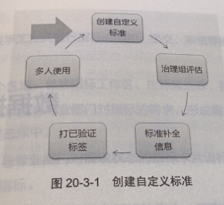

# 第3篇 工具篇
## 18. 数据治理工具概述
工业数据治理工具平台定义

## 19.数据资产运营工具

数据资产运营是指把数据作为资产，通过对数据的采集、清洗、加工、分析、挖掘，在合规化的条件下进行共享与开放。

数据资产运营的目的在于获得收益。

数据资产运营的核心是促进数据的流通，让数据资产的价值最大化。

高质量、可信任的数据是基础。

### 19.1 数据资产目录

数据资产目录使得数据资产易于查找、便于理解、值得信任，让数据资产更好地满足数据应用需求。

数据资产目录构建思路：

数据资产价值评估指标体系

数据资产价值评估工具

## 20.数据模型管理工具
### 20.1 基础功能
1. 数据模型设计
2. 模型差异稽核
3. 数据模型变更管控
### 20.2 企业级数据模型管控
1. 数据架构管控
2. 标准管控
3. 事前模型管控
4. 事后元数据管控

### 20.3 数据标准管控

## 21. 数据指标管理工具

### 21.1 指标库管理
1. 指标的批量导入与导出
2. 指标录入
3. 指标信息维护
4. 指标申报管理
5. 指标查询
6. 指标发布管理

### 21.2 指标体系管理
1. 指标分类管理
2. 指标体系维护  维护指标与分类之间的关系
3. 指标维度管理
4. 指标标准管理
5. 分类查询
### 21.3 指标评价管理
### 21.4 指标应用管理
1. 指标统计报告
2. 指标地图
3. 指标版本管理
4. 指标订阅管理
5. 指标查询管理
6. 指标分析   通过指标的应用情况对指标问题、指标质量进行分析
7. 指标血缘分析
8. 指标质量管理
9. 指标应用追溯

## 22.主数据管理工具
### 22.1 主数据标准管理
1. 标准管理组织管理
2. 标准修订流程管理
3. 标准发布管理
### 22.2 主数据模型管理
1. 对主数据模型的创建申请、变更申请、审批过程管理
2. 主数据属性定义与管理
3. 主数据编码的定义与管理
4. 主数据属性校验规则和约束条件管理等
### 22.3 主数据清洗管理
1. 唯一性
2. 准确性
3. 完整性
4. 一致性
5. 有效性
#### 22.3.1 清洗内容
1. 数据缺失
   1. 记录中缺少值
   2. 缺失一些记录
2. 数据重复
   1. 相同的记录出现多条
   2. 记录中某些值重复
3. 数据错误
4. 数据不可用
#### 22.3.2 清洗的一般过程
1. 缺失值清洗
2. 格式内容清洗
3. 逻辑错误清洗
4. 非需求数据清洗
5. 关联性验证
6. 干净数据回流
### 22.4 主数据生命周期管理
1. 数据申请
2. 数据审核
3. 数据变更
4. 数据查询
5. 数据归档
### 22.5 主数据质量管理
### 22.6 主数据发布与共享

## 23. 元数据管理工具
### 23.1 主要功能
1. 元数据采集
2. 元数据识别
3. 元数据分类
4. 元数据展示
5. 元数据应用
6. 元数据搜索
### 23.2 元数据在数据架构管理中的应用
在规划和设计数据架构时，必须涵盖的元数据包括
1. 业务域、业务过程、业务活动定义与描述
2. 数据集、表、字段的定义和描述
3. 业务规则、转换规则、计算公式和推到公式
4. 数据模型、属性数据元定义及属性数据元有效值约束
5. 数据质量规则和核检结果
6. 数据的CRUD规则
7. 数据溯源和数据血缘
8. 信息代码的数据结构和编码标准
9. 特定的数据元记录系统
10. 利益相关者的联系信息（例如 数据所有者、使用者和管理者）
11. 数据的安全/隐私级别
12. 已知的数据问题
13. 数据使用说明
## 24. 时序数据处理工具
### 24.1 通用大数据处理工具的不足
1. 开发效率低
2. 运行效率低
3. 运维成本高
4. 产品推出慢、利润低
5. 对于小数据量场景，私有化部署太重
### 24.2 时序数据处理工具应具备的功能和特点
1. 必须是高效的分布式系统
2. 必须是实时的处理系统
3. 需要运营商级别的高可靠服务  必须支持数据实时备份，异地容灾，软硬件在线升级，支持在线IDC机房迁移
4. 高效的缓存功能
5. 实时流式计算
6. 支持数据订阅  订阅应该是个性化的，容许应用设置过滤条件
7. 实时数据和历史数据的处理要合二为一
8. 需要保证数据能持续、稳定的写入
9. 需要支持灵活的多维度数据分析
10. 需要支持数据降频、插值、特殊函数计算等操作
11. 需要支持即席分析和查询
12. 需要提供灵活的数据管理策略
13. 必须是开放的
14. 必须支持异构环境  必须支持各种档次、不同配置的服务器并存
15. 需要支持边缘计算、云计算协同
16. 需要单一的额后台管理系统
17. 便于私有化部署
### 24.3 时序数据采集
一般都是通过传感器自动进行的，包括光电、热敏、气敏、力敏、磁敏、声敏、湿敏、电量等不同类别的工业传感器。

复杂度体现
1. 工业数据的协议不标准。如ModBus、OPC、CAN、ControlNet、Profibus、MQTT等
2. 通信方式不统一。如局域网、蓝牙、WiFi、2.5G、3G、4G等
3. 安全性考虑不足。传统工业系统运行在局域网，安全问题不是重点，若连上互联网后，暴露安全风险，可能会造成重大损失

根据上述原因，企业在实际采集数据时，往往配有工业互联网网关盒子，该盒子支持各种物理接口、通讯协议和工业标准协议，进行协议转换，数据加密，统一以MQTT协议或其他协议发往云端

### 24.4 时序数据工具

#### InfluxDB
优点
1. 单机版开源免费
2. 存储采用KV和LSM技术
3. 支持多列数据写入
4. Schemaless模式，无需预先定义数据表结构
5. 压缩性能高，节省存储空间
6. 小数据量情况下，性能不错
7. 不仅是一个数据库 ，还有流式计算、报警等功能，安装部署、维护相对简单

缺点
1. 集群版本收费
2. 对于历史数据查询，性能欠佳

#### OpenTSDB
Apache开源软件，在HBase基础上开发，底层存储是HBase，根据时序数据特点做了些优化

优点
1. 建立在hadoop体系上，各种工具链成熟
2. Schemaless，无需预先定义数据结构
3. 每个序列可以打多个标签，方便聚合操作
4. 支持集群部署和水平扩展

缺点
1. 因为Hadoop不是为时序数据设计，所以性能较低
2. 依赖很多组件，部署复杂，系统稳定性欠佳
3. 每个时间序列只能写入一个采集量，不支持多列写入

#### TDengine
来自中国的开源软件

优点
1. 不仅是一款时序数据库，而且还提供缓存、消息队列、数据订阅、流式计算等功能，是时序数据的全栈技术方案
2. 不依赖任何第三方软件，部署维护简单
3. 读写性能高，计算资源占用低
4. 列式存储，对不同数据类型采取不同压缩算法，压缩率高
5. 无需分库分表，无实时数据和历史数据之分
6. 采用标准SQL语法

缺点
1. 无？？？

#### TimeScale

优点
1. 在PG基础上开发，接口与PG完全兼容，支持复杂SQL

缺点
1. 性能一般
2. 不支持集群

