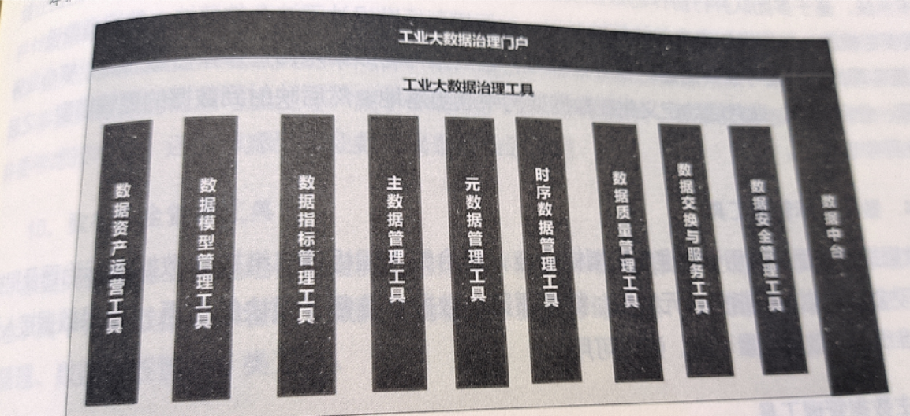
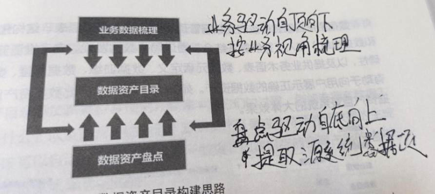
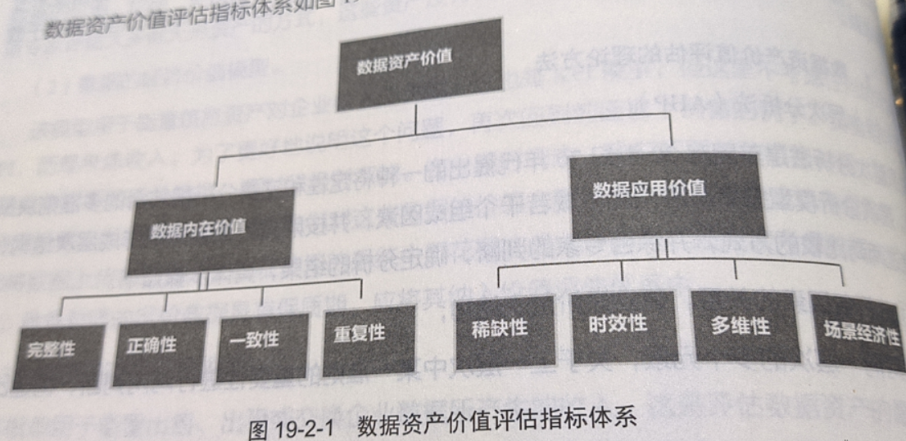

# 第3篇 工具篇
## 18. 数据治理工具概述
工业数据治理工具平台定义

## 19.数据资产运营工具

数据资产运营是指把数据作为资产，通过对数据的采集、清洗、加工、分析、挖掘，在合规化的条件下进行共享与开放。

数据资产运营的目的在于获得收益。

数据资产运营的核心是促进数据的流通，让数据资产的价值最大化。

高质量、可信任的数据是基础。

### 19.1 数据资产目录

数据资产目录使得数据资产易于查找、便于理解、值得信任，让数据资产更好地满足数据应用需求。

数据资产目录构建思路：

数据资产价值评估指标体系

