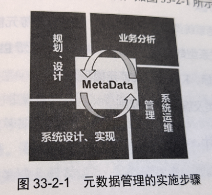
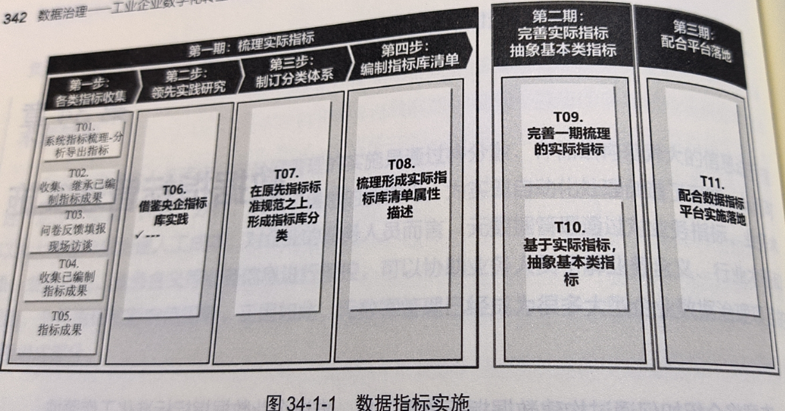
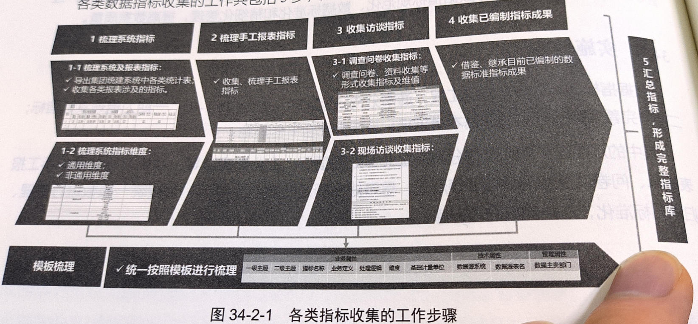
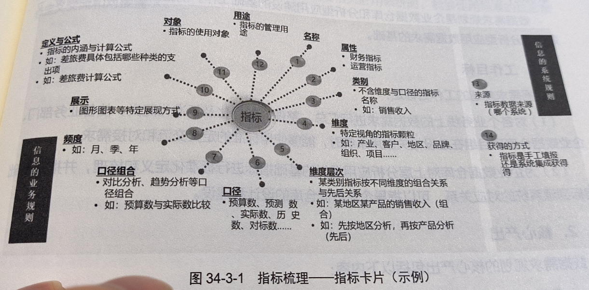
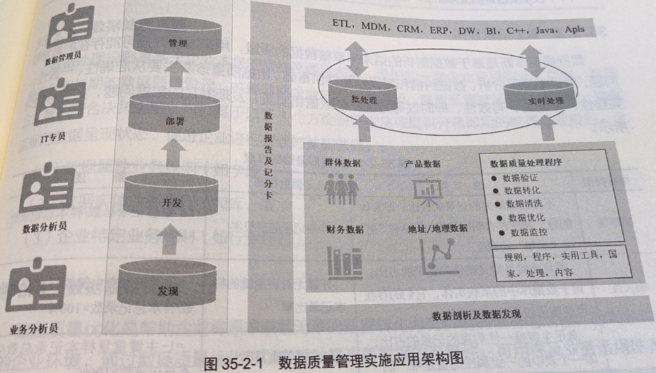
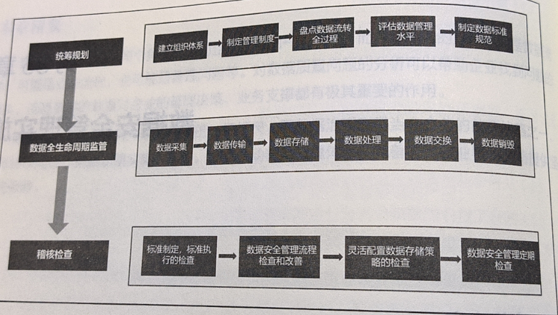

# 第4篇 实施篇

## 29. 数据治理实施策略和路径选择
### 29.1 实施内容
1. 坚持支持企业战略，突出治理绩效
2. 制订数据治理长期计划，兼顾数据短期成效
3. 严选数据治理工具，聚焦数据实施能力
4. 坚持以解决数据问题为导向，重视数据治理的全局把控

### 29.2 路径选择
1. 根据组织方式，分为自上而下和自下而上两种模式
   1. 自上而下特点是规范、标准先行
   2. 自下而上特点是问题导向、系统建设先行、快速见效
2. 根据建设策略，分为生产系统切入和从数据系统切入

## 30. 数据治理顶层架构规划与设计
### 30.1 实施内容
指导原则
1. 统一性原则。基于企业整体业务、信息化战略目标，统筹考虑企业信息化建设的其他部分内容，并进行统一规划设计。
2. 实用性原则。以解决实际需求为导向，确保实用可行，为上层创新应用提供有力支撑。
3. 标准化原则。根据企业实际需求制定相关体系建设标准、规范和指导文件；明确总体规划目标，统一规划思路。
4. 开放性原则。能够充分考虑未来应用发展的需要，能够顺利、平稳地向更新的技术过渡。
5. 易推广原则。考虑现有的信息化基础，在保证先进性、实用性原则上，尽量降低推广难度。
6. 安全性原则。提高数据安全风险识别和处理能力。

数据治理顶层架构规划与设计分为调研与需求分析、顶层架构总体设计、应用场景验证3个阶段。

### 30.2 步骤和方法
#### 30.2.1 顶层设计总体思路
1. 引入DAMA数据管理知识体系设计理念

2. 调研与需求分析

通过对企业数据治理文档、数据、制度、流程、信息化系统运行记录等资料的收集，可以充分理解企业的战略、
管理模式和各主要业务方向，明晰企业发展战略对数据资产管理、数据治理、数据质量、数据运维、组织架构的需求。

#### 30.2.2 数据治理顶层设计要点

1. 数据治理核心领域
 

2. 重视数据标准管理

结合企业业务实际情况，从数据标准化的角度制定数据资产管理标准等，要涵盖所有相关制度和流程的编制及发布。包括如下几项：
+ 数据资产管理办法
+ 数据标准管理办法
+ 主数据管理办法
+ 数据指标管理办法
+ 数据运维管理办法

3. 强化数据质量管理
4. 编制企业数据资产目录

（1） 数据资产目录编制方法

方法一、系统视角

以企业目前核心系统为主，将系统功能模块分类，按照系统数据主题、实体定义信息、实体分类信息、技术信息构建数据资产目录

方法二、主题域视角

构建企业统一的数据域主题（通常按照战略发展、业务运营、管理支持抽象一级主题域），
将企业现有系统按数据驱动方式，划分为各数据主题域。

（2） 数据资产目录可视化呈现

5. 规划数据治理平台

+ 构建统一的数据治理技术平台
+ 构建全域数据汇聚平台
+ 规划数据治理平台的核心功能

+ 设计数据治理管理机制  组织架构、职责分工、管理制度、考核评价等
+ 构建数据治理相关模型 

### 30.3 成熟度评估

## 31. 数据资产应用实施
### 31.1 实施内容
1. 数据资产成本管理
2. 数据资产质量评估
3. 数据资产确权
4. 数据资产价值评估与定价
5. 数据资产共享服务与计费
6. 数据资产运营分析

### 31.2 步骤和方法

## 32. 主数据管理实施
主数据管理是一项长期、复杂的工程，实际主数据管理体系、主数据标准、主数据管理平台、主数据质量和安全、
相关系统升级和改造、数据清洗等多个方面。在项目实施中需依据快速见效、急用先建的思路，先整体规划，
以主数据模型和主数据标准为基础，以主数据管理平台为载体，开展主数据管理专项工作，确保主数据管理项目的成功。

### 32.1 实施内容
1. 成立主数据管理项目建设期组织机构
2. 调研主数据管理现状
3. 进行主数据识别
4. 制定主数据标准
5. 编制主数据管理办法
6. 搭建主数据管理系统
7. 集成主数据管理系统和业务系统
8. 建立运维期组织机构
9. 规范主数据内容
10. 等等
### 32.2 步骤和方法
#### 步骤

#### 方法
1. 理需求
2. 绘蓝图

3. 定职责

4. 定标准
5. 洗数据

6. 搭平台

7. 接服务

8. 建体系

9. 促应用

应用方式：

## 33. 元数据管理实施
### 33.1 实施内容
主要包括
1. 元数据的需求调研
2. 定义元数据框架
3. 建立元数据标准
4. 搭建元数据管理平台
5. 创建和维护元数据
6. 分发和交付元数据

### 33.2 步骤和方法

四个阶段
1. 规划、设计
2. 业务分析阶段
   1. 需求调研和理解
   2. 建立元数据标准
   3. 制定元模型  管理类、技术类、业务类、编码规则
3. 系统设计、实现阶段
   1. 搭建元数据管理系统
   2. 建设及管理元数据存储库
   3. 元数据的交付和分发
4. 系统运维管理阶段

## 34. 数据指标管理实施
实现企业经营数据精细化，使数据“数出一家，政归一门”，使企业能够准确、智能、敏捷地消费数据，
让数据高效赋能业务，提升业务协同和创新能力，充分挖掘数据资产的价值潜力。

### 34.1 实施内容
1. 一期梳理实际指标
2. 二期完善实际指标、抽象基本类指标
3. 配合平台落地

其中难点是收集和整理分散在企业各处的指标

### 34.2 步骤和方法

### 34.3 模板
#### 指标项定义
1. 指标分类
2. 指标代码
3. 指标名称
4. 指标定义  对指标进行的说明
5. 计算逻辑
6. 指标单位
7. 分析维度
8. 取数频率

## 35. 数据质量管理
数据质量管理实施策略主要包括
1. 严控数据的采集、录入、审核、传输、存储、清理、发布等方面操作
2. 统一数据口径，制定数据标准规范
3. 确保数据在各个环节的一致性，避免数据指标体系相互冲突
4. 做到一次采集，多处使用
### 35.1 实施内容
实施内容包括如下4个方面
1. 了解数据:通过业务部门和IT部门之间的努力协作，
评估数据内容、结构、字段、记录，以及与系统之间的关系
2. 设计数据标准：了解企业存在的数据及服务的需求，编制长期按计划施行的跨系统标准定义和规则
3. 自动化数据质量：将标准纳入数据集成、迁移和实时流程；补充、扩充数据；
使用第三方提供的用户统计信息、企业和行业标准信息
4. 监控数据质量：评估结果并不断对规则进行系统性调整，以满足新的业务需求
### 35.2 步骤和方法
数据质量管理实施应用架构图

#### 数据剖析
1. 数据内容及北京分析
2. 数据结构及路径分析
3. 数据成分及业务规则合规分析
4. 数据间关系及相关资源匹配
5. 识别数据转化机制
6. 建立数据有效性及准确性规则
7. 校验数据间的依赖性

#### 数据质量诊断
1. 完整性  样本记录的空值率
2. 相关性  外键无对应主键的样本记录占比
3. 唯一性  主键唯一性
4. 有效性  满足在值域和数据有效范围内
5. 及时性  满足业务应用的时间要求
6. 真实性  真实记录，数据库中实体与现实世界的对象一致
7. 准确性  满足业务精度需求的记录
8. 一致性  与系统内部或其他系统一致的记录
9. 可理解性 含义明确和易于理解的记录
10. 可用性 可获得、可满足业务使用的记录

## 36. 数据安全管理实施
### 36.1 实施内容
数据安全管理以数据本身为导向，分布在数据安全能力构建的多个环节中
### 36.2 实施步骤
按照统筹规划、数据全生命周期监管、稽核检查3个阶段实施

## 37. 数据治理常见误区
1. 企业需求不明确
2. 数据治理不只是技术部门的事
3. 大而全的数据治理无法一蹴而就
4. 数据治理工具不是万能的
5. 数据标准难落地
6. 数据质量不能闭环管理

