# 第4篇 实施篇
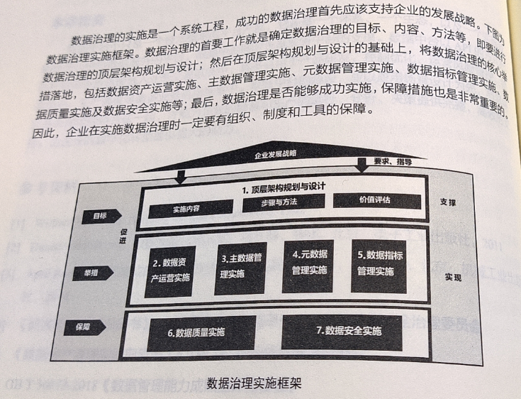

## 29. 数据治理实施策略和路径选择
### 29.1 实施内容
1. 坚持支持企业战略，突出治理绩效
2. 制订数据治理长期计划，兼顾数据短期成效
3. 严选数据治理工具，聚焦数据实施能力
4. 坚持以解决数据问题为导向，重视数据治理的全局把控

### 29.2 路径选择
1. 根据组织方式，分为自上而下和自下而上两种模式
   1. 自上而下特点是规范、标准先行
   2. 自下而上特点是问题导向、系统建设先行、快速见效
2. 根据建设策略，分为生产系统切入和从数据系统切入

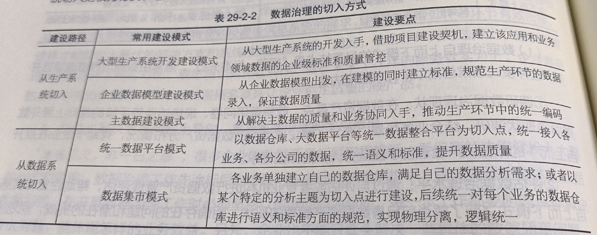

## 30. 数据治理顶层架构规划与设计
### 30.1 实施内容
指导原则
1. 统一性原则。基于企业整体业务、信息化战略目标，统筹考虑企业信息化建设的其他部分内容，并进行统一规划设计。
2. 实用性原则。以解决实际需求为导向，确保实用可行，为上层创新应用提供有力支撑。
3. 标准化原则。根据企业实际需求制定相关体系建设标准、规范和指导文件；明确总体规划目标，统一规划思路。
4. 开放性原则。能够充分考虑未来应用发展的需要，能够顺利、平稳地向更新的技术过渡。
5. 易推广原则。考虑现有的信息化基础，在保证先进性、实用性原则上，尽量降低推广难度。
6. 安全性原则。提高数据安全风险识别和处理能力。

数据治理顶层架构规划与设计分为调研与需求分析、顶层架构总体设计、应用场景验证3个阶段。

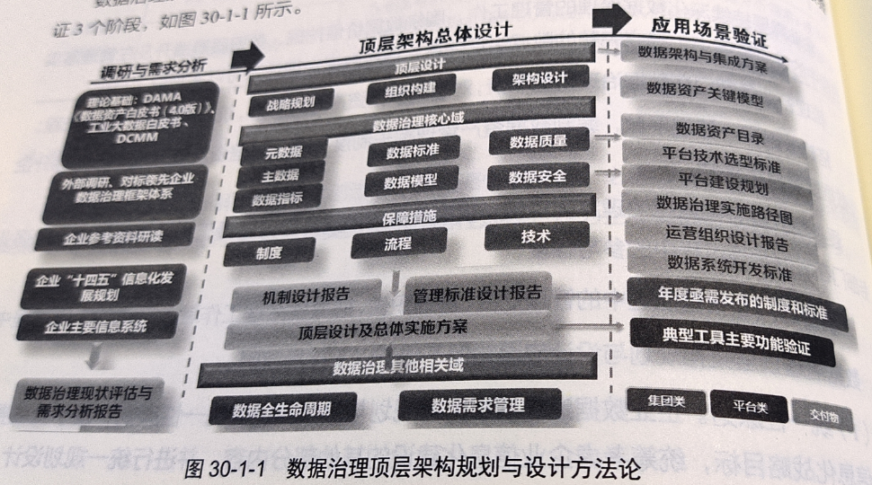

### 30.2 步骤和方法
#### 30.2.1 顶层设计总体思路
1. 引入DAMA数据管理知识体系设计理念

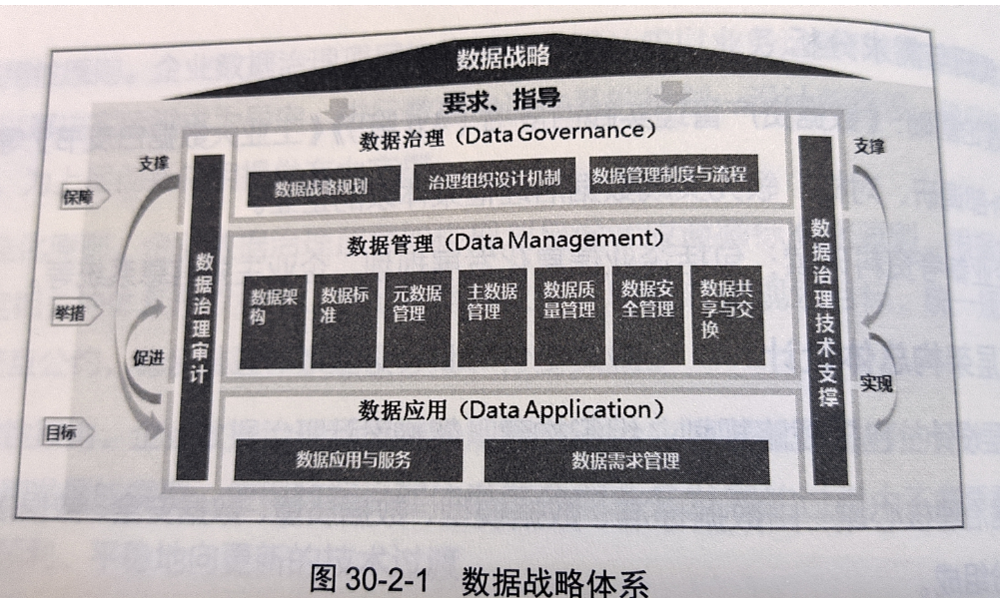

2. 调研与需求分析

通过对企业数据治理文档、数据、制度、流程、信息化系统运行记录等资料的收集，可以充分理解企业的战略、
管理模式和各主要业务方向，明晰企业发展战略对数据资产管理、数据治理、数据质量、数据运维、组织架构的需求。

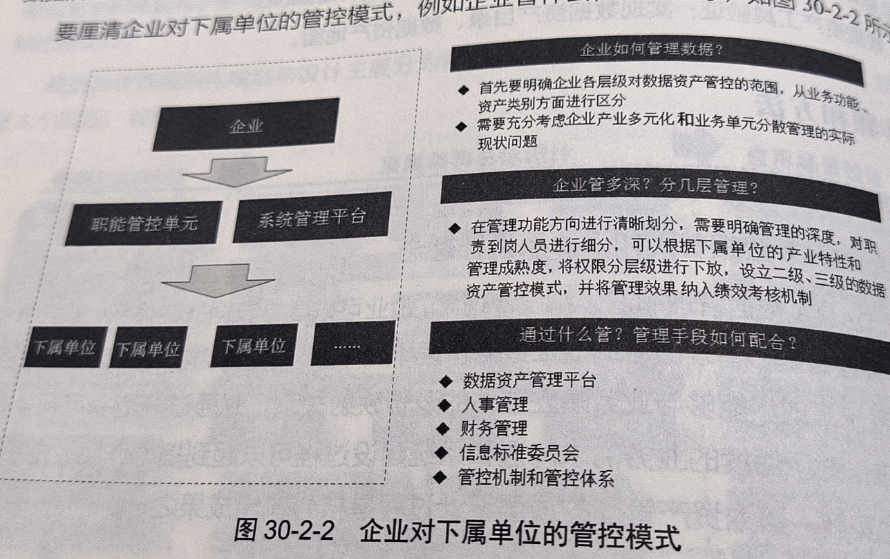

#### 30.2.2 数据治理顶层设计要点

1. 数据治理核心领域
 
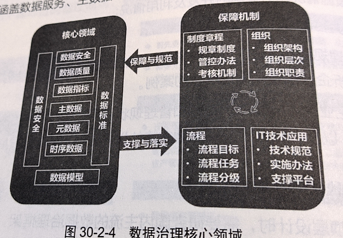

2. 重视数据标准管理

结合企业业务实际情况，从数据标准化的角度制定数据资产管理标准等，要涵盖所有相关制度和流程的编制及发布。包括如下几项：
+ 数据资产管理办法
+ 数据标准管理办法
+ 主数据管理办法
+ 数据指标管理办法
+ 数据运维管理办法

3. 强化数据质量管理
4. 编制企业数据资产目录

（1） 数据资产目录编制方法

方法一、系统视角

以企业目前核心系统为主，将系统功能模块分类，按照系统数据主题、实体定义信息、实体分类信息、技术信息构建数据资产目录

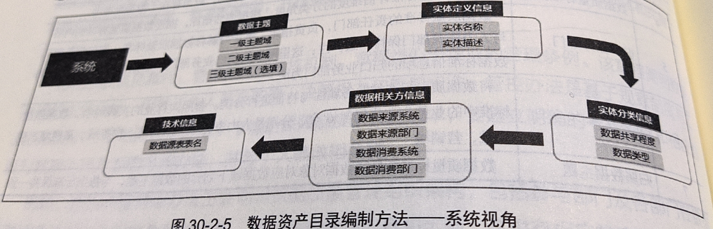

方法二、主题域视角

构建企业统一的数据域主题（通常按照战略发展、业务运营、管理支持抽象一级主题域），
将企业现有系统按数据驱动方式，划分为各数据主题域。

（2） 数据资产目录可视化呈现

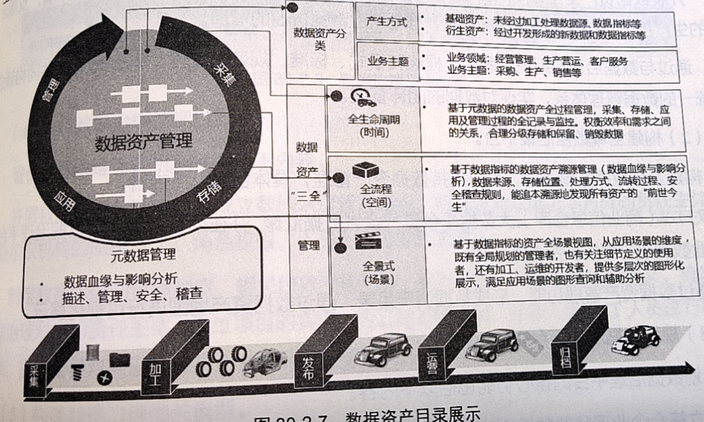

5. 规划数据治理平台

+ 构建统一的数据治理技术平台
+ 构建全域数据汇聚平台
+ 规划数据治理平台的核心功能
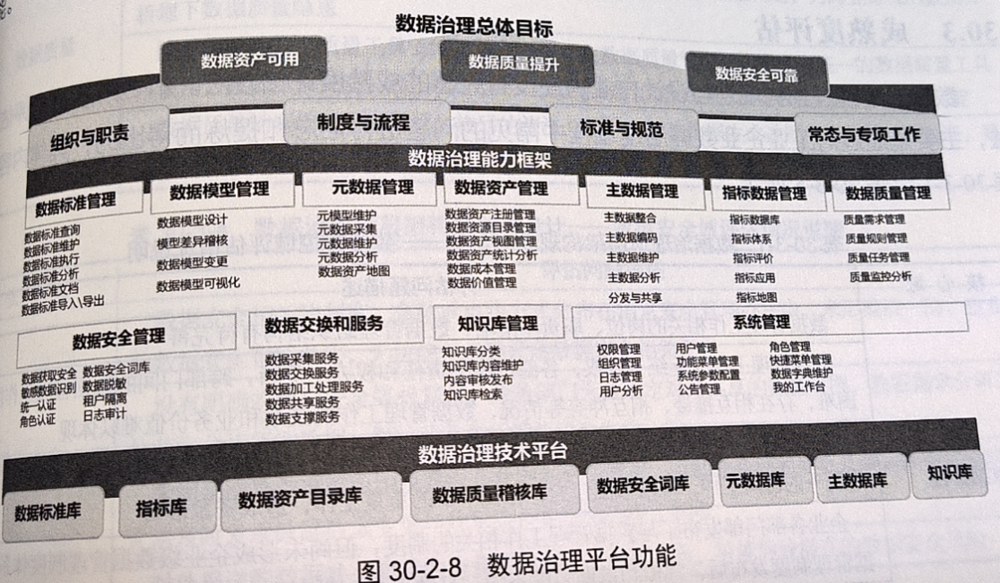
+ 设计数据治理管理机制  组织架构、职责分工、管理制度、考核评价等
+ 构建数据治理相关模型 

### 30.3 成熟度评估

## 31. 数据资产应用实施
### 31.1 实施内容
1. 数据资产成本管理
2. 数据资产质量评估
3. 数据资产确权
4. 数据资产价值评估与定价
5. 数据资产共享服务与计费
6. 数据资产运营分析

### 31.2 步骤和方法
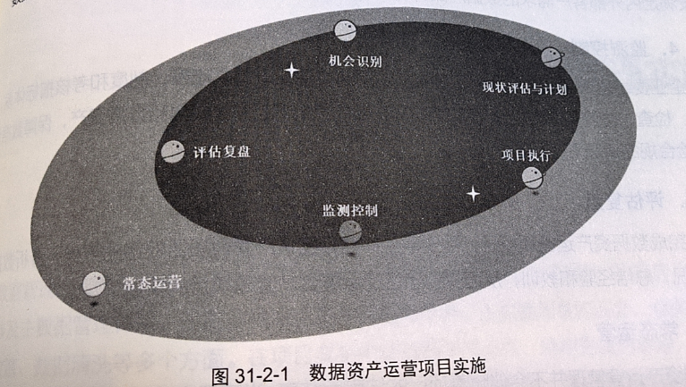

## 32. 主数据管理实施
主数据管理是一项长期、复杂的工程，实际主数据管理体系、主数据标准、主数据管理平台、主数据质量和安全、
相关系统升级和改造、数据清洗等多个方面。在项目实施中需依据快速见效、急用先建的思路，先整体规划，
以主数据模型和主数据标准为基础，以主数据管理平台为载体，开展主数据管理专项工作，确保主数据管理项目的成功。

### 32.1 实施内容
1. 成立主数据管理项目建设期组织机构
2. 调研主数据管理现状
3. 进行主数据识别
4. 制定主数据标准
5. 编制主数据管理办法
6. 搭建主数据管理系统
7. 集成主数据管理系统和业务系统
8. 建立运维期组织机构
9. 规范主数据内容
10. 等等
### 32.2 步骤和方法
#### 步骤
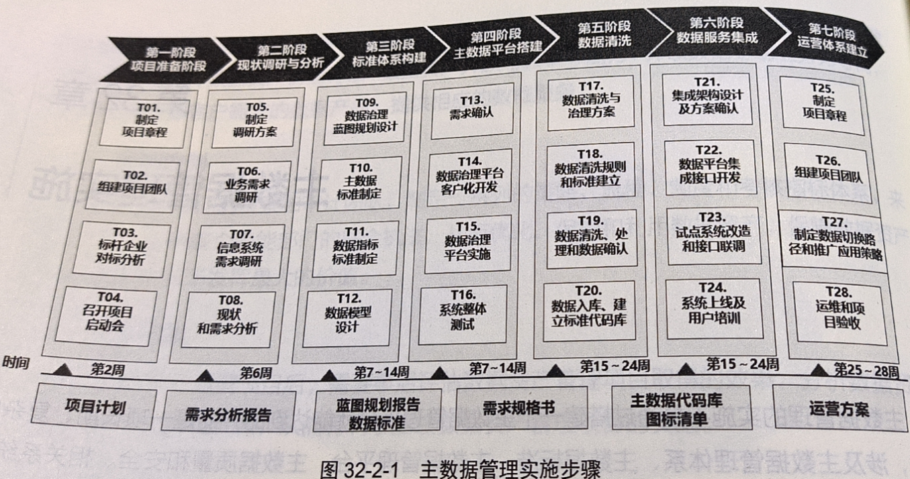

#### 方法
1. 理需求
2. 绘蓝图
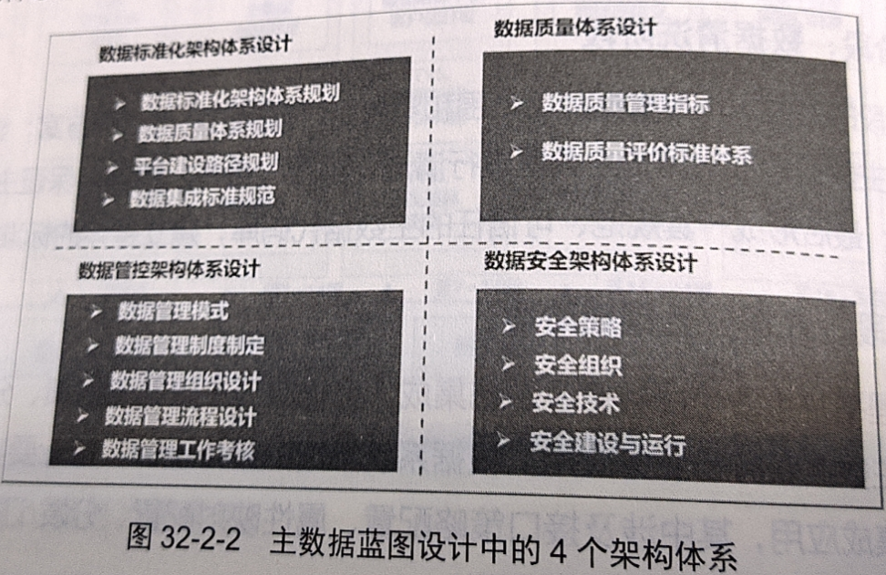
3. 定职责
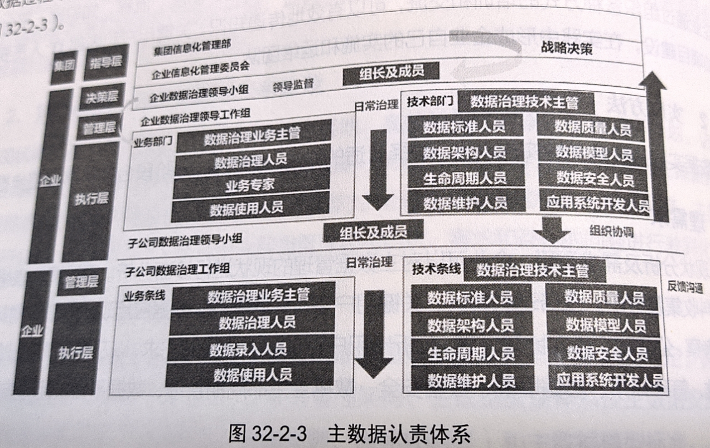
4. 定标准
5. 洗数据
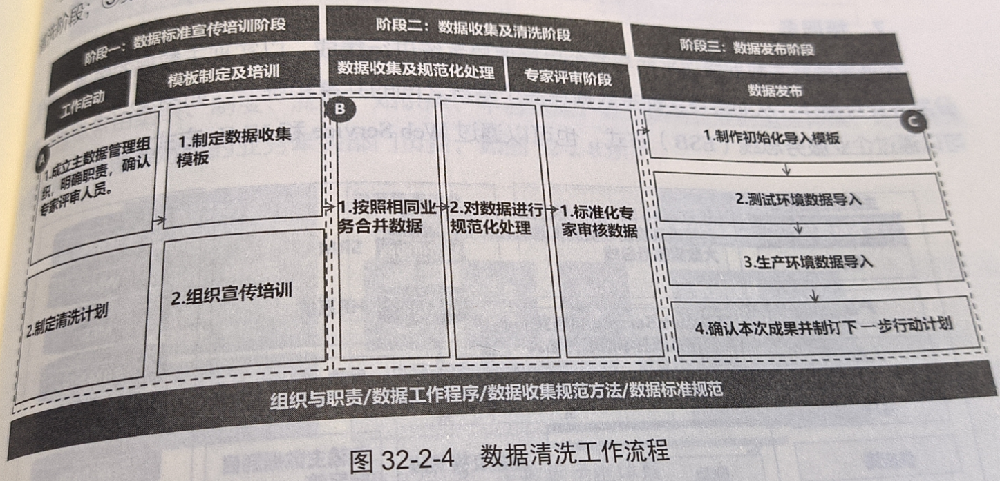
6. 搭平台
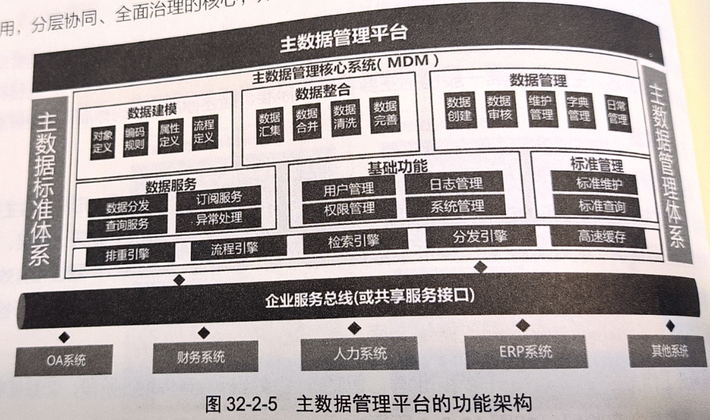
7. 接服务
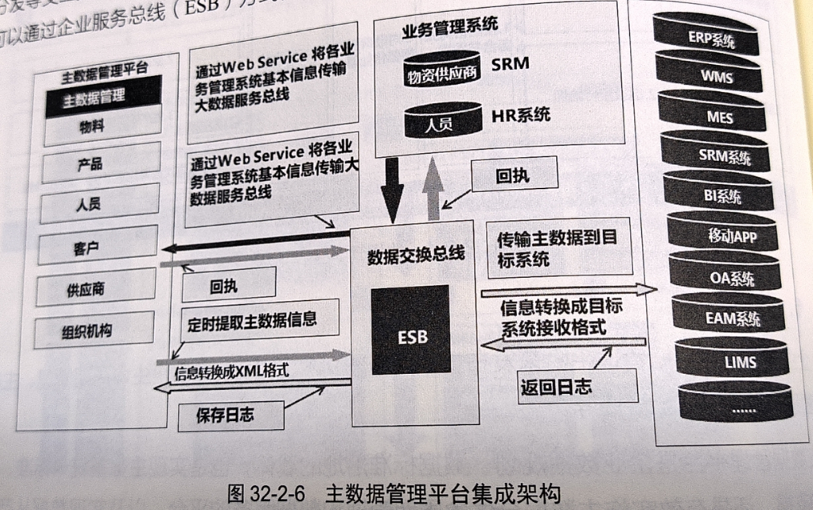
8. 建体系
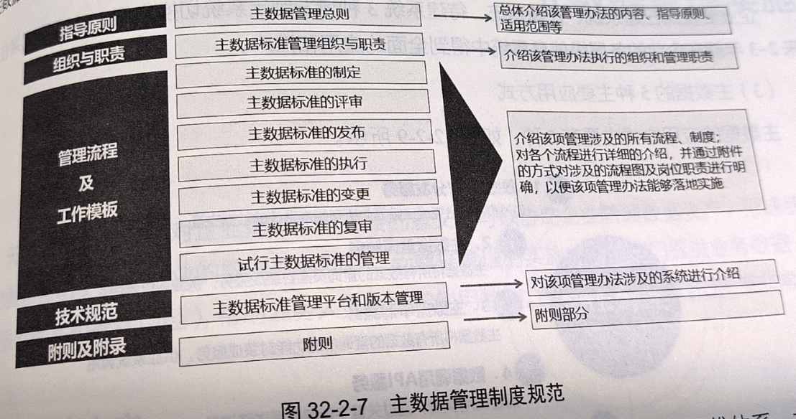
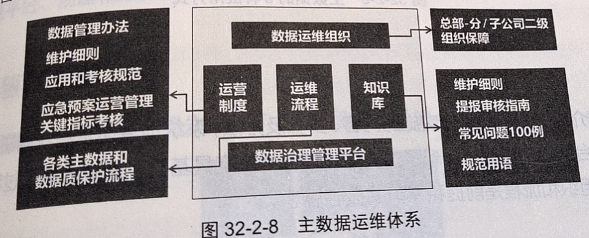
9. 促应用

应用方式：
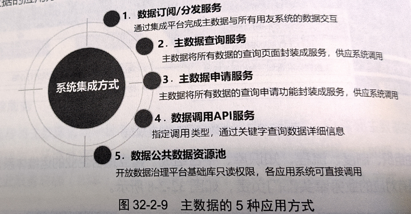

