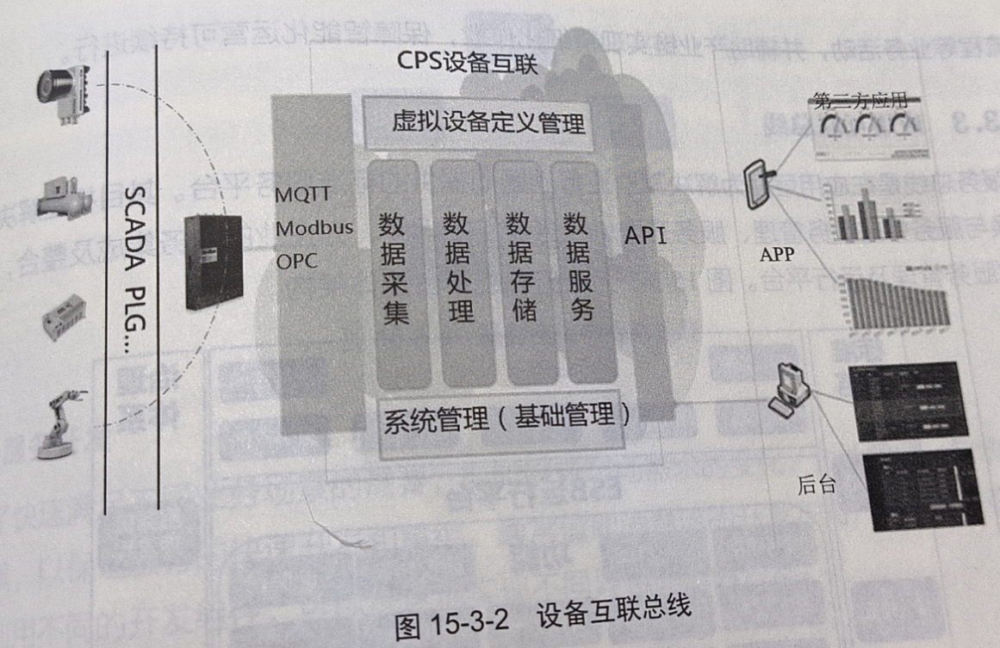
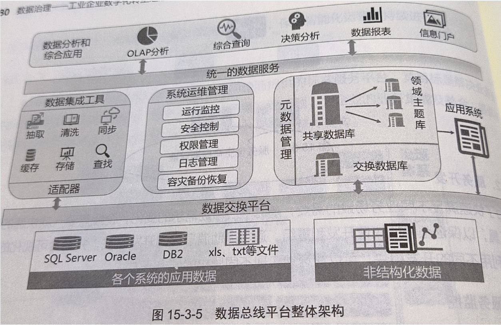

# 第二篇 体系篇
## 15.数据交换与服务
### 15.1 数据交换与服务的意义
意义：连接各业务系统的信息孤岛，将各业务单元中自有的数据共享处理啊，供其他业务单元使用，从而将各业务系统的能力进行整合，为企业新的管理模式和业务模式提供灵活、可靠的数据支撑
### 15.2 数据交换与服务技术演进
1. 文件共享技术
2. 数据库中间表技术
3. 点对点接口技术，优点：简单，缺点：接口越来越多后，接口间调用存在不透明、不规范操作，
   1. web service
   2. SOAP（Simple Object Access Protocol，简单对象访问协议）
   3. REST（Representation State Transfer，表述性状态转移协议）

4. 消息队列
5. 企业服务总线交换技术

服务总线技术是基于消息队列而产生的，是消息队列技术的扩展。目的是解决接口快速开发和接口泛滥的管理问题。
通过服务总线的协议转换、路由分发等技术，可以很好地控制接口的泛滥，保证接口的重用。

6. ETL数据交换技术 

在数据仓库项目、数据分析项目中被大量使用，应用场景主要是从业务系统的数据库到数据仓库
7. 物联网数据采集交换技术

物联网设备、自动化系统进行的实时数据采集、加工、交换，常见数据采集传输协议有MQTT和OPCUA，MQTT使用比较广泛

由于物联网数据的采样频率高，所以需要及时处理和转换，不能先存储后处理，因此也就出现了“边缘计算”的概念

边缘计算也是基于消息的流式数据计算处理逻辑，类似ESB的消息流。常见的物联网流式数据处理引擎是NODE-RED

### 15.3 工业企业数据交换与服务标准体系架构

#### 15.3.2. 设备互联总线

#### 15.3.3 应用互联总线
服务总线目标是解决业务数据交换与服务中的服务管理、服务开发、服务监控等问题，为企业的业务集成及整合，提供标准化的服务管理及运行平台。

1. 服务全生命管理

2. 服务开发
3. 服务监控
#### 15.3.4 数据总线
数据总线是数据层面的定时或者实时的数据交换和共享平台。
作用是通过数据总线解决企业中各业务系统数据库层面的数据整合，加强数据管理，提高数据质量，
最终为企业的智能分析和综合决策提供精确的数据支撑。架构图如下：

#### 15.3.5 开放互联API网关
