# 3.排列组合与古典模型
# 4.统计与分布
## 4.1标准差
反应一组数值与其平均数之间差距的大小，标准差小，说明各数据越接近平均数
## 4.3众数、中位数
众数反应出现频率最高的数

中位数为处于中间位置的数字。
中位数在一定程度上可以消除个别极端值对样本平均值的影响
## 4.4欧式距离
在一个N维度空间里，求两点距离，这个距离肯定是大于等于0的数字，这个距离需要用两个点在各自维度的坐标相减，平方后加和再开平方

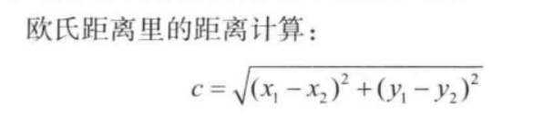

## 4.5曼哈顿距离
标明两个点在标准坐标系上的绝对轴距离总和，c=|x1-x2| + |y1-y2|
## 4.6同比和环比
同比为与相邻时段的同一时期相比
	例如今年7月与去年7月相比

环比为和上一个报告期进行比较
	例如今年7月环比增长10%，是与6月相比
## 4.7抽样
了解大量样本空间分布情况的方法，样本越大则抽样带来的成本减少的收益月明显

抽样要有代表性和分散性，才能体现与样本空间更为接近的分布特点
## 4.8高斯分布（正态分布）
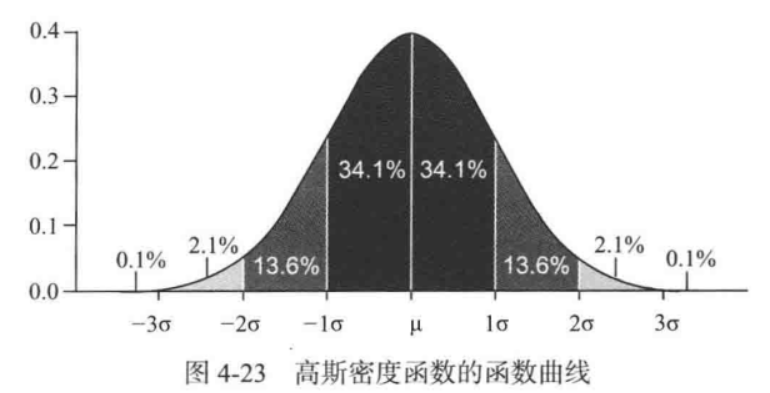

分布特点：一般般的很多，极端的很少

可用于重点客户跟踪，产品成本投入预算分配等
## 4.9泊松分布
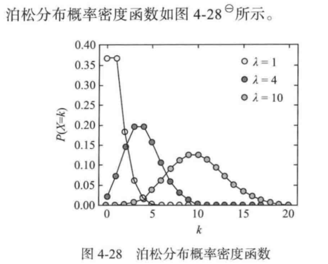

适合描述单位时间内随机事件发生的次数

需满足3个条件
1. 这是个小概率事件
2. 事件的每次发生是独立的不会相互影响
3. 事件的概率是稳定的

适合场景示例：
    已知书店中工具书销售较为稳定而且数量较少，新华字典平均每周卖出4套。作为书店老板，应该备多少为宜。
## 4.10伯努利分布
1表示成功，出现概率为p（0<p<1），0表示失败，出现概率为q=1-p

需满足条件
1. 歌词试验中事件是相互独立的
2. 每次试验都只有两种结果，即n=0，或n=1
# 5.指标
## 5.2指标运营
### 5.2.1指标的选择
一. 常用指标
1. PV
页面浏览数，通常指每天的点击数，用户访问一次网站的页面算一次pv
2. UV
浏览的独立用户数，1个相同的用户点击页面10次，算10个PV，只算1个UV
3. DAU （Daily Activated Users）
日活跃用户数，习惯上说当天登录过至少一次的用户算活跃用户
4. MAU
月活跃用户数。
5. LTV （Life-Time Value）
用户生命周期价值，游戏为例，用户从开始玩到抛弃这个游戏总共付费多少
6. APPU （Average Revenue per User）
每用户平均收入。每年平均从每个用户身上的收入。

二. 指标的标准
1. 数字化
2. 易衡量
3. 意义清晰
4. 周期适当
5. 尽量客观
### 5.2.2指标体系的构建
	
1. 确定考核对象
2. 指标周期
3. 指标的比较可以横向对比，也可以纵向对比
4. 复合指标  由基础指标和复合指标进行运算得到的
# 6.信息论
## 6.1信息的定义
信息是被消除的不确定性
## 6.2信息量的计算
### 对数

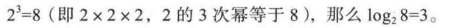

### 信息量计算公式
1. 概率均等情况

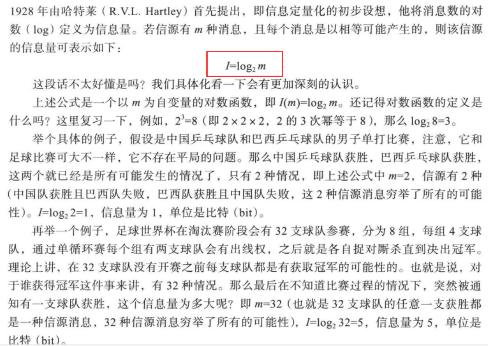
	
2. 极少见事件所带来的的信息量大
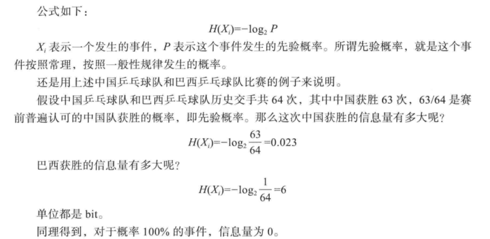
## 6.4熵
### 6.4.2信息熵
信息的杂乱程度的量化描述

在信息可能有n中情况时，如果每种情况出现的概率相等，那么n越大，信息熵越大，当n一定，那么其中所有情况概率相等时信息熵是最大的，如果一种情况的概率比其他情况大很多，信息熵会越小
# 7.多维向量空间
## 7.1向量和维度
在python和java里，向量定义可以理解成类的定义

一般来说，向量的设计推荐采用维度正交原则，主要原因是避免两个非正交维度不一致时如何采信哪种更好
## 7.2矩阵
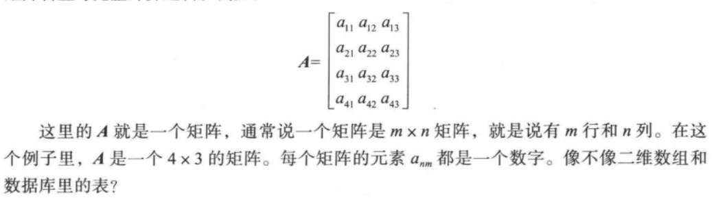
## 7.3数据立方体
帮助人们在一个研究对象和3个维度及以下的情况下快速找到让人感兴趣的小数据块，快速定位问题所在
## 7.4上卷和下钻
# 8.回归
## 概述
简单说是由果索因的过程，是一种归纳思想，当看到大量的事实所呈现的样态，推断出原因是如何的，当看到大量的数字对是某种样态，推断出他们之间蕴含的关系是如何的
## 8.1线性回归
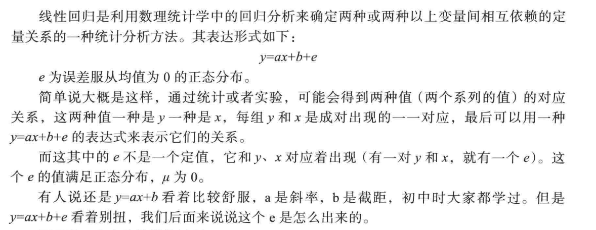
## 8.2拟合
把平面上一系列的点用一条光滑的曲线连接起来的过程就是拟合
## 8.3残差分析
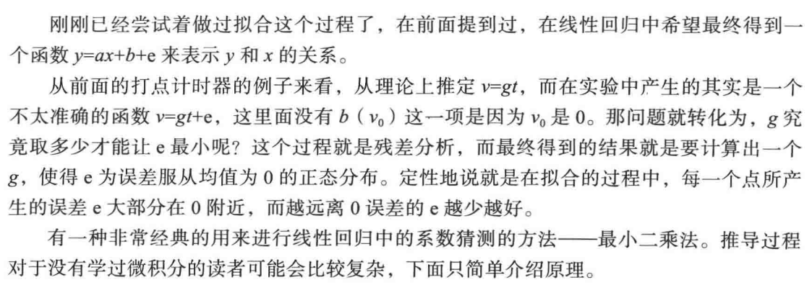
## 8.4过拟合
### 定义
过度拟合，即通过对数据样本的观察和抽象，最后归纳成为一个完整的数据映射模型，但是在归纳的过程中，可能为了迎合所有样本向量点，甚至是噪声点将模型描述过于复杂

### 危害
1. 描述复杂，参数复杂，计算逻辑多
2. 失去泛化能力，及降低通过学习得到的模型对未知数据的预测能力

### 原因
1. 训练样本太少
2. 力求“完美”，对于所有的训练样本都希望用拟合的模型覆盖，但大部分训练样本是带有噪声的，当偏差比我们预期大很多的时候就可以认为是噪声点
## 8.5欠拟合
通常体现出来的是在线性回归中的因素考虑不足

原因
1. 参数过少，对于训练样本向量的维度提取太少，导致模型描述不准确
2. 拟合不当
## 8.6曲线拟合转化为线性拟合
非线性回归太过复杂。在生产实践中尽量避免使用
# 9.聚类
## 概述
聚类指把物理或抽象对象的集合分组为由彼此类似的对象组成的多个类的分析过程
## 9.1K-Means算法
sklearn.cluster Kmeans算法

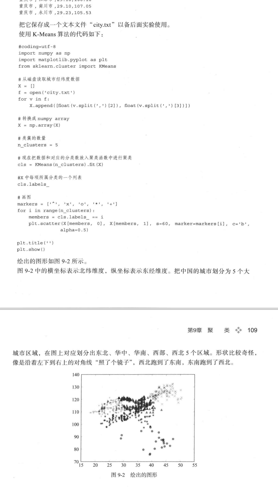
	
基于向量距离来做聚类，算法步骤
1. 从n个向量对象任意选择k个向量作为初始聚类中心
2. 根据在步骤1中设置k个向量（中心对象向量），计算每个对象与这k个中心对象各自的距离
3. 对于步骤2的计算，任何一个向量与这k个向量都有一个距离，有的远有的近，把这个向量和距离他最近的中心向量对象归在一个类簇中
4. 重新计算每个类簇中心对象向量位置
5. 重复3.4.两个步骤，知道类簇聚类方案中的向量归类变化极少为止。

注意
1. 需要实现制定类簇的数量
2. 需要事先给定初始的类中心
## 9.2有趣模式
特点
1. 易于理解
2. 在某种确信度上，对于新的或检验数据是有效的
3. 是潜在有用的
4. 是新颖的
## 9.3孤立点
定义：在聚类的过程中，会常常碰到一些离主群或者离每个群都非常远的点，这种点就叫做孤立点，也叫离群点。

聚类算法通常不能直接解释孤立点产生的原因，但孤立点通常也是有具体意义的

产生原因
1. 可能是数据清洗不当产生的，属于操作失误，不是要研究的内容
2. 孤立点通常是由一些和群里的个体差异极大的样本组成，他们的行为在真实世界里和在我们的生产生活中也极有可能和群里的样本有着巨大的差异
## 9.4层次聚类
层次聚类是通过聚类算法把样本根据距离分成若干大群，大群之间相异，内部相似，大群内部又当成一个全局的样本空间，再继续划分成若干小群，最后形成树形结构

凝聚的层次聚类方法

一. 分类算法

Scikit-learn库AgglomerativeClustering
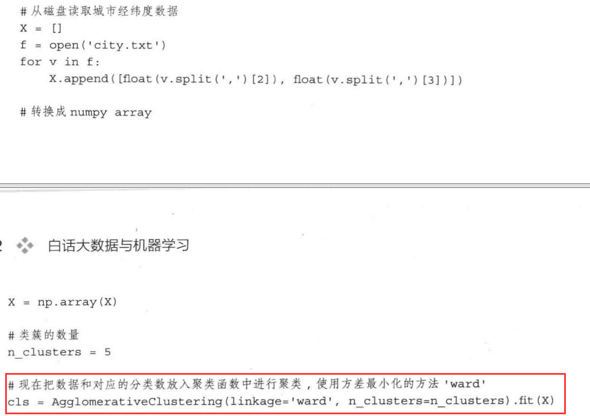

二. 聚类合并策略
1. Ward策略：让所有类簇中的方差最小化
2. Maximum：力求将类簇之间的距离最大值最小化
3. Average linkage：力求将簇之间的距离的平均值最小化
## 9.5密度聚类
sklearn中专门用来基于密度分类的算法库 sklean.cluster.DBSCAN

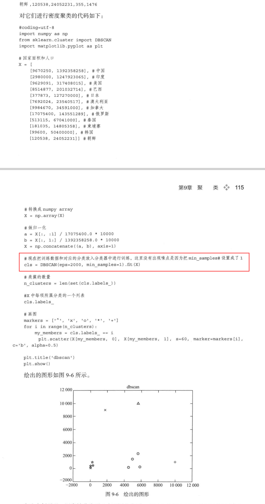

使用相同形状表示同一类，不同形状表示不同类

归一化 为了解决由于维度量纲或单位不同所产生的距离计算问题而进行的权重调整，议案放在数据准备阶段，目的是把两个不同维度的数据都投影(延展或压缩)到以1W为最大值的正方形区域里。
## 9.6聚类评估
质量评估
1. 估计聚类的趋势，数据中必须存在非随机结构，聚类分析才是有意义的
2. 确定数据集中的簇数，K-Means算法在一开始就需要确定类簇的数量，并作为参数传递给算法
3. 测量聚类的质量，用量化的方法来测量聚类的质量
### 9.6.1聚类趋势
如果样本空间的样本是随机出现的本身没有聚类趋势，那使用聚类是有问题的

霍普金斯统计量进行量化评估分布样态
### 9.6.2簇数确定
簇数太多样本被分成很多小簇，簇数太少，样本基本没有被分开，都没有意义

肘方法
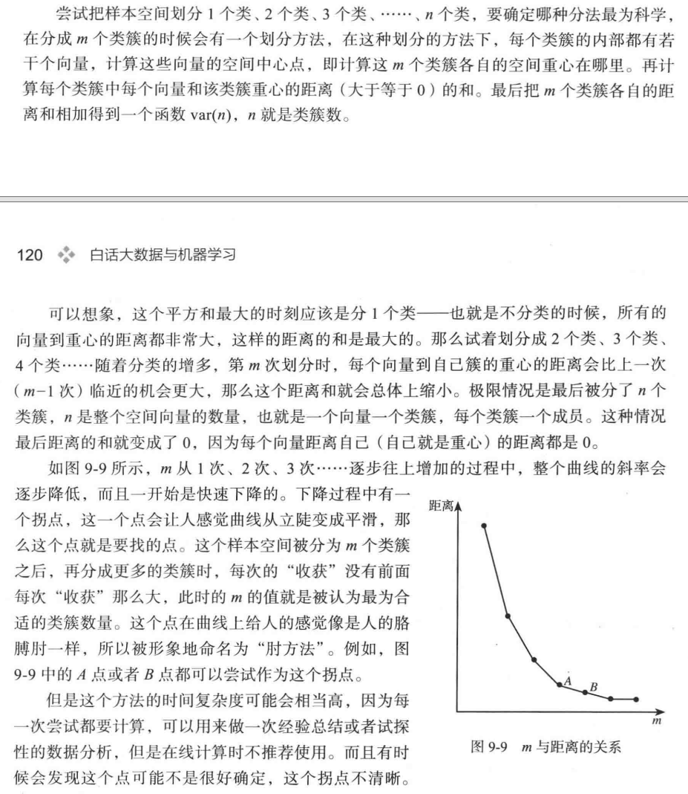
### 9.6.3从测定聚类的质量
使用轮廓系数进行度量

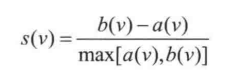
对于有n个向量的样本空间，假设它被划分为k个类簇，即C1、C2、...、Ck。对于任何一个样本空间中向量v来说，可以求一个v到本类簇中其他各点的距离的平均值a(v)，还可以求一个v到其他所有各类簇的最小平均距离（即从每个类簇中挑选一个离v最近的向量，然后计算距离），求这些距离的平均值，得到b(v)，轮廓系数定义为

一般来说，这个函数的结果在-1和1之间。a(v)标识的类簇内部的紧凑型，越小越紧凑，而b(v)表示该类簇和其他类簇之间的分离程度。

示例代码
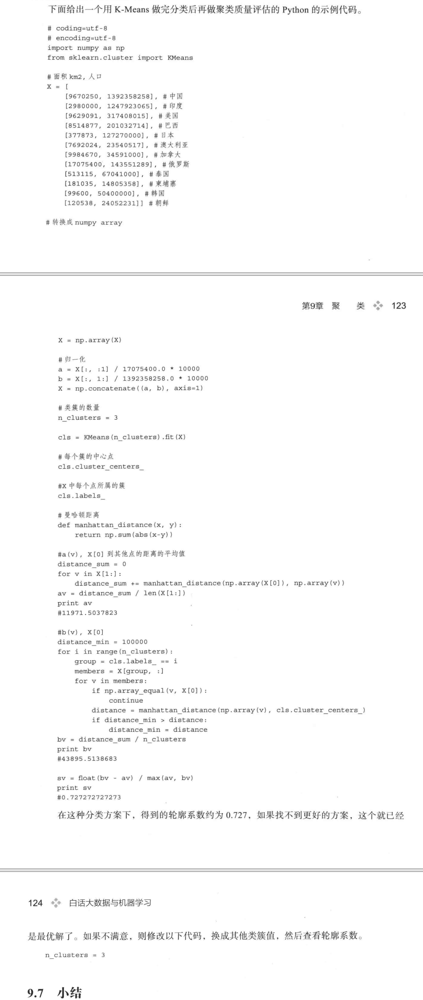

# 10.分类
## 概述
分类算法是人们常说的有监督学习。是类型一系列已知类别的样本对模型进行训练调整分类器的参数，使其达到所要求性能的过程，也称为监督训练或有教师学习。

也就是说，先用一部分有特征的数据和每种数据归属的标识来训练分类模型，训练完毕后，再让金算计用这个分类模型来区分新的数据
## 10.1朴素贝叶斯
贝叶斯决策理论基本思想
1. 已知类条件概率密度参数表达式和先验概率
2. 利用贝叶斯公式转换成后验概率
3. 根据后验概率大小进行决策分类

定义
    在全样本空间下，发生x的概率乘以在发生x的情况下发生Dj的概率，等于发生Dj的概率乘以在发生Dj的情况下发生x的概率
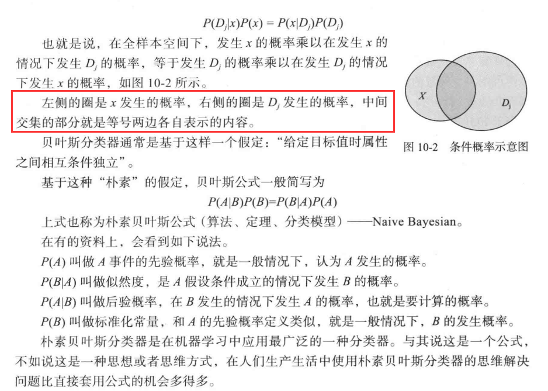

变种模型
1. 高斯朴素贝叶斯
利用高斯概率密度工时进行分类拟合
2. 多项式朴素贝叶斯
多用于高维度向量分类，例如文章分类
3. 伯努利朴素贝叶斯
针对布尔类型特征值分类
## 10.2决策树归纳
概述

决策树是一种树形结构，其中每个内部节点表示一个属性上的判断，每个分支代表一个判断结果的输出，最后每个叶节点代表一种分类结果。
      决策树是一种十分常用的分类方法，需要监管学习（有教师的Supervised Learning），监管学习就是给出一堆样本，每个样本都有一组属性和一个分类结果，也就是分类结果已知，那么通过学习这些样本得到一个决策树，这个决策树能够对新的数据给出正确的分类。
## 10.3随机森林
在机器学习中，随机森林是一个包含多个决策树的分类器， 并且其输出的类别是由个别树输出的类别的众数而定。
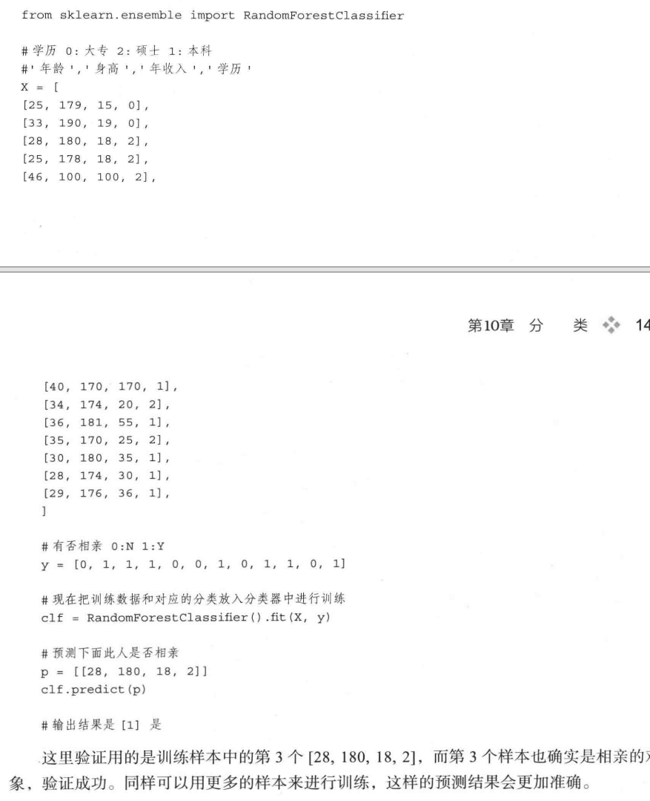
## 10.4隐马尔科夫模型
## 10.5支持向量机SVM
## 10.6遗传算法
# 11.关联分析
## 11.1频繁模式和Apriori算法
### 频繁模式
定义：高频率的模式

衡量指标
1. 支持度
在所有数据记录中出现的比例
2. 置信度
置信度是有方向性的，如果购买啤酒的记录中100%都购买了香烟，那么说明购买啤酒后购买香烟的置信度为100%

经典的Apriori算法
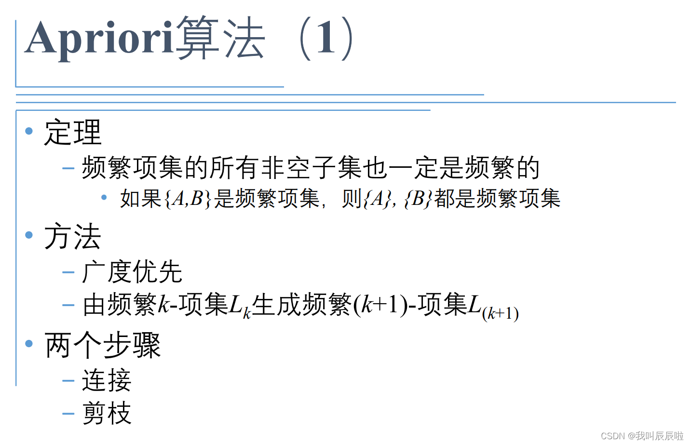

## 11.2关联分析与相关性分析
提升度Lift用于体现关联度
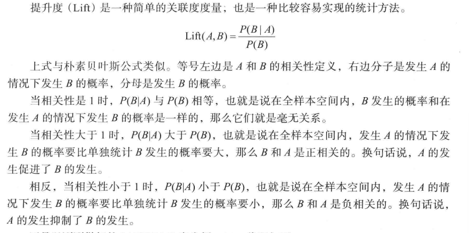
## 11.3稀有模式和负模式
稀有模式是支持度(出现几率)远低于设定的支持度的模式

负模式  一种事物增加的同时对应另一种事物的减少
# 12.用户画像
目的
希望通过某些手段对用户做甄别，把他们分成彼此相通或不同的人群或个体，进而区别化提供服务和进行观察分析
# 13.推荐算法
## 13.1推荐思路
贝叶斯分类 通过用户购买物品的分布特性，统计该用户购买物品的分布情况

利用搜索记录
# 14.文本挖掘
## 14.1文本挖掘的领域
1. 搜索和信息检索，搜索引擎和关键字搜索等
2. 文本聚类：使用聚类方法，对词汇、片段、段落或文件进行分组和归类
3. 文本分类：对片段等进行分组和归类，在使用数据挖掘分类方法的基础上，通过训练来标记示例模型
4. Web挖掘：在互联网上进行数据和文本挖掘，并特别关注网络的规模和相互联系
5. 信息抽取：从非结构化文本中识别与提取有关的事实和关系；从非结构化或半结构化文本中抽取出结构化数据的过程
6. 自然语言处理：将语言作为一种有意义、有规则的符号系统。在底层解析和理解语言的任务，膜前主要从语法、语义角度发现语言最本质的结构和所表达的意义
7. 概念提取：把单词和短语按照语义分成意义相似的组
## 14.2文本分类
一. 分词

二. 文本表示

三. 分类标记

1. Rocchio算法

2. 朴素贝叶斯算法
       
朴素贝叶斯算法关注的是文档属于某类别的概率，文档属于某个类别的概率等于文档中每个词属于该类别的概率的综合表达式

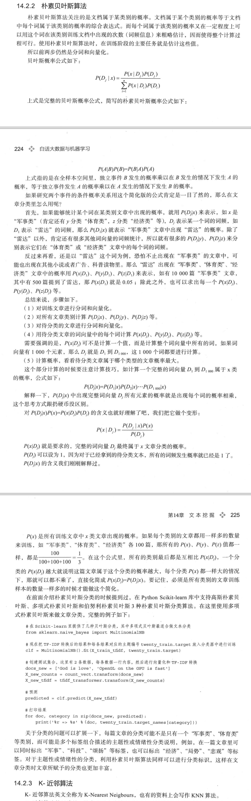

3. K-近邻算法
   
思路是没有必要去总结原型向量，只需要原始的训练样本，这些样本具有最基础最原始而且准确的向量信息。
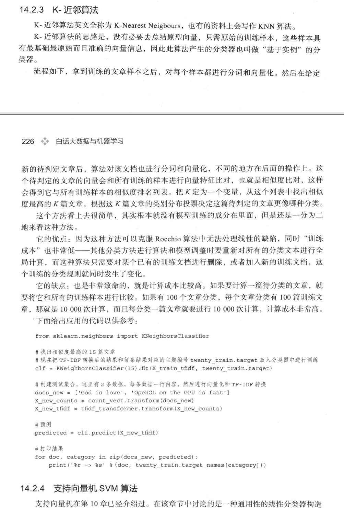

4. 支持向量机SVM算法
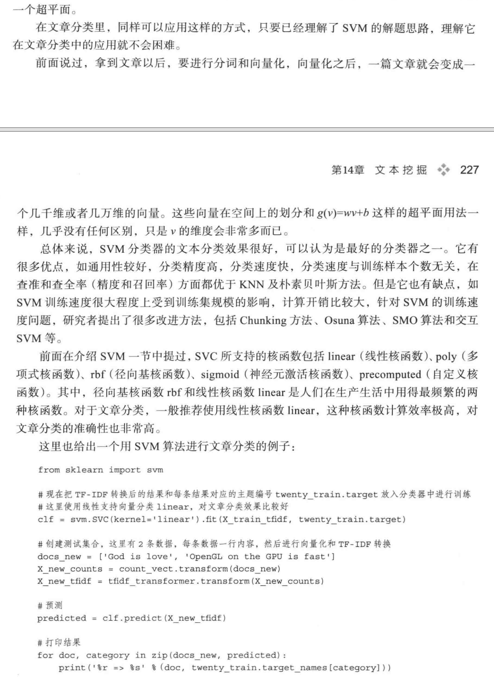
# 15.人工神经网络
## 1神经网络
大规模并行分布式结构

神经网络的学习能力以及由此而来的泛化能力
## 15.2 FANN库（Fast Artificial Neural Network Library）
开源的神经网络模型库，由C语言编写，运行高效，可以支持模拟单层、多层的各种全连接和半连接网络

神经网络搭建的可视化工具 Agiel Neural Network
## 15.3 常见的神经网络
一. 感知器网络

单细胞神经网络，只有一个神经元

二. BP神经网络

按误差逆传播算法训练的多层前馈网络(Back Propagation， BP神经网络)

三. 自组织特征映射神经网络（ Self-Organizing Feature Map， SOM）

四. Hopfield网络

五. 玻尔兹曼机

六. 卷积神经网络

a. 是一种前馈神经网络，它的人工神经元可以响应一部分覆盖范围内的周围单元。说到底还是一个分类器，是一种有监督机器学习的工具。

b. 分层
1. 第一层为特征提取层，每个神经元的输入与前一层的局部接收域相连，并提取该局部的特征。一旦该局部特征被提取后，他与其他特征间的位置关系也随之确定下来
2. 第二层为特征映射层，网络的每个计算层有多个特征映射组成，每个特征映射是一个平面，平面上所有神经元的权值相等

c. 入门讲解
        https://zhuanlan.zhihu.com/c_141391545