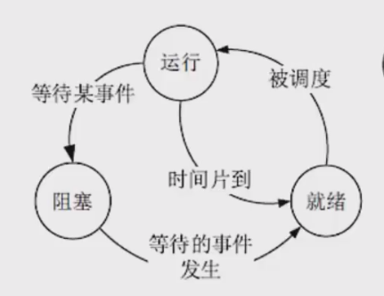
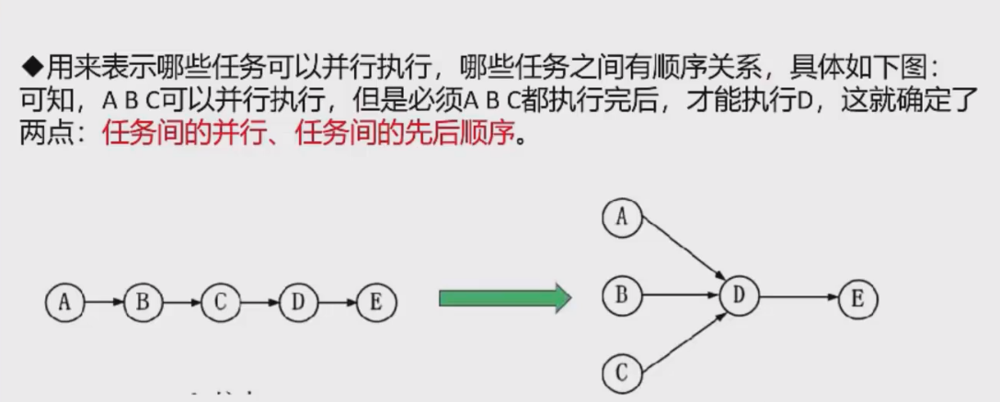
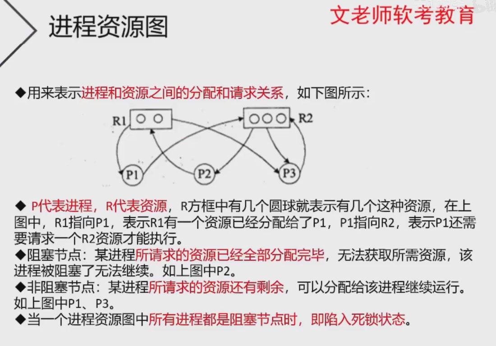
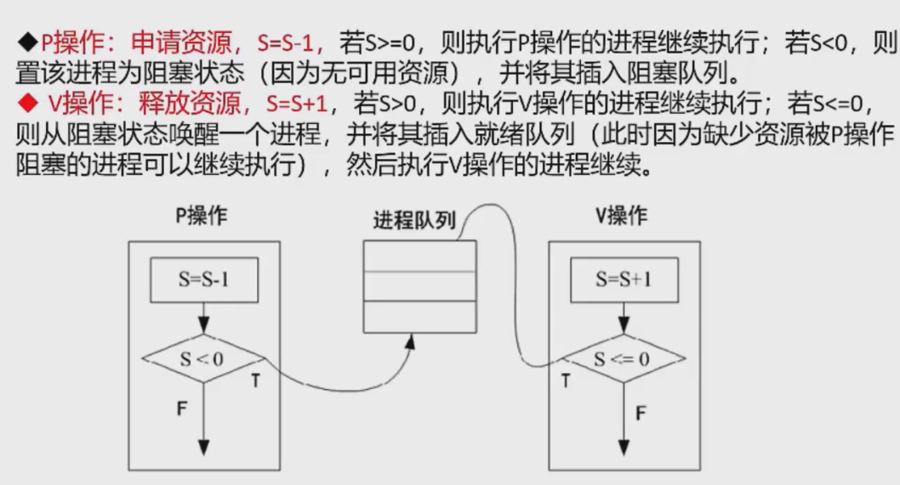

## 操作系统概述
定义 能有效地组织和管理系统中的各种软/硬件资源，合理地组织计算机系统工作流程，控制程序的执行，
并且向用户提供一个良好的工作环境和友好的接口。

**三个重要作用**
1. 管理计算机中运行的程序和分配各种软硬件资源
2. 为用户提供友善的人机界面
3. 为应用程序的开发和运行提供一个高效率的平台

**4个特征**
1. 并发性
2. 共享性
3. 虚拟性
4. 不确定性（异步性）

**操作系统的功能**
1. 进程管理 进程控制、同步、通信、调度
2. 文件管理 文件存储空间管理、目录管理、文件的读写管理和存取控制
3. 存储管理 是对主存储器(内存)空间进行管理，包括存储分配与回收、存储保护、地址映射（变换）、主存扩充
4. 设备管理 对硬件设备的管理，包括对输入输出设备的分配、启动、完成和回收
5. 作业管理 包括任务、界面管理、人机交互、图形界面、语音控制和虚拟现实等

操作系统的分类
1. 批处理操作系统
2. 分时操作系统 将cpu的工作时间划分为许多很短的时间片，轮流为各个终端的用户服务
3. 实时操作系统 实时指计算机对于外来信息能够以足够快的速度进行处理，并在被控对象允许的时间范围内
做出快速反应。实时操作系统对交互能力要求不高，但要求可靠性有保障。
4. 网络操作系统  可以联网的操作系统。三种模式：集中模式、客户端/服务器模式、对等模式（p2p模式）
5. 分布式操作系统 多个分散的计算机经连接而成的系统
6. 微型计算机操作系统 简称微机操作系统，如windows、linux等

**嵌入式操作系统**

特点
1. 微型化  占用的资源和代码量少，内存少、字长短、运行速度有限
2. 可定制  要求能运行在不同的微处理器平台上，针对硬件变化进行结构与功能上的配置，以满足不同应用需要
3. 实时性  实时性要求较高
4. 可靠性
5. 易移植性

嵌入式系统初始化过程按照自底向上、从硬件到软件的次序依次为 片级初始化（芯片）->板级初始化（主板）->系统初始化

## 进程管理

**进程三态图** 

运行态 cpu等各种资源、数据准备都满足

就绪态 各种数据都满足，只差资源，排队等待中

阻塞态 资源和数据都不满足

### 前驱图 

### 进程资源图

## 进程同步与互斥

临界资源： 各进程间需要以互斥方式对其进行访问的资源

临界区：指进程中对临界资源实施

互斥：某资源（临界资源）在同一时间内只能由一个任务单独使用，使用时需要加锁，
使用完后解锁才能被其他任务使用，如打印机。

同步：多个任务可以并发执行，不过速度上有差异，在一定情况下停下等待，不存在资源是否单独或共享的问题；如自行车和骑车

互斥信号量：对临界资源采用互斥访问，使用互斥信号量后其他进程无法访问，初值为1.

同步信号量：对共享资源的访问控制，初值一般是共享资源的数量。

