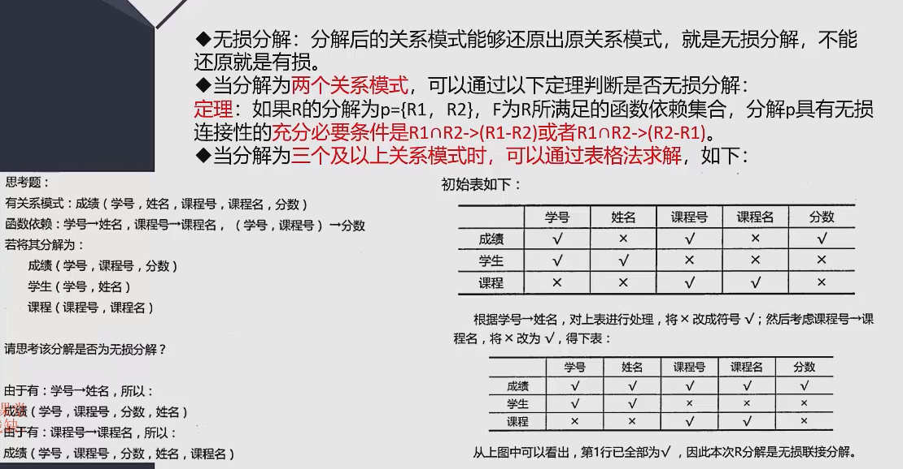
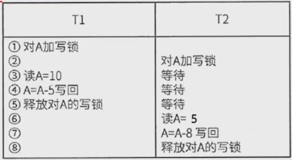
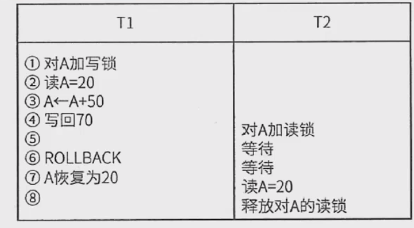
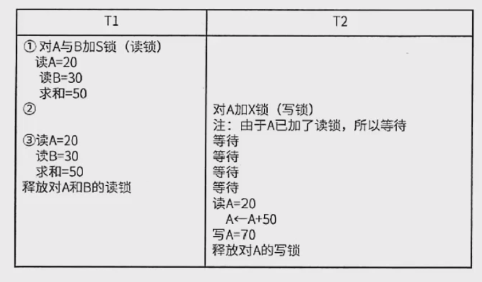

## 模式分解
范式之间的转换一般是通过拆分属性，即模式分解，将具有部分函数依赖和传递依赖的属性分离出来。
来达到一步步优化，一般分为以下两种：

1. 保持函数依赖分解

对于关系模式R，有依赖集F，若对R进行分解，分解出来的多个关系模式，保持原来的依赖集不变，则
为保持函数依赖的分解。另外，需要消除掉冗余依赖（如传递依赖）

2. 无损分解

定义：分解后的关系模式能够还原出原关系模式，就是无损分解，不能还原就是有损。

 
## 事务、并发
事务四种特性 原子性、一致性、隔离性、持续性

事务是并发控制的前提条件，并发控制就是控制不同的事务并发执行，提高系统效率，但是
并发控制中存在下面三个问题：
1. 丢失更新
2. 不可重复读
3. 读脏数据

## 封锁协议
X锁是排它锁（写锁）。若事务T对数据对象A加上X锁，则只允许T读取和修改A，其他事务都不能再对A加
任务类型锁，直到T释放A上的锁

S锁是共享锁（读锁）。所事务T对数据对象A加上S锁，则只允许T读取A，但不能修改A，其他事务只能再对
A加S锁（能读不能修改），直到T释放A上的S锁。

三级封锁协议 修改前加写锁，读之前加读锁
1. 一级封锁协议

事务在修改数据R之前必须先对其加X锁，直到事务结束才释放。可解决丢失更新问题。

2. 二级封锁协议

在一级封锁协议基础上（修改数据前加写锁），读数据前加读锁，读完后释放读锁。可解决丢失更新、读脏数据问题

3. 三级封锁协议

一级封锁协议加上事务T在读取数据R之前先对其加S锁，直到事务结束才释放。可解决丢失更新、读脏数据、数据重复度问题

