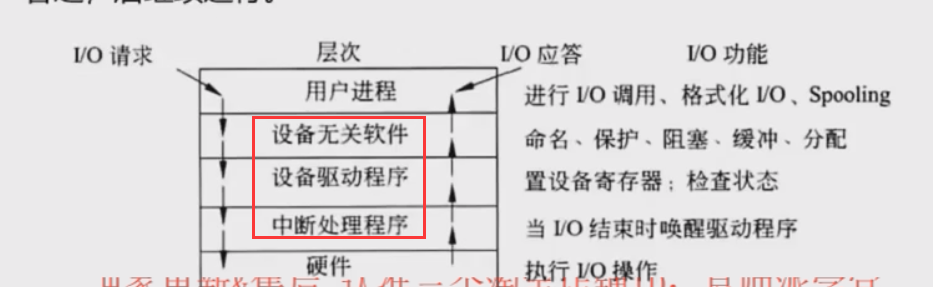
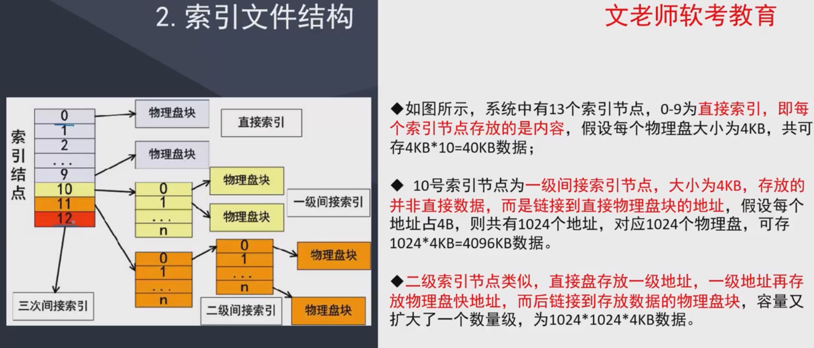

##设备管理
设备是计算机系统与瓦解交互的工具，具体负责计算机与外部的输入/输出工作，
所以常称为外部设备（简称外设）。在计算机系统中，将负责管理设备和输入/
输出的机构成为I/O系统。因此，I/O系统由设备、控制器、通道（具有通道
的计算机系统）、总线和I/O软件组成。

设备分类
1. 按数据组织分类：块设备、字符设备
2. 按设备功能分类：输入设备、输出设备、存储设备、网络联网设备、供电设备
3. 按资源分配分类：独占设备、共享设备、虚拟设备（通过虚拟技术将独占设备转为共享设备）
4. 按数据传输速率分类：低速、中速、高速设备

### I/O软件
I/O设备管理软件的层次及功能

### 设备管理技术

##文件管理
### 概述
文件是**具有符号名的、在逻辑上具有完整意义的**一组相关信息项的集合。

信息项是构成文件内容的基本单位。**一个文件包括文件体和文件说明**。文件体是文件
的真实内容。文件说明是操作系统为了管理文件所用到的信息，包括文件名、文件内部标识
、文件类型、文件存储地址、文件长度、访问权限等

文件管理系统，是**操作系统中实现文件统一管理的一组软件和相关数据的集合，专门负责管理和
存取文件信息的软件机构**，简称文件系统。

文件系统功能包括
1. 按名存取
2. 统一的用户接口
3. 并发访问和控制
4. 安全性控制
5. 优化性能
6. 差错恢复

文件的逻辑结构
1. 有结构的记录式文件
2. 无结构的流式文件

文件的物理结构市直文件在屋里存储设备上的存放方法
1. 连续结构
2. 链接结构
3. **索引文件结构**
4. 多个物理块的索引表

索引文件结构 

### 文件目录

文件目录是文件控制块的有序集合。文件控制块包含以下三类信息
1. 基本信息类。例如文件名、文件物理地址等
2. 存取控制信息类。文件的存取权限
3. 使用信息类。文件建立日期、最后一次访问的日期等

### 文件存储空间管理

文件存取方法 通常由顺序存取和随机存取，磁带是顺序存取，其他基本上都是随机存取

