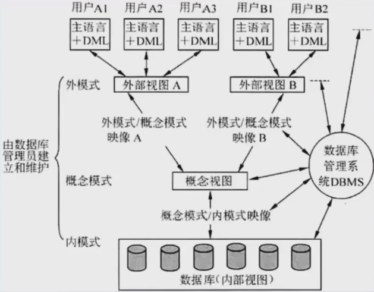

## 数据库系统
数据库的基本特征
1. 数据按一定的数据模型组织、描述和存储
2. 可为各种用户共享
3. 冗余度较小
4. 数据独立性较高
5. 易扩展

### 三级模式-两级映像

三级模式
1. 内模式： 管理如何存储物理的数据，对应具体物理存储文件
2. 模式： 又称为概念模式，就是我们通常使用的基本表，根据应用、需求将物理数据划分为一张张表
3. 外模式：对应数据库中的视图这个级别，将表进行一定的处理后再提供给用户使用

两级映像
1. 外模式-模式映像：表和视图之间的映射，存在于概念级和外部级之间，若表中数据发生了改变，只需要修改此映射，而无需修改应用程序
2. 模式-内模式映像：是表和数据的物理存储之间的映射，存在于概念级和内部级之间，若修改了数据存储方式，只需要修改此映射，而不需要去修改应用程序

### 数据库设计
步骤
1. 需求分析 产出物有数据流图、数据字典、需求说明书。获得用户对系统的三个要求：信息要求、处理要求、系统要求。 
2. 概念结构设计：就是设计E-R图，即实体-联系图。工作步骤包括：选择局部应用、逐一设计分E-R图、E-R图合并。分E-R图进行合并时，存在的冲突包括
   1. 属性冲突。同一属性可能会存在于不同的分E-R图中
   2. 命名冲突。相同意义的属性，在不同的分E-R图上有着不同的命名，或是名称相同的属性在不同的分E-R图中代表着不同的意义
   3. 结构冲突。同一实体在不同的分E-R图中有着不同的属性，同一对象在某一分E-R图中被抽象为实体，在另一个途中又被抽象为属性。
3. 逻辑结构设计：将E-R图转换成关系模式（表）。工作步骤包括
   1. 确定数据模型
   2. 将E-R图转换成指定的数据模型
   3. 确定完整性约束
   4. 确定用户视图 
4. 物理设计：步骤包括确定数据分布、存储结构和访问方式
5. 数据库实施阶段。根据逻辑设计和物理设计阶段的结果建立数据库，编制与调试应用程序，组织数据入库，并进行试运行
6. 数据库运行和维护阶段。数据库应用系统经过试运行即可投入运行，但该阶段需要不断对系统进行评价、调整与修改

### 数据模型
数据模型三要素：
1. 数据结构：所研究的对象类型的集合
2. 数据操作：对数据库中各种对象的实例允许执行的操作的集合，增删改查
3. 数据的约束条件：一组完整性规则的集合

核心概念
1. 实体：客观存在并可相互区别的事物。可以是具体的人、事、物或抽象概念。
2. 弱实体和强实体：弱实体依赖于强实体的存在而存在。如再超市管理系统中员工是强实体，经理是弱实体
3. 实体集：具有相同类型和共享相同属性的实体的集合，如学生、课程
4. 属性：实体所具有的特性
5. 属性分类：简单属性和复合属性；单值属性和多值属性；null属性；派生属性
6. 域：属性的取值范围称为该属性的域
7. 码（key）：唯一标识实体的属性集。
8. 联系：现实世界中事物内部以及事物之间的联系，在E-R图中反映为实体内部的联系和实体之间的联系
9. 联系类型：1对1，1对N、N对N
