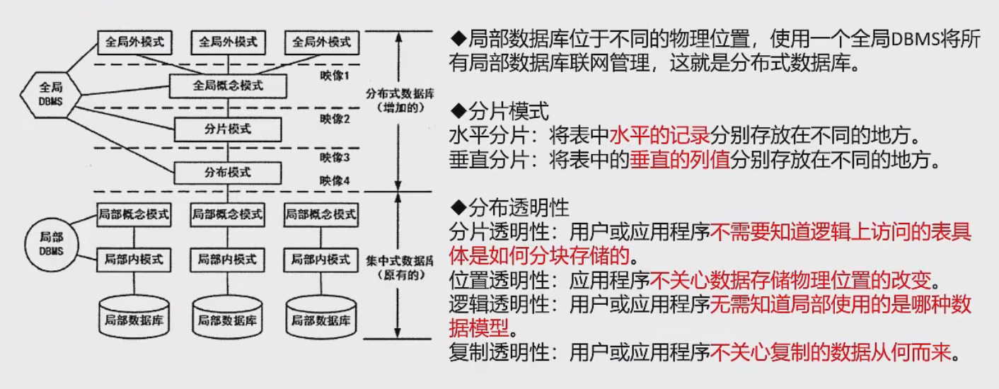

## 数据库新技术

### 数据库安全

静态转储：即冷备份，在转储期间不允许对数据库进行任何存储、修改操作
1. 优点：非常快、容易归档
2. 缺点：只能提供到某一时间点上的恢复，不能做其他工作，不能按表或按用户恢复

动态转储：即热备份，在转储期间允许对数据库进行存取、修改操作
1. 优点：可在表空间或数据库文件级备份，数据库仍可使用，可达到秒级恢复
2. 缺点：不能出错，否则后果严重，若热备份不成功，所得结果几乎全部无效

其他备份方式：完全备份、差量备份（仅备份上一次完全备份后变化的数据）、增量备份（备份上一份备份之后变化的数据）

### 分布式数据库

### 数据仓库
定义：是一个面向主题的、集成的、相对稳定的、反应历史变化的数据集合，用于支持管理决策。

BI系统主要包括数据预处理、建立数据仓库、数据分析和数据展现四个主要阶段

### 反规范化技术
反规范化：规范化设计后，数据库设计值希望牺牲部分规范化来提高性能。
1. 好处：降低连接操作的需求、降低外键和索引的树木，减少表的数目，提高查询效率
2. 问题：数据的重复存储，浪费磁盘空间；可能出现数据的完整性问题，为了保障数据的一致性，增加了数据维护的复杂性，降低修改速度

具体方法
1. 增加冗余列
2. 增加派生列：增加由本表或其他表中数据计算生成的列
3. 重新组表
4. 水平分割表
5. 垂直分割表

### 大数据
特点：大量化、多样化、价值密度低、快速化

## SQL语言

