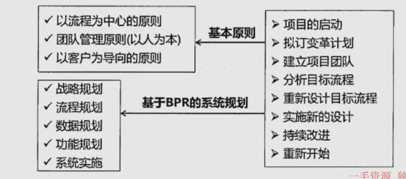
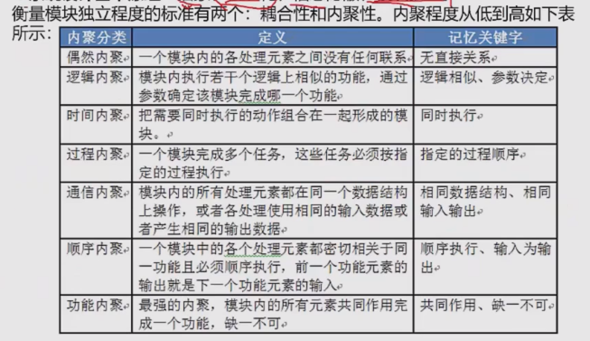
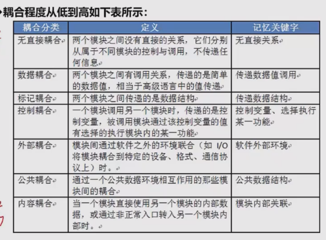

## 处理流程设计
流程表示工具：
1. 程序流程图：用一些图框标识各种操作，由顺序、选择和循环结构组合或嵌套而成。
2. IPO图：用来描述构成软件系统的每个模块的输入、输出和数据加工
3. N-S图（盒图）：容易标识嵌套和层次关系，并具有强烈的结构化特征。不适合于复杂程序的设计
4. 问题分析图（PAD）：支持结构化程序设计的图形工具。他引导设计人员使用结构化程序设计方法

业务流程重组BPR
重新设计业务流程

业务流程管理BPM
以规范化的构造端到端的卓越业务流程为中心，以持续的提高组织业务绩效为目的的系统化方法

流程管理包含三个层面 规范流程、优化流程、再造流程

## 系统设计
1. 主要目的：为系统指定蓝图，在各种技术和实施方法中权衡利弊，合理地使用各种资源，
最终勾画出新系统的详细设计方法
2. 设计方法：结构化设计方法，面向对象设计方法
3. 主要内容：概要设计、详细设计
4. 概要设计基本任务：又称系统总体结构设计，划分软件模块，确定每个模块的功能和调用关系，
形成软件的模块结构图，即系统结构图
5. 详细设计的基本任务：
   1. 模块内详细算法设计
   2. 模块内数据结构设计
   3. 数据库的物理设计
   4. 其他设计（代码、输入/输出格式、用户界面）
   5. 编写详细设计说明书
   6. 评审
6. 系统设计的基本原理
   1. 抽象化
   2. 自顶而下，逐步求精
   3. 信息隐蔽（封装）
   4. 模块独立（高内聚，低耦合）

7. 系统设计原则
   1. 保持模块的大小适中
   2. 尽可能减少调用的深度
   3. 多扇入，少扇出：设计的模块多让别人调用我，少调用别人，即复用率大
   4. 单入口，单出口：输入输出
   5. 模块的作用域应该在模块之内
   6. 功能应该是可以预测的

## 人机界面设计
三大黄金原则
1. 置于用户控制之下
2. 减少用户的记忆负担，即简洁
3. 保持界面的一致性

