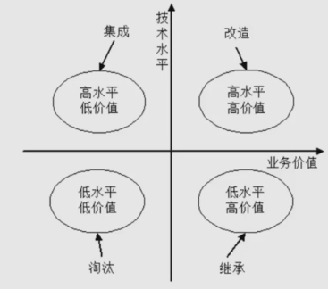

## 系统转换
遗留系统（将要被替换的老系统）的特点
1. 当前已不能完全满足要求
2. 性能上已经落后，采用的技术已经过时
3. 维护工作十分困难
4. 基本上没有文档，很难理解

系统转换指系统开发完毕，投入运行，取代现有系统的过程，三种转换计划
1. 直接转换：现有系统直接下线，上新系统，风险很大，优点是节省成本
2. 并行转换：风险小，缺点是耗费人力和时间，难以控制两个系统间的数据转换
3. 分段转换：分期分批逐步转换。将大型系统分为多个子系统，一次试运行每个子系统。
适合大型项目，只是更耗时，而且现有系统和新系统很合使用，需要协调好接口等问题

数据转换与迁移有三种方法
1. 系统切换前通过工具迁移
2. 系统切换前采用手工录入
3. 系统切换后通过新系统生成

## 系统维护
系统的可维护性可以定义为维护人员理解、改正、改动和改进这个软件的难易程度，评价指标：
1. **易分析性**
2. **易改变性**
3. **稳定性**
4. **易测试性** 
5. 维护性的依从性：是否遵循相关标准

系统维护包括硬件维护、软件维护和数据维护。其中软件维护类型如下
1. 正确性维护：发现了bug而进行修改
2. 适应性维护：由于外部环境发生改变，被动进行修改和升级
3. 完善性维护：基于主动提出的需求，使软件更完善
4. 预防性维护：对未来可能发生的bug进行预防性的修改

## 净室软件工程

## 基于构件的软件工程
是一种基于分布式对象技术、强调通过可复用构件设计与构造软件系统的软件服用特征。
将软件开发的重点从程序编写转移到了基于已有构件的组装。具备以下特征
1. 可组装性
2. 可部署性
3. 文档化
4. 独立性
5. 标准化

构建模型定义了构建实现、文档化以及开发的标准，包含的模型要素为
1. 接口
2. 使用信息
3. 部署

构件模型提供了一组**被构件使用的通用服务**，服务包括
1. 平台服务
2. 支持服务

CBSE开发过程的6个主要活动
1. 系统需求概览
2. 识别候选构件
3. 根据发现的构件修改需求
4. 体系结构设计
5. 构件定制与适配
6. 组装构件创建系统

CBSE过程与传统软件开发过程的不同点
1. 早期需要完整的需求
2. 早期根据可利用的构件来细化和修改需求
3. 架构设计完成后，会进一步对构建搜索及设计精化的活动
4. 开发就是将已经找到的构件集成在一起的组装过程

构件组装
1. 顺序组装
2. 层次组装
3. 叠加组装：两个或以上构建放在一起创建一个新构件

构建组装的3种不兼容问题（通过编写适配器解决）
1. 参数不兼容
2. 操作不兼容
3. 操作不完备

