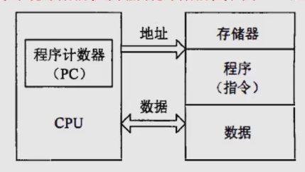
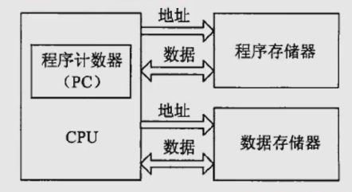

## 嵌入式微处理体系结构
冯诺依曼结构 将程序指令存储器和数据存储器合并在一起的存储器结构，采用单一的地址及
数据总线，程序指令和数据的宽度相同，处理器执行指令时，先从存储器中取出指令解码，再取操作数
执行运算，即使单条指令也要耗费几个甚至几十个周期，在高速运算时，在传输通道上会出现瓶颈效应

哈佛结构 是一种并行体系结构，主要特点是程序和数据存储在不同的存储空间中，每个存储器独立编址、独立访问。
与两个存储器相对应的是系统中的两套独立地址总线和数据总线
这种分离的程序总线和数据总线可允许在一个机器周期内同事获取指令字和操作数，从而提高了执行速度

## 微处理器分类
根据嵌入式微处理器的字长宽度，一般把16位及以下的成为嵌入式微控制器(EMC),32位及以上的称为
嵌入式微处理器。

系统集成度划分：1. 微处理器内部仅包含单纯的中央处理器单元，称为一般用途微处理器，
2. 将CPU、ROM、RAM及IO等部件集成到同一个芯片上，成为单芯片微控制器

根据用途分类
1. 嵌入式微控制器MCU - 16位及以下，典型代表：单片机，适合于控制。微控制器
最大特点是单片化，体积大大减小，从而使功耗和成本下降、可靠性提高，其片上外设资源一般比较丰富，
适合于控制，是嵌入式系统工业的主流。
2. 嵌入式微处理器MPU - 32位及以上的处理器，具有较高性能，价格也相应较高。但与计算机处理器不同
的是，在实际嵌入式应用中，只保留和嵌入式应用紧密相关的功能硬件，去除其他冗余功能部分，这样就以
最低的功耗和资源实现嵌入式应用的特殊要求。与工业控制计算机相比，嵌入式微处理器具有体积小、重量轻、
成本低、可靠性高的有点。常见有ARM、MIPS、POWER PC等
3. 嵌入式数字信号处理器DSP - 住啊们用于信号处理方面的处理器，具有很高的编译效率和指令的执行速度。
采用哈佛结构，流水线处理，处理速度比最快的cpu还快10-50倍
4. 嵌入式片上系统SOC，是追求产品系统最大包容的集成器件。最大的特点是成功实现了软硬件无缝结合，
直接在处理器片内嵌入操作系统的代码模块。其中包含完整系统并有嵌入软件的全部内容。

## 多核处理器嵌入式技术