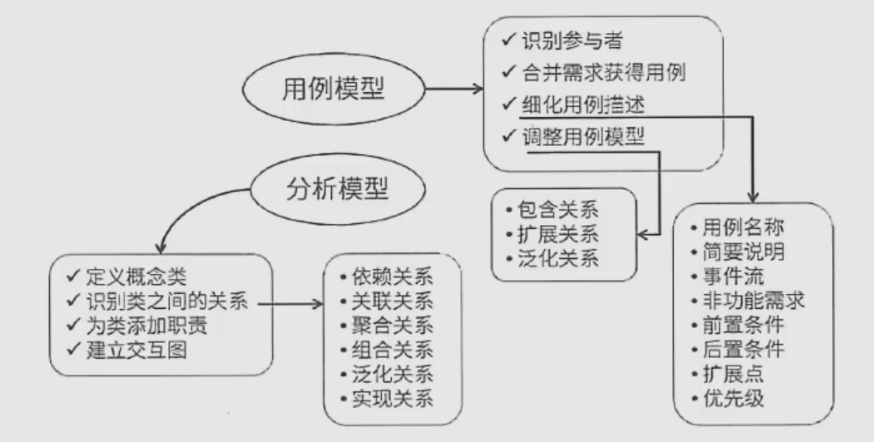
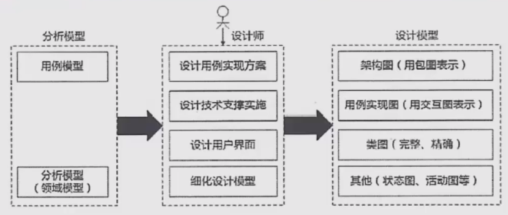

## 面向对象开发

面相对象的分析：是为了**确定问题域，理解问题**，包含5个活动
1. 认定对象
2. 组织对象（确定对象的属性）
3. 描述对象间的相互作用
4. 确定对象的操作（对象的行为）
5. 定义对象的内部信息

面向对象需求建模
1. 用例模型 E-R图
2. 分析模型 类图、

面向对象的分析模型主要由以下构成
1. 顶层架构图
2. 用例与用例图
3. 领域概念模型

设计模型包括
1. 以包图表示的软件体系结构图
2. 以交互图表示的用例实现图
3. 完整精确的类图
4. 针对复杂对象的状态图
5. 用以描述流程化处理过程的活动图等

面向对象的设计原则
1. 单一职责：仅有一个引起他变化的原因
2. 开放-封闭原则：对扩展开放，对修改关闭
3. 里氏替换原则：子类必须能替换他们的父类
4. 依赖倒置原则：抽象不应该依赖于细节，细节应该依赖于抽象。即高层模块不应该依赖低层，二者都应该依赖于抽象
5. 接口分离原则：依赖于抽象，不要依赖于具体

面向对象测试分为4个层次
1. 算法层：测试类中定义的每个方法。相当于单元测试
2. 类层：测试类中方法与属性之间的相互作用。面向对象测试特有的
3. 模块层：模块与模块之间的测试。相当于集成测试
4. 系统层：各个子系统组成完整的系统。相当于系统测试

