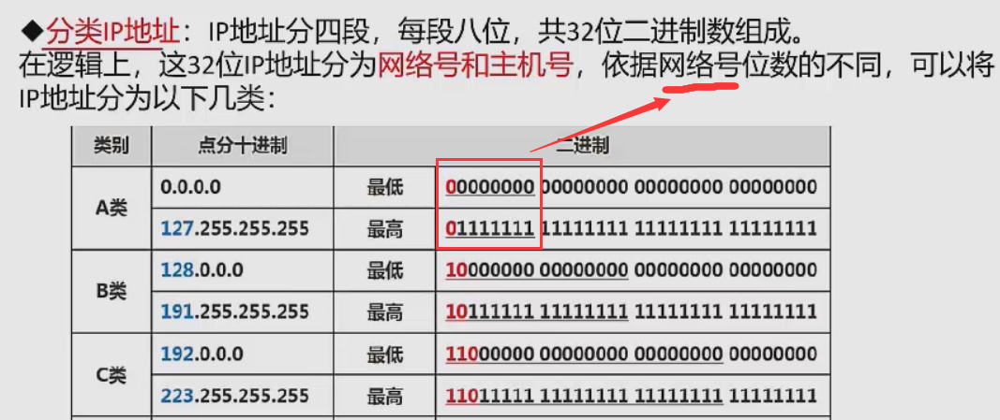
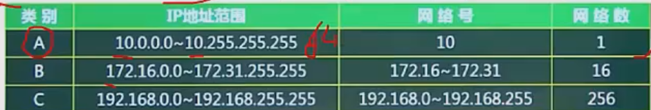
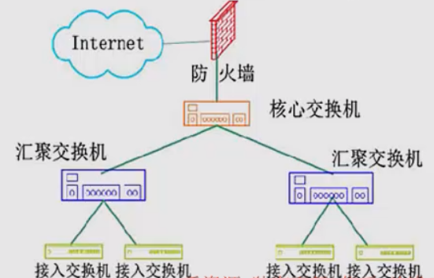
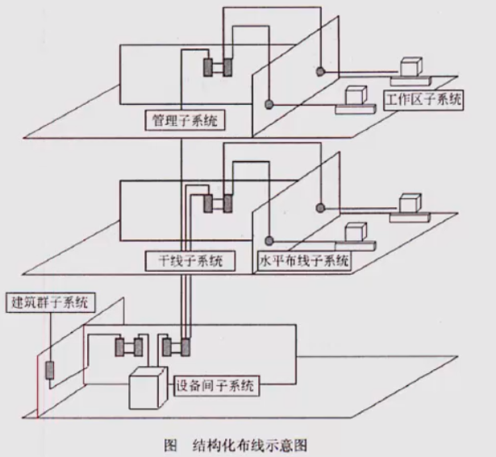

## 传输介质

双绞线
1. 无屏蔽双绞线 UTP 价格低，安装简单，可靠性相对较低
2. 屏蔽双绞线 STP 有效提高可靠性，对应的价格高，安装麻烦

光纤
1. 多模光纤MMF：可以同时传输多种不同的信号，光信号在光纤中已全反射形式传输，采用发光二极管LED为
光源，成本低，传输效率和可靠性都较低，适合短距离传输
2. 单模光纤SMF：一般只能传输一种信号，采用激光二极管LD作为光源，只支持激光信号传播，陈本高，但是
传输距离远，可靠性高，传输距离可达5km

无线信道
1. 无线电波
2. 红外光波

## 通信方式和交换方式
通信方向
1. 单工
2. 半双工
3. 全双工

同步方式
1. 异步传输
2. 同步传输

1. 串行传输
2. 并行传输

### 交换方式

1. 电路交换：二者建立专用电路，**面向连接、实时性高、链路利用率低**，一般用于音视频通信
2. 报文交换：以报文为单位，存储转发模式，接收到数据后先存储，进行差错校验，因此会**有延时，但可靠性高，面向无连接**
3. 分组交换：以分组为单位，也是存储转发，延时小于报文交换，又可分为三种方式
   1. 数据报：主流交换方式。各个分组携带地址信息，**自由选择不同的路由路径**，接收后重新组装成原数据
   2. 虚电路：发送方和接收方建立一个虚拟的通信线路，二者之间的分组数据交互都通过该线路传送，**面向连接的，可靠的**
   3. 信元交换：**本质是按照虚电路方式，不过是固定长度的分组**，也是面向连接的，可靠的。

## IP地址表示
**分类IP地址**：IP地址分四段，每段八位，共32为二进制数组成。在逻辑上，这32为IP地址分为网络号和主机号，根基网络号
位数的不同，将IP地址分为以下几类：
1. A类 网络号是8位，首位是0 ，可以表示2^24 - 2个主机，因为不能全0或全1所以要减2
2. B类 网络号是16位，10开头
3. C类 网络号是24位，110开头

**无分类编址**：不按照A B C类规则，自动规定网络号，格式为IP地址/网络号，示例128.168.0.11/20表示的IP得知
为128.168.0.11，其网络号占20位，主机号占32-20=12位，可分配的主机数量2^12 - 2 个

特殊IP地址
1. 公有地址：全网唯一的IP地址
2. 私有地址：属于非注册地址，专门为组织机构内部使用，不能直接访问因特网，下表为私有地址范围

## 子网划分

## IPv6
特性
1. IPv6地址长度为128位，IPv4长度为32位，地址空间增大了2^96倍
2. 灵活的IP报文头部格式
3. 简化了报文头部格式，加快报文转发，提高了吞吐量
4. 提高安全性，身份证中和隐私权是IPv6的关键特性
5. 支持更多服务类型等

IPv4和IPv6的过渡期间，主要采用3中基本技术
1. 双协议栈，同事支持Ipv4和v6两台协议栈
2. 隧道技术，在IPv4网络之上建立一条能够传输IPv6数据报的隧道，将IPv6的的数据报套个v4的壳
3. 翻译技术：利用专门的翻译设备（如转换网关）

## 网络规划与设计
三层模型
1. 核心层：只负责高速数据转发
2. 汇聚层：将网络业务连接到接入层，并且实施与安全、流量、负载和路由相关的策略
3. 接入层：与用户相关的能力，为用户提供了在本地网段访问引用系统的能力，解决相邻用户之间的互访需要

建筑物综合布线系统PDS
1. 工作区子系统：实现工作区终端设备（如电脑）到水平布线子系统的信息插座之间的互联
2. 水平布线子系统：实现信息插座和管理子系统之间的连接（管理某个楼层）
3. 设备间子系统：实现中央主配线架与各种不同设备之间的连接
4. 垂直干线子系统：实现各楼层设备间子系统之间的互联
5. 管理子系统：连接各楼层水平布线子系统和垂直干缆线，负责连接控制其他子系统，为连接其他子系统提供连接手段
6. 建筑群子系统：各个建筑物通信系统之间的互联

## 网络存储
磁盘冗余阵列技术RAID，将数据分散存储在不同磁盘，并可并行读取，可冗余存储，提高磁盘访问速度，保障数据安全性
1. **RAID0**，磁盘利用率100%，访问速度最快，没有冗余和错误修复技术
2. **RAID1**，在成对的独立磁盘上产生互为备份的数据，增加存储可靠性，可以纠错，磁盘利用率只有50%
3. **RAID5**，在所有磁盘上交叉存储数据及奇偶校验信息，读写可同时操作

网络存储技术
1. 直接附加存储DAS：将存储设备直接连到一台服务器上使用，本身是硬件的堆叠，

存在问题：在传递距离、连接数量、传输速率等方面都受到限制。容量难以扩展；数据处理和传输能力降低；服务器异常会波及存储器

2. 网络附加存储NAS：类似云盘，通过网络接口与网络直接相连，由用户通过网络访问

NAS的性能特点是进行小文件级的共享存取；支持即插即用；可以很经济的解决存储容量不足的问题，但难以获得满意的性能

3. **存储区域网SAN**：通过专用交换机将磁盘与服务器连接起来的高速专用子网。

最大特点是将存储设备从传统的以太网中分离出来，成为独立的存储区域网络的系统结构。

