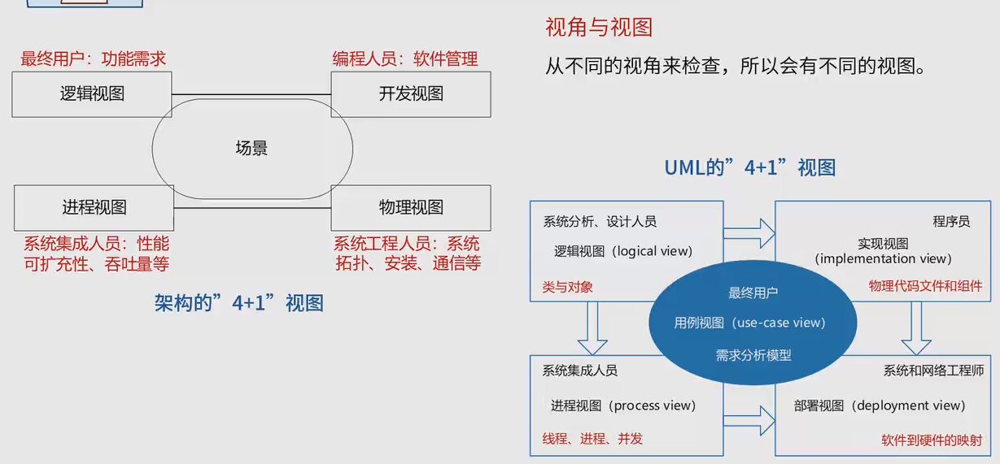

## 软件概述
软件架构=软件体系结构
**从需求分析到软件设计之间的过度过程称为软件架构。**

架构设计就是**需求分配，将满足需求的职责分配到组件上**

软件架构为软件系统提供了一个**结构、行为和属性的高级抽象，由构建的描述、构建的相互作用（连接件）、
指导构建集成的模式以及这些模式的约束** 组成

软件架构不仅**指定了系统的组织架构和拓扑结构**，并且显示了**系统需求和构件之间的对应关系** ，提供了一些
设计决策的基本原理 

解决好**软件的复用、质量和维护问题**，是研究软件架构的根本目的。

架构设计的活动包括**提出架构模型、产生架构设计、进行设计评审等**

架构设计主要关注**软件组件的结构、属性和交互作用，并通过多种视图全面描述特定系统的架构。**

软件架构考虑系统结构的可选方案，便于**技术人员与非技术人员就软件设计进行交互** ，能够**展现软件的结构、属性与内部交互关系**

架构的作用
1. 软件架构是**项目干系人进行交流的手段**
2. 软件架构是**可传递和可复用的模型，通过研究软件架构可能预测软件的质量**
3. 软件架构使**推理和控制的更改更加简单** 有助于循序渐进的原型设计，可以作为培训的基础

## 软件架构4+1视图

