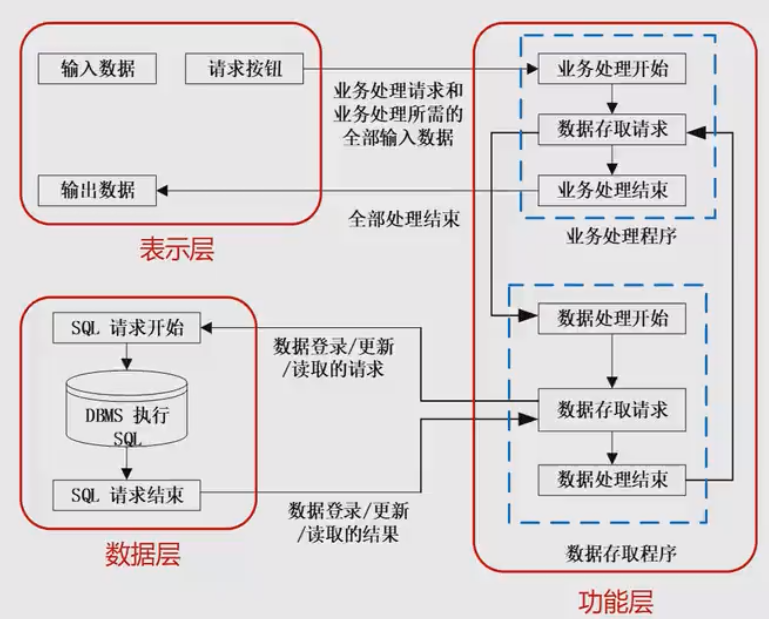
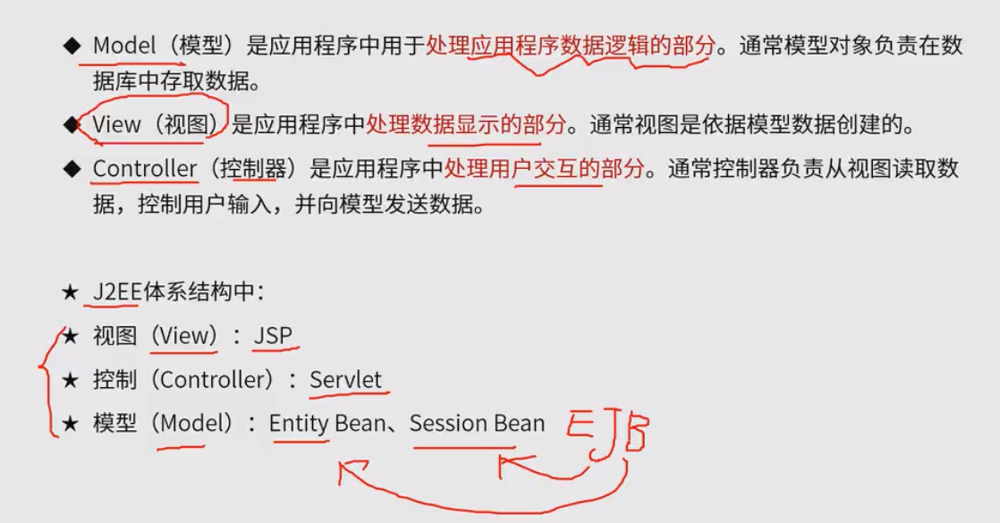
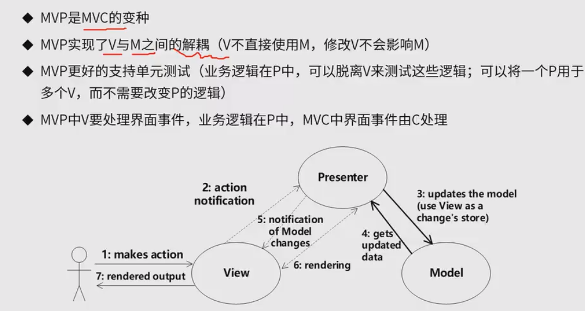
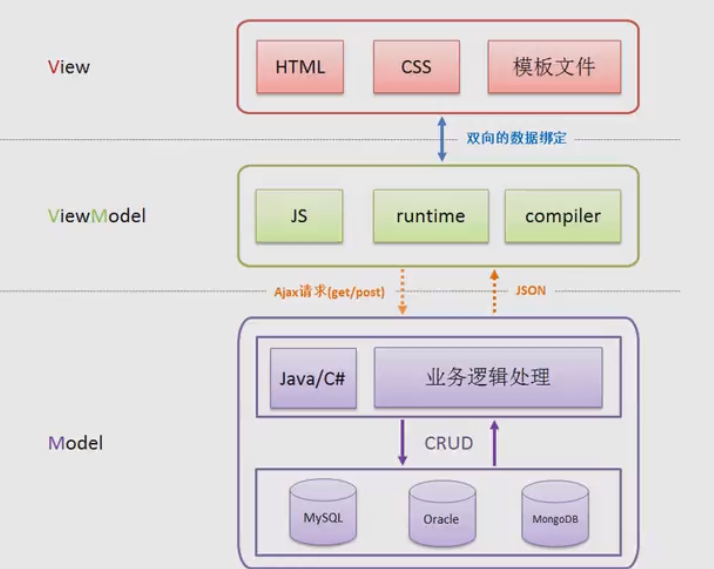
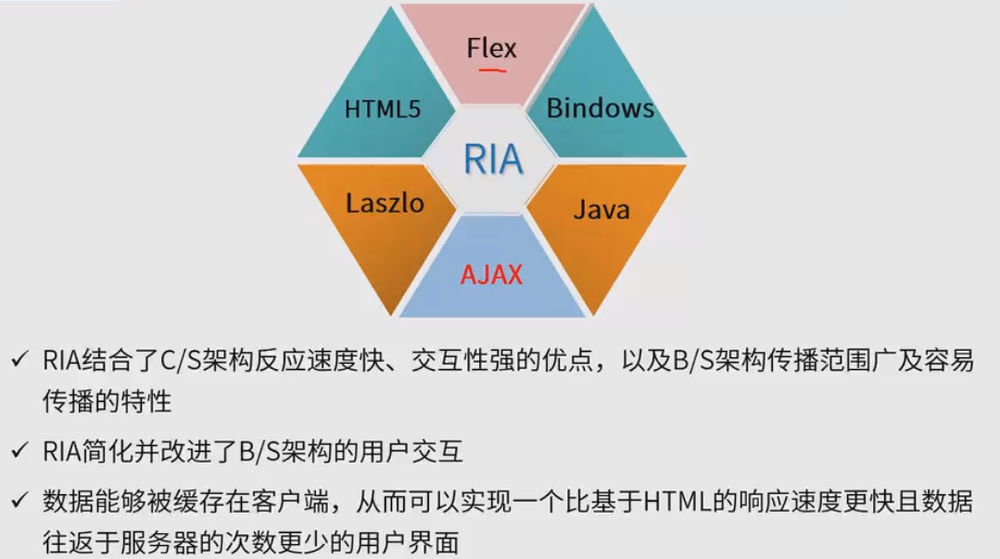
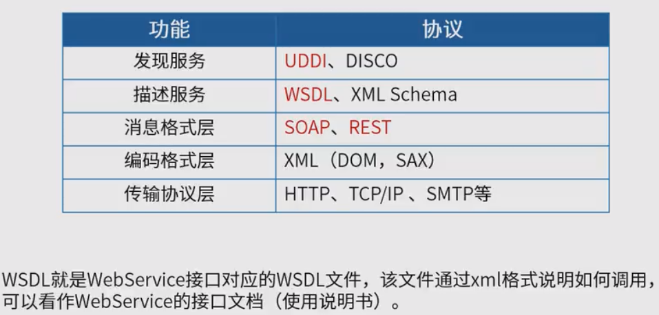
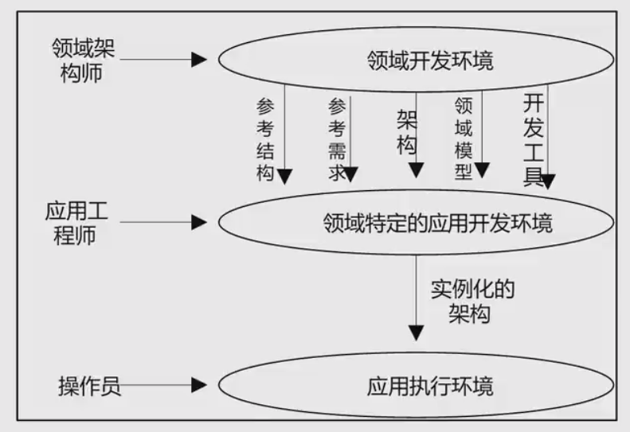

## 概述

## 数据流风格

把数据的处理分步骤处理，前一步的处理结果是后一步的输入内容，所以叫数据驱动

数据流风格分两类
1. 批处理序列：适合大量整体数据、无需用户交互
2. 管道-过滤器：适合 流式数据、若用户交互

## 调用/返回风格

分类
1. 主程序/子程序：面向过程
2. 面向对象：对象的方法调用
3. **分层**

## 独立构件

优点
1. 松耦合
2. 良好的重用性、可修改性、可扩展性

缺点
1. 构件放弃了对系统计算的控制，无法保证其他构件的响应，无法保证调用顺序
2. 各构件之间数据交换会增加成本
3. 过程需要依赖于被触发事件的上下文，正确性不好推理

特点
1. 系统由若干子系统构成且成为一个整体
2. 系统有统一的目标
3. 子系统有主从之分
4. 每一个子系统有自己的事件收集和处理机制

## 虚拟机风格 
例如 java虚拟机

子分类
1. 解释器：适合需要“自定义规则”的场合
2. 规则为中心：特点是在解释器的基础上增加经验规则，适合专家系统

优点
1. 可以灵活应对自定义场景

缺点
1. 复杂度较高，要开发虚拟机

## 仓库风格
子类
1. 数据库系统：特点是以数据为中心
2. 超文本系统
3. **黑板系统**：黑板

## 闭环控制架构（过程控制）

用于解决简单闭环控制问题，适合于嵌入式系统，不适合复杂的控制场景

经典应用：空调温控

## 层次架构风格

### CS BS架构
#### 两层CS架构
客户端为胖客户端

#### 三层C/S架构

客户端为瘦客户端

#### B/S架构
客户端为0客户端

#### 混合架构
B/S、C/S混合

### 三层B/S
#### MVC

#### MVP

#### MVVM
通过中间层进行数据交换，与mvp没什么本质上的区别

#### RIA 富互联网

## 基于服务架构 SOA 

服务是一种为了满足某项业务需求的操作、规则等的逻辑组合，它包含一系列有序活动的交互，未实现用户目标提供支持

服务相比构件的标准化更高

服务的特点
1. 松耦合
2. 粗粒度
3. 标准化接口

SOA的实现方式
1. web service
组成元素 服务注册中心、服务提供者、服务请求者

2. esb （企业服务总线）：主要用于数据交换、集成，将服务请求者与服务提供者之间解耦

## 微服务
特点
1. 小 专注于做一个事
2. 轻量级的通信机制
3. 松耦合、独立部署

优势
1. 技术异构性 不同服务可以用不同技术
2. 弹性
3. 扩展
4. 简化部署，需要应用一些自动化部署的工具
5. 与组织结构相匹配
6. 可组合性
7. 对可替代性的优化

挑战
1. 分布式系统 复杂度高
2. 运维成本高
3. 部署自动化
4. DevOps与组织结构
5. 服务间依赖测试和管理

## MDA（模型驱动架构）
3种核心模型
1. 平台独立模型（PIM）：具有高抽象层次、独立于任何实现的技术模型
2. 平台相关模型（PSM）：为某种特定技术量身定做，例如java
3. 代码：将PSM变化成代码

主要目标
1. 可移植性
2. 互通性
3. 可重用性

## ADL 架构描述语言
ADL的基本元素
1. 构件
2. 连接件
3. 架构配置：描述构件与连接件的连接图

## 特定领域软件架构（DSSA）

基本步骤
1. 领域分析
2. 领域设计
3. 领域实现

垂直域：相同领域，深入研究
水平域：不同领域，平移

人员角色
1. 领域专家：主要任务包括提供关于领域中系统的需求规约和实现的知识
2. 领域分析人员：需求分析
3. 领域设计人员：系统设计
4. 领域实现人员：编码

建立过程
1. 定义领域范围
2. 定义领域特定元素
3. 定义领域特定的设计和实现需求约束
4. 定义领域模型和架构
5. 产生搜集可复用的产品单元 --> 1.定义领域范围

三层次模型

## 其他

### C2风格
是层次架构的一种

