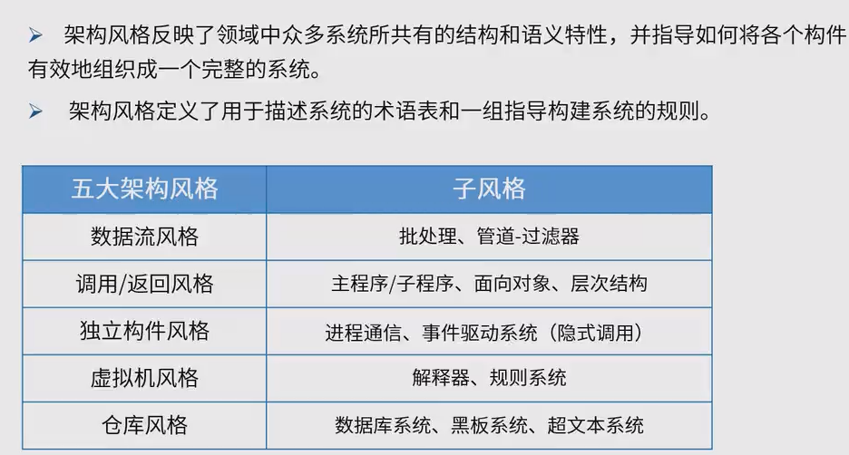
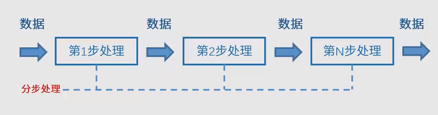
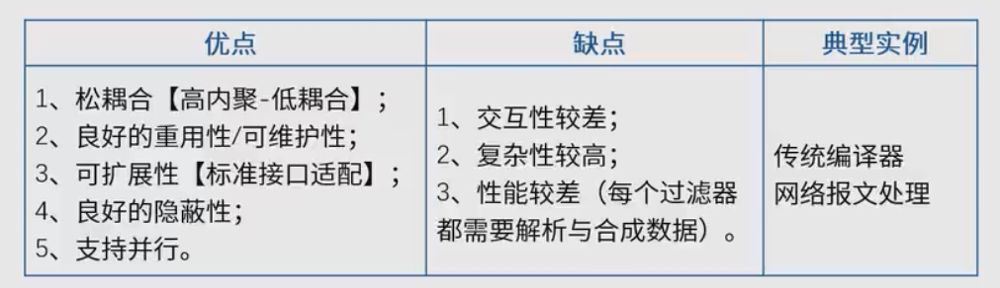
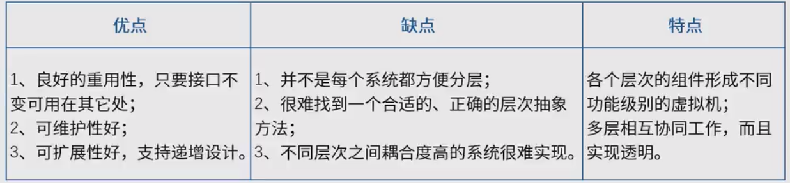
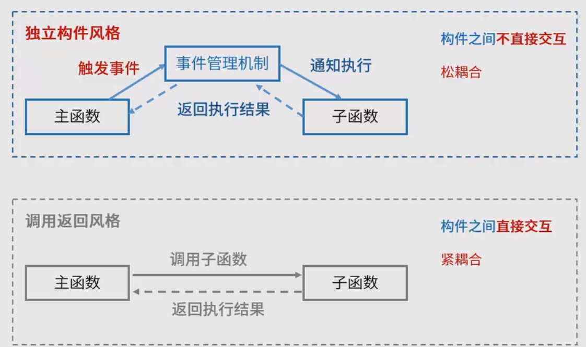
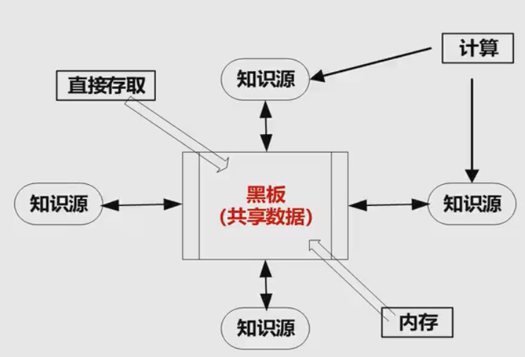
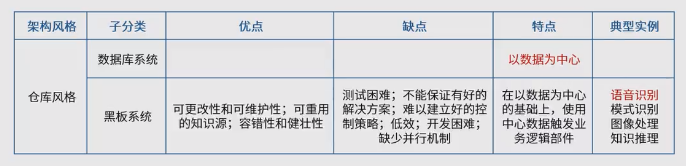
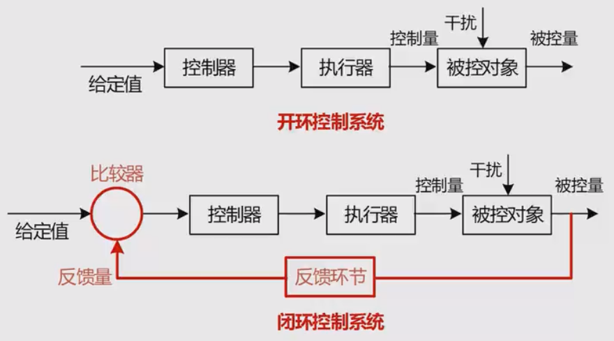
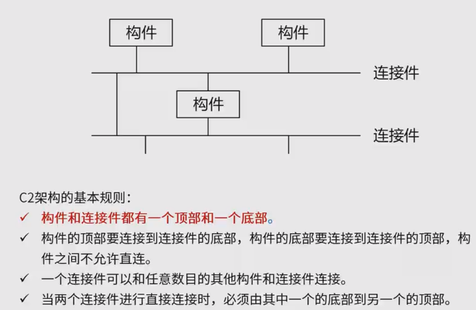

## 概述

## 数据流风格

把数据的处理分步骤处理，前一步的处理结果是后一步的输入内容，所以叫数据驱动

数据流风格分两类
1. 批处理序列：适合大量整体数据、无需用户交互
2. 管道-过滤器：适合 流式数据、若用户交互

## 调用/返回风格

分类
1. 主程序/子程序：面向过程
2. 面向对象：对象的方法调用
3. **分层**

## 独立构件

优点
1. 松耦合
2. 良好的重用性、可修改性、可扩展性

缺点
1. 构件放弃了对系统计算的控制，无法保证其他构件的响应，无法保证调用顺序
2. 各构件之间数据交换会增加成本
3. 过程需要依赖于被触发事件的上下文，正确性不好推理

特点
1. 系统由若干子系统构成且成为一个成体
2. 系统有统一的目标
3. 子系统有主从之分
4. 每一个子系统有自己的事件收集和处理机制

## 虚拟机风格 
例如 java虚拟机

子分类
1. 解释器：适合需要“自定义规则”的场合
2. 规则为中心：特点是在解释器的基础上增加经验规则，适合专家系统

优点
1. 可以灵活应对自定义场景

缺点
1. 复杂度较高，要开发虚拟机

## 仓库风格
子类
1. 数据库系统：特点是以数据为中心
2. 超文本系统
3. **黑板系统**：黑板

## 闭环控制架构（过程控制）

用于解决简单闭环控制问题，适合于嵌入式系统，不适合复杂的控制场景

经典应用：空调温控

## 层次架构风格

## 其他

### C2风格
是层次架构的一种

