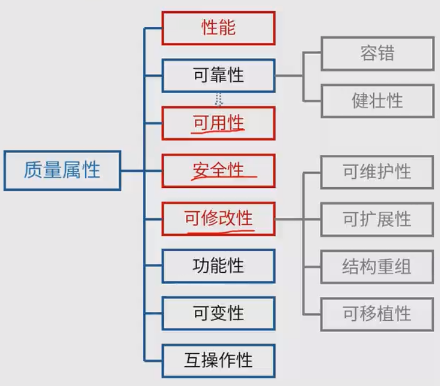
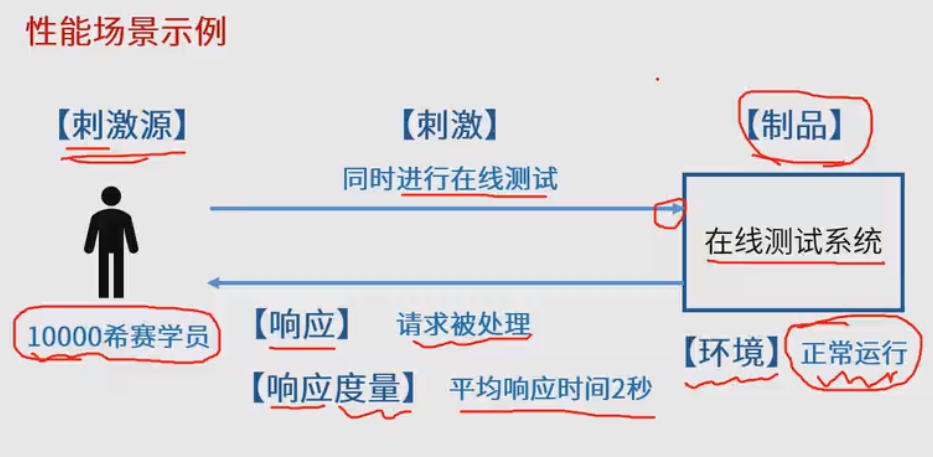
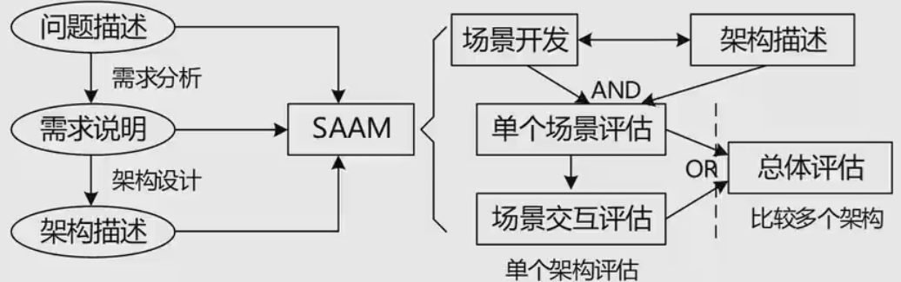
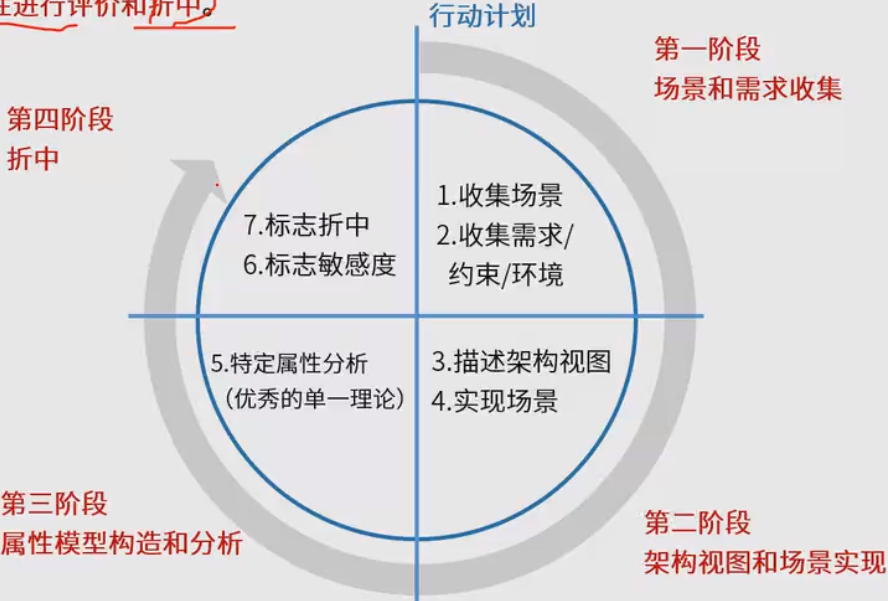

## 软件架构评估

### 软件质量属性 概览

### *性能
性能是指**系统的响应能力**，即要经过多长时间才能对某个事件作出响应，或者在某段时间内系统所能
处理的事件的个数。

提高性能战术
1. 资源需求：减少对资源的诉求
   1. 提高计算效率
   2. 减少计算开销
   3. 管理事件率
   4. 控制采样频率
2. 资源管理
   1. 引入并发
   2. 维持多个副本
   3. 增加可用资源
3. 资源仲裁：资源调度策略
   1. 先进先出
   2. 动态优先级等

## *可用性
系统能够正常运行的时间比例。经常使用两次故障之间的时间长度或在出现故障是系统能够恢复正常的速度表示。
例如
1. 主服务故障，1分钟内切换到备用服务器
2. 系统故障，1小时内修复
3. 系统支持7*24小时工作

提高可用性战术
1. 错误检测
   1. 命令/响应【ping/echo】
   2. **心跳**
   3. 异常
2. 错误恢复
   1. 表决
   2. **冗余【主动/被动】**
   3. 备件
3. 错误预防
   1. 进程监视器
   2. 事务
   3. 把有问题的从服务器删除

## *安全性
指系统在向合法用户提供服务的同时能够阻止非授权用户使用的企图或拒绝服务的能力。
分类
1. 机密性
2. 完整性
3. 不可否认性
4. 可控性等

提高安全性战术
1. 抵抗攻击
   1. 身份验证
   2. 用户授权
   3. 数据加密
   4. 限制访问等
2. 检测攻击
   1. 入侵检测
3. 从攻击中恢复
   1. 识别：**审计追踪**
   2. 恢复：冗余【与可用性重叠】

## *可修改性
指能够快速地以较高的性能价格比对系统进行变更的能力。

提高可修改性
1. 局部化修改
   1. 维持语义一致性
   2. 预期期望的变更
2. 防止连锁反应
   1. **隐藏信息** ，如属性定义为private，通过接口变动
3. 推迟绑定时间

## 易用性
界面友好；学习成本低；

## 可测试性
指通过测试揭示软件缺陷的容易程度，例如提供远程调试接口，支持远程调试

## 敏感点、权衡点、风险点、非风险点 
敏感点：一个或多个构件的特性，对系统有所影响

权衡点：影响多个质量属性的特性，是多个质量属性的敏感点。例如安全和性能的权衡，两个质量属性负相关，需要权衡

风险点：架构设计中潜在的、存在问题的架构决策所带来的隐患

非风险点：不会带来隐患

## 架构评估方法

场景的描述元素
1. 刺激源
2. 制品
3. 刺激
4. 环境
5. 响应
6. 响应度量

## 软件架构评估-SAAM
最初用于分析架构可修改性，后扩展到其他质量属性

## 软件架构评估-ATAM
在SAAM的基础上发展起来的，主要针对性能、实用性、安全性、可修改性

