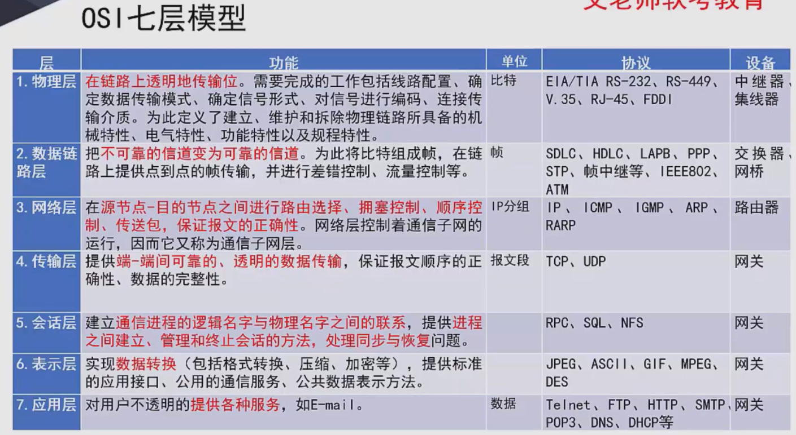
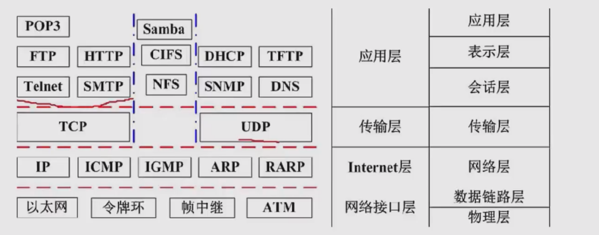
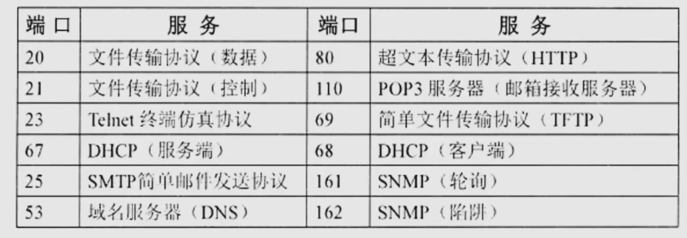

## 通信技术
信道可分为物理信道和逻辑信道。

同事传递多路数据需要复用技术和多址技术。

5G网络的主要特征：服务化架构、网络切片。

## 七层协议模型

## 局域网和广域网协议
以太网是局域网的代表

以太网是数据链路层 通过MAC地址通信

以太网最小帧长 64字节 

广域网相关技术：同步光网络（SONET利用光线通信）、数字数据网（DDN利用数字信道提供半永久性连接电路
以传输数据）、帧中继（数据包交换技术）、异步传输技术（ATM）

## TCPIP协议
网络协议三要素：语法、语义、时序。

TCP 4层网络模型：应用层、传输层、网络层、网络接口层

网络层协议：
1. IP 网络层最重要的核心协议，在源地址和目的地址之间的传送数据报，**无连接、不可靠**。
2. ICMP 因特网控制报文协议，用于在IP主机、路由器之间传递控制消息。就是指网络通不通、主机是否可达等
3. ARP和RARP 地址解析协议，ARP是将IP地址转换为物理地址，RARP是将物理地址转为IP地址
4. IGMP 网络组管理协议

传输层协议
1. TCP：采用了重发技术，为应用程序提供了一个可靠的、面向连接的、全双工的数据传输服务。用于传输数据量少，
且对可靠性要求高的场合。
2. UDP：不可靠、无连接的协议，有助于提高传输速率，一般用于传输数据量大，对可靠性要求不高，但要求速度快的场景

应用层协议
1. 其中采用TCP协议的有
   1. FTP
   2. HTTP
   3. SMTP和POP3：简单邮件传输协议
   4. Telnet：远程连接协议
2. 采用UDP协议的
   1. TFTP：不可靠的、开销不大的小文件传输协议
   2. SNMP：简单网络管理协议
   3. DHCP：动态主机配置协议
   4. DNS：域名解析协议

协议端口对照表 

网络建设工程可分为网络规划、网络设计、网络实施三个环节
