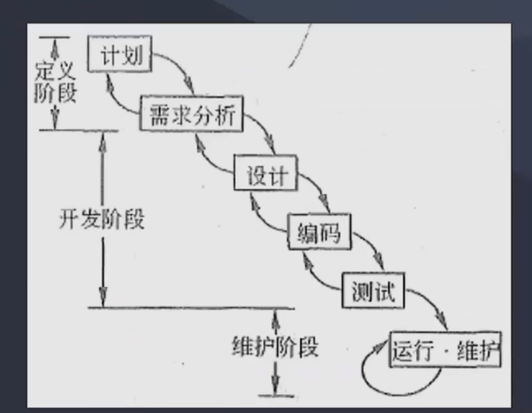
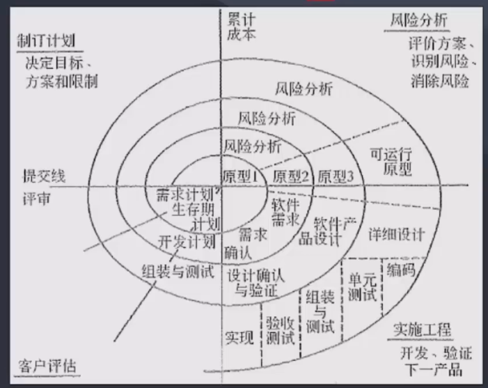
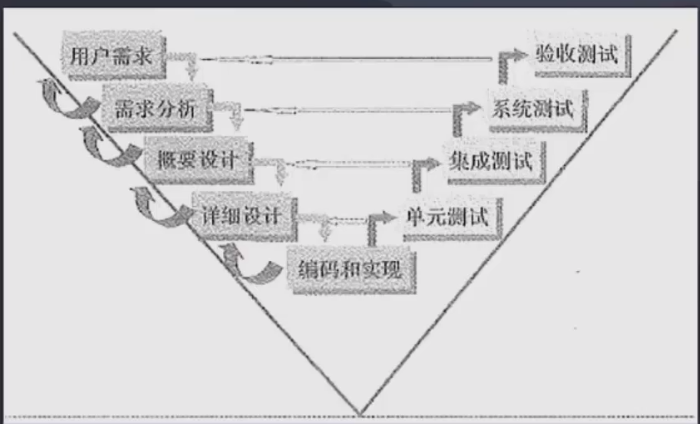
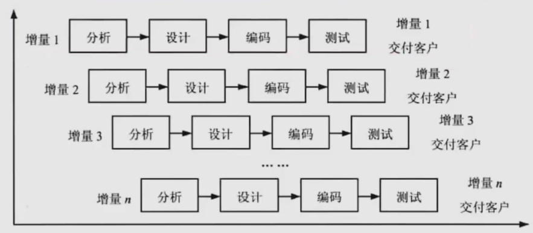

## 软件工程概述
软件开发生命周期
1. 软件定义时期：包括可行性研究和详细需求分析过程
2. 软件开发时期：软件的设计与实现，可分为概要设计、详细设计、编码、测试等
3. 软件运行和维护：把软件产品移交给用户使用

软件系统的文档
1. 用户文档：描述系统的功能和使用方法
2. 系统文档：系统设计、实现和测试等各方面的内容

软件工程过程是指为获取软件产品的以下4个方面的活动
1. P（Plan）-- 软件规格说明
2. D（Do）-- 软件开发
3. C（Check）-- 软件确认
4. A（Action）-- 软件演进

软件系统工具
1. 开发工具
2. 维护工具
3. 软件管理和软件支持工具

软件设计的四个活动
1. 数据设计
2. 架构（体系结构）设计
3. 人机界面（接口）设计
4. 过程设计

## 能力成熟度模型

能力成熟度模型（CMM）
1. 初始级：杂乱无章，项目的成功完全依赖个人的努力和英雄式核心人物的作用
2. 可重复级：建立了基本的项目管理过程和实践来跟踪项目费用、进度和功能特性。有必要的过程准则来重复以前在同类项目中的成功
3. 已定义级：管理和工程两方面的软件过程已经文档化、标准化，并综合成整个软件开发组织的标准软件过程
4. 已管理级：制定了软件过程和产品质量的详细度量标准
5. 优化级：不断持续的改进

能力成熟度模型集成CMMI
阶段式模型
1. 初始级
2. 已管理级
3. 已定义级
4. 定量管理
5. 优化级

## 软件过程模型
### 瀑布模型
软件开发阶段
1. 可行性分析（计划）
2. 需求分析
3. 软件设计（概要设计、详细设计）
4. 编码（含单元测试）
5. 测试
6. 运行维护

特点
1. 从上一项开发活动接受该活动的工作对象作为输入
2. 利用该输入，实施该项活动应完成的工作内容
3. 该活动的工作成果，作为输出传给下一项开发活动
4. 对活动的实施工作成果进行评审，如果得到确认则进行下一项，否则返回前一项

### 螺旋模型
定义：是一个演化软件过程模型，将原型实现的迭代特征与线性顺序（瀑布）模型中控制的系统化的方面结合起来。
在螺旋模型中，软件开发是一系列增量发布

开发过程具有周期性重复的螺旋线状。四个象限分别标志每个周期所划分的四阶段：**制定计划、风险分析、实施工程、客户评估**
螺旋模型强调了**风险分析**，特别适合**庞大而复杂的、高风险的系统**

### V模型
强调测试，特点是
1. 单元测试，针对编码过程（单编）
2. 集成测试，针对详细设计（集详）
3. 系统测试，针对概要设计（系概）
4. 验收测试，针对需求分析和用户需求（验需）
5. **V模型用于需求明确和需求变更不频繁的情形**

### 原型化模型
创建一个快速原型，适用于需求不确定情况

### 增量模型
首先开发核心模块功能，再开发次核心模块功能，优先级最高的服务最先交付，每个增量版本都可以作为独立可操作性的作品

### 敏捷模型
开发宣言：**个体和交互胜过过程和工具、可以工作的软件胜过面面俱到的文档、客户合作胜过合同谈判、响应变化胜过遵循计划**

特点
1. **适应性**而非预设性
2. **面向人的**而非面向过程的
3. 迭代增量式开发过程

主要敏捷方法
1. 极限编程（XP）：加强交流，从简单做起，寻求反馈，勇于实事求是，XP是一种近螺旋式的开发方法，将复杂的开发过程
分解为一个个相对简单的小周期，提倡测试先行
2. 水晶系列方法，强调以人为中心。目的是发展一种提倡“机动性的“方法，每个都含有独特的角色、过程模式、工作产品和实践
3. 并列争球法。是一种迭代的增量化过程，把每段时间（如30天）一次的迭代称为一个冲刺（Sprint）
4. 特性驱动开发。迭代的开发模型。
   1. 有效的软件开发需要3个要素：
      1. 人
      2. 过程
      3. 技术
   2. 5个核心过程:
      1. 开发整体对象模型
      2. 构造特征列表
      3. 计划特征开发
      4. 特征设计
      5. 特征构建
### 统一过程模型RUP
RUP描述了如何有效地利用商业的、可靠的方法开发和部署软件，是一种重量级过程。
RUP软件开发生命周期是一个二维的软件开发模型，RUP中有9个核心工作流
1. 业务建模
2. 需求
3. 分析与设计
4. 实现：开发与单元测试
5. 测试
6. 部署
7. 配置与变更管理
8. 项目管理
9. 环境

将软件开发过程分为4个阶段
1. 初始阶段：确定系统范围，需求
2. 细化阶段：设计及确定系统的体系结构
3. 构造阶段：构造产品并继续演进需求
4. 移交阶段：提交给用户使用

核心概念
1. 角色who：架构师、开发、测试等
2. 活动how：活动是有明确目的的独立工作单元
3. 制品what：制品是活动生成、创建或修改的一段信息
4. 工作流when：工作流描述了一个有意义的连续的活动序列，并显示了角色的关系

特点
1. 用例驱动
2. 以体系结构（架构）为中心：会采用多个视图来描述。如4+1视图模型：
   1. 用例视图（核心）
   2. 逻辑视图
   3. 实现视图
   4. 进程视图
   5. 部署视图
3. 迭代与增量

### 其他
1. 喷泉模型，**面向对象的开发方法**
2. 基于构件的开发模型CBSD：预先**包装的构件来构造应用系统**，特点是增强了**复用性**，节省时间和成本
3. 形式化方法模型：建立在**严格数学基础**上的开发方法

## 逆向工程

逆向工程：分析程序，力图在比源代码更高抽象层次上建立程序的表示过程，逆向工程是程序的恢复过程。逆向工程
的4个级别
1. 实现级：如过程的设计表示
2. 结构级：例如调用图、结构图、数据结构
3. 功能级：例如数和控制流模型
4. 领域级：例如E-R模型

其中领域级抽象级别越高，完备性最低，实现级抽象最低，完备性最高

