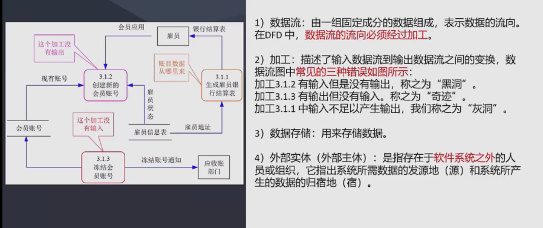

## 软件需求

### 需求定义
1. 业务需求 反应企业或客户对系统高层次的目标要求，抽象程度较高
2. 用户需求 描述用户的具体目标，或用户要求系统必须要完成的任务，即描述用户能使用系统做什么。通常使用
调查问卷等方式收集
3. 系统需求 从系统的角度来描述需求
   1. 功能需求：描述开发人员必须要实现的系统功能
   2. 非功能需求：系统必须具备的属性或品质，如软件质量属性（可扩展性、安全性、稳定性、效率等）和其他
   3. 设计约束：通常是对系统的一些约束说明，如必须使用国产数据库等

### 需求获取
获取方式
1. 用户访谈 选有代表性的用户，
2. 问卷调查
3. 采样：
4. 情节串联版：一系列图片，通过这些图片讲故事
5. 联合需求计划（JRP）：联合关键客户代表、系统分析师、开发团队一起，开会讨论需求

### 需求分析
定义：一个好的需求应具备无二义性、完整性、一致性、可测试性、确定性、可跟踪性、正确性、必要性等。
需求分析的工作就是把杂乱无章的用户要求和期望转化为用户需求。

需求分析的任务
1. 绘制系统上下文范围关系图
2. 用户界面原型
3. 分析需求的可行性
4. 确定需求的优先级
5. 为需求建立模型
6. 创建数据字典
7. 使用QFD（质量功能部署）

结构化的需求分析：

特点：自顶向下，逐步分解，面向数据

三大模型：功能模型（数据流图）、行为模型（状态转换图）、数据模型（E-R图）以及数据字典

数据流图DFD

数据字典DD
定义：数据字典是为数据流图中的每个数据流、文件、加工，以及组成数据流或文件的数据项做出说明。
数据字典有以下4类条目：数据流、数据项、数据存储和基本加工

加工逻辑也称为小说明，常用的加工逻辑描述方法有结构化语言、判定表和判定树3种

### 需求定义
是整个开发工作的基础

需求定义方法
1. 严格定义（预先定义）：前提是所有需求都能够被预先定义
2. 原型方法：迭代的循环型开发方式，适合需求不明确的情况

### 需求验证
目的是与用户一起确认需求无误，包括两个步骤
1. 需求评审：正式评审和非正式评审
2. 需求测试：设计概念测试用例

需求验证通过后，要请用户签字确认，作为验收标准之一，作为需求基线

### 需求管理
定义需求基线：通过了评审额需求说明书就是需求基线，如果要变更，需要按流程来一步步进行

需求变更

需求跟踪
双向跟踪：正向跟踪是根据需求文档对系统功能进行验证，是否能够完全覆盖文档内容，
反向跟踪是梳理系统的功能，是否都符合需求文档的描述，不多不少

