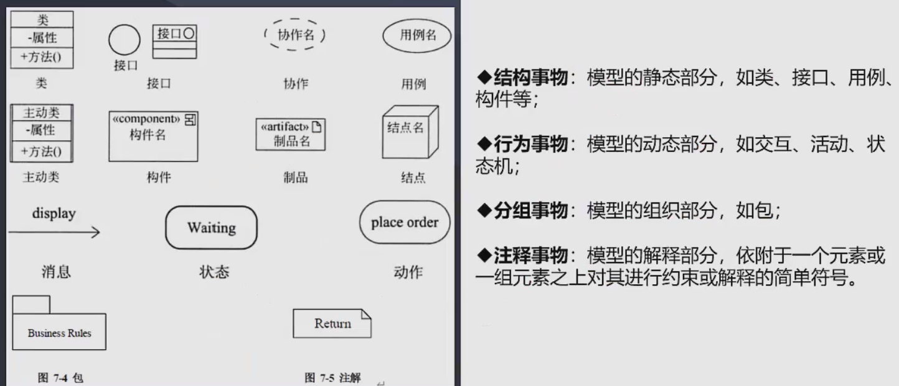
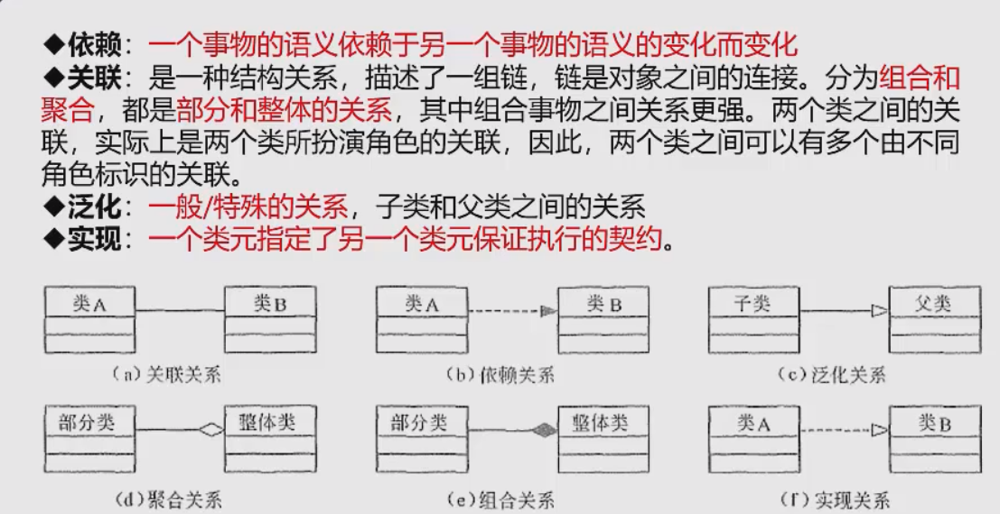
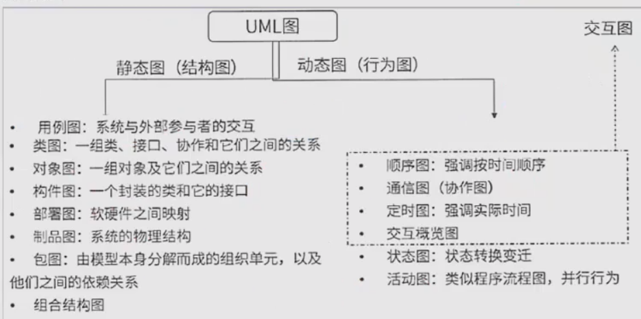

## UML
UML：结构包括
1. **构造块**：包含3中基本的构造块
   1. 事物
   2. 关系：把事物联系在一起
   3. 图：多个相互关联的事物的集合
2. 规则
3. 公共机制

事物：

**关系：**

图：
1. 静态图（结构图）
   1. **类图**：展现一组对象、接口、协作和他们之间的关系
   2. 对象图：类图的某一时刻的快照
   3. **用例图**：展现了一组用例、参与者以及他们之间的关系。用例之间的关系有**扩展、包含、泛化**。
      1. 包含：在做一个操作之前必须做另外一件事，比如说登录
      2. 扩展：在做一个操作时，也可以做另外一个事
      3. 泛化：父子关系
   4. 构件图（组件图）：展现了一组构件之间的组织和依赖
   5. 部署图：物理模块的节点分布
2. 动态图（行为图）
   1. **序列图（顺序图、动态图）**：以时间顺序组织对象之间的交互活动
   2. 通信图（协作图）：强调参加交互的对象的组织
   3. **状态图**：描述单个对象在多个用例中的行为
   4. 活动图：是一种特殊的状态图，展现了在系统内从一个活动到另一个活动的流程 

UML 4+1视图
1. 逻辑视图（设计视图）：类、子系统、包、用例实现的子集
2. 进程视图：他是逻辑视图的一次执行实例，描述了并发与同步结构
3. 实现视图：物理代码文件和组件进行建模
4. 部署视图：把构件部署到一组物理节点上，表示软件到硬件的映射和分布结构
5. 用例视图：用例图，需求分析模型