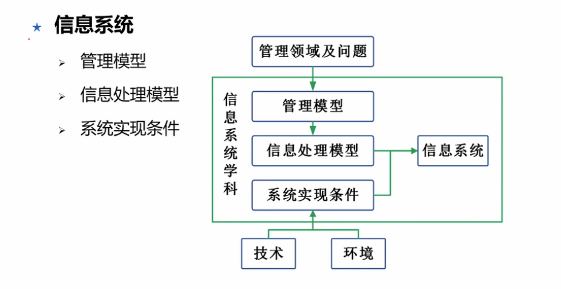

## 信息系统的内涵与特征
### 内涵
广义： 组织是基础、管理是框架、信息技术是工具

### 信息系统的组成
硬件、软件、数据库、网络、存储设备、感知设备、外设、人员、规程

### 特征
复杂性、动态性、可扩展性、易用性、实时性、安全性、可靠性、成本效益

## 我国信息化发展战略
### 三步走
技术+产业+资源
1. 第一步2020年 核心关键领域达到国际先进水平
2. 第二步2025年 移动通讯等达到国际领先
3. 第三步到21世纪中叶 全面信息化

### “十四五”国家信息化规划
数字化建设为核心

## 信息系统抽象模型

1. 管理模型：领域知识、模型
2. 信息处理模型：强调结构、方法、数据流转
3. 系统实现条件：技术资源、运行条件等

## 信息系统生命周期

## 信息系统的结构
