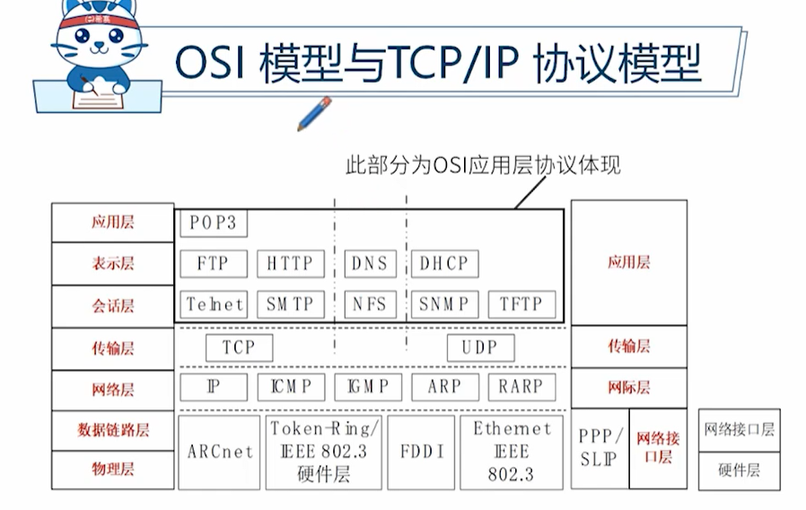
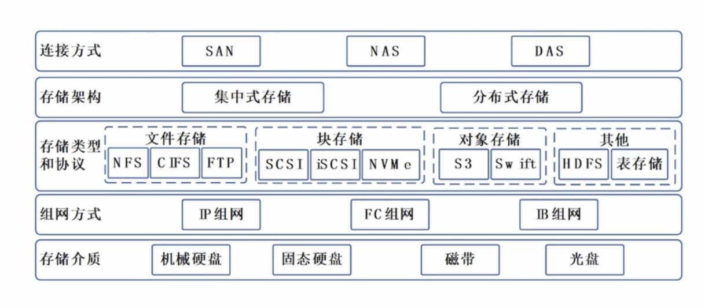
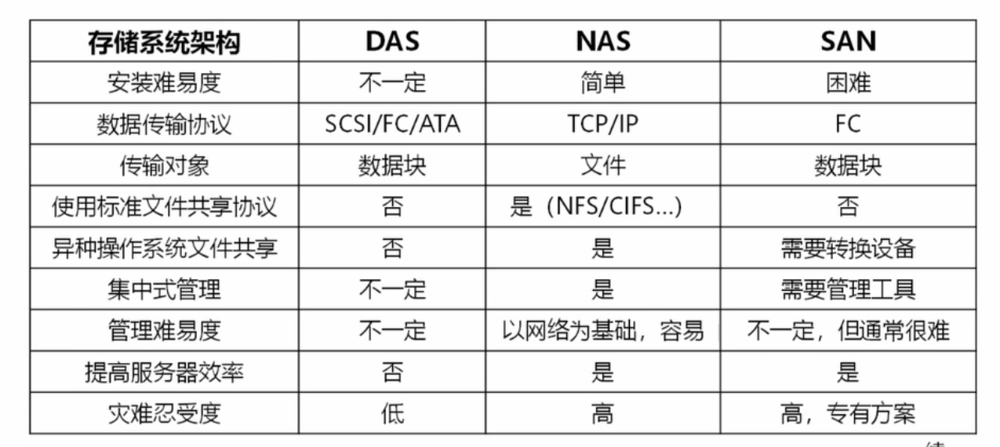

## 计算机软硬件
硬件 冯诺依曼计算机结构：控制器、运算器、存储器、输入设备、输出设备

软件 系统软件（操作系统、数据库、中间件）、应用软件

## 计算机网络

### 分类
1. 网络的作用范围 （互联网涵盖下面所有）
   1. 个人局域网
   2. 局域网
   3. 城域网
   4. 广域网
2. 使用者角度
   1. 公用网
   2. 专用网 例如政务内网

### 基本组成

网络硬件设备 交换机、路由器等

网络协议
1. OSI 7层理论模型 
2. TCP/IP协议 TCP(传输控制协议，可靠连接)、UDP(不可靠、快速传输)是传输层协议 IP是网络层协议
3. IEEE 802协议族 网卡如何访问传输介质

OSI 7层模型说明
1. 应用层
2. 表示层  数据转化加密
3. 会话层 建立会话
4. 网络层 分组传输、路由选择，选择最优路径
5. 数据链路层  打包数据帧
6. 物理层 二进制

### 软件定义网络 SDN

让网络管理更简单直观、灵活

### 5G
应用场景
1. 增强移动宽带 - 移动互联网
2. 超高可靠，低时延通信 - 工业控制、自动驾驶
3. 海量机器类通信 - 传感、采集数据

## 数据存储和数据库

### 存储类型

连接方式上区分
1. SAN(存储区域网络)，专业、高速、贵
2. NAS(网络附加存储) 文件共享平台
3. DAS(直接附加存储) 直接挂接磁盘等到主机上 存储量有限

存储架构
1. 集中式
2. 分布式

### 数据结构模型
常见的三种数据结构模型
1. 层次模型  树结构 - 族谱  一对多
2. 网状模型  有向图，多对多关系
3. 关系模型 二维表，信息一致靠规范

### 数据库类型

关系型数据库，特点
1. A 原子性 
2. C 一致性 
3. I 隔离性 
4. D 持久性 

非关系型数据库
1. 键值数据库 
2. 列存储数据库
3. 面向文档数据库
4. 图形数据库

## 信息安全

常见的信息安全问题
1. 计算机病毒泛滥
2. 恶意软件的入侵
3. 黑客攻击
4. 利用计算机犯罪
5. 网络有害信息泛滥
6. 个人隐私泄露

信息安全基本属性
1. **保密性** 不泄露给非授权用户
2. **完整性** 防止非法篡改
3. **可用性** 防止系统故障，随时提供服务
4. 可控性 必要控制管理
5. 不可否认性 提供信息证据

信息安全技术和措施
1. 身份认证 密码、短信等
2. 访问控制 访问权限管理
3. 入侵检测
4. 防火墙
5. 网闸
6. 防病毒
7. 数据加密技术
