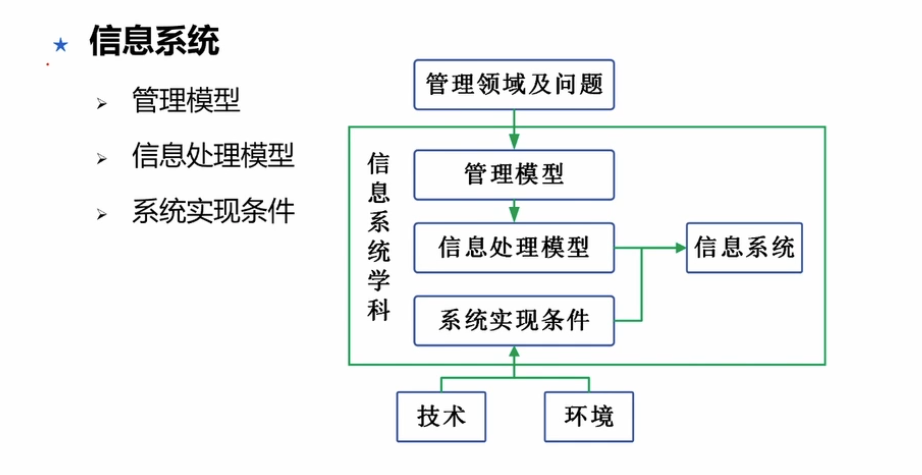
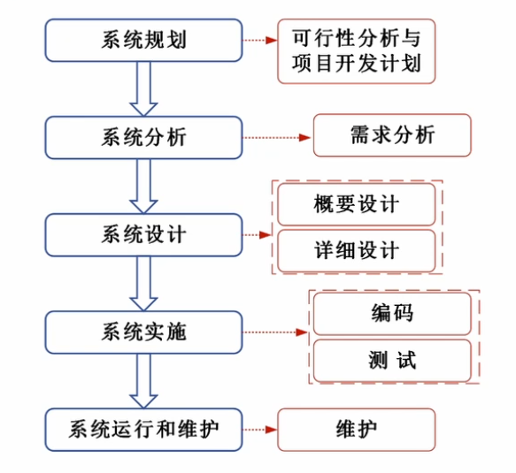
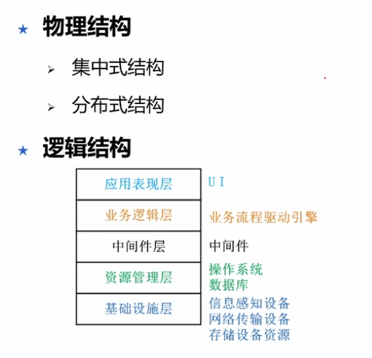
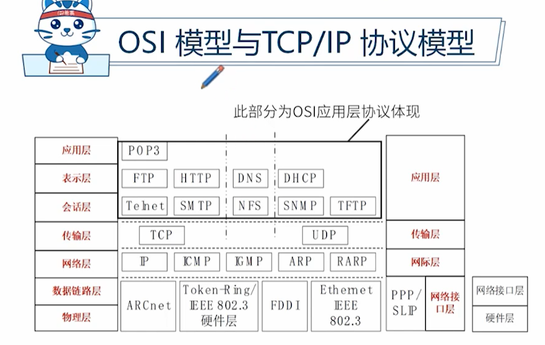
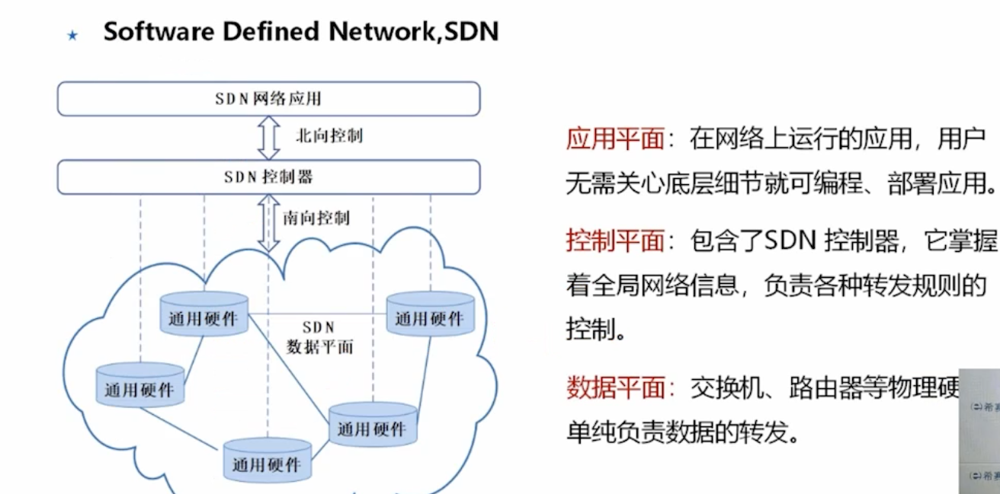
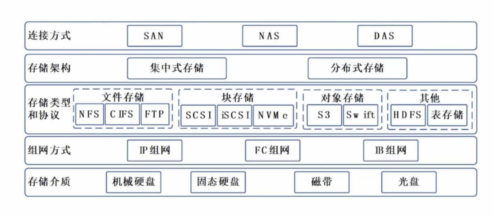
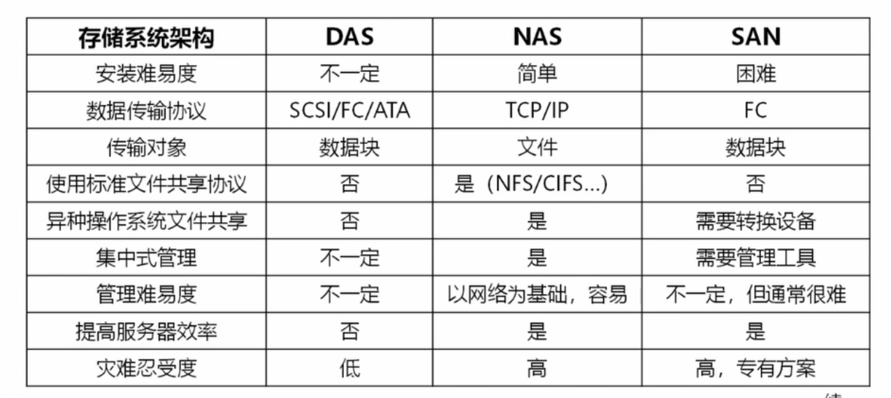
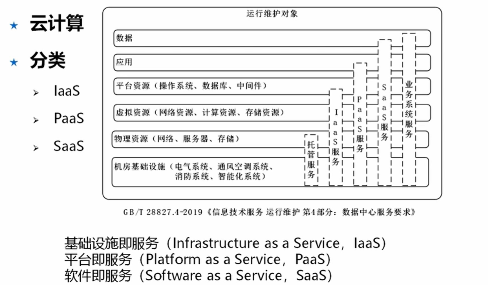

# 信息系统与信息技术发展
## 信息系统的内涵与特征
### 内涵
广义： 组织是基础、管理是框架、信息技术是工具

### 信息系统的组成
硬件、软件、数据库、网络、存储设备、感知设备、外设、人员、规程

### 特征
复杂性、动态性、可扩展性、易用性、实时性、安全性、可靠性、成本效益

## 我国信息化发展战略
### 三步走
技术+产业+资源
1. 第一步2020年 核心关键领域达到国际先进水平
2. 第二步2025年 移动通讯等达到国际领先
3. 第三步到21世纪中叶 全面信息化

### “十四五”国家信息化规划
数字化建设为核心

## 信息系统抽象模型

1. 管理模型：领域知识、模型
2. 信息处理模型：强调结构、方法、数据流转
3. 系统实现条件：技术资源、运行条件等

## 信息系统生命周期

## 信息系统的结构

## 计算机软硬件
硬件 冯诺依曼计算机结构：控制器、运算器、存储器、输入设备、输出设备

软件 系统软件（操作系统、数据库、中间件）、应用软件

## 计算机网络

### 分类
1. 网络的作用范围 （互联网涵盖下面所有）
    1. 个人局域网
    2. 局域网
    3. 城域网
    4. 广域网
2. 使用者角度
    1. 公用网
    2. 专用网 例如政务内网

### 基本组成

网络硬件设备 交换机、路由器等

网络协议
1. OSI 7层理论模型
2. TCP/IP协议 TCP(传输控制协议，可靠连接)、UDP(不可靠、快速传输)是传输层协议 IP是网络层协议
3. IEEE 802协议族 网卡如何访问传输介质

OSI 7层模型说明
1. 应用层
2. 表示层  数据转化加密
3. 会话层 建立会话
4. 网络层 分组传输、路由选择，选择最优路径
5. 数据链路层  打包数据帧
6. 物理层 二进制

### 软件定义网络 SDN

让网络管理更简单直观、灵活

### 5G
应用场景
1. 增强移动宽带 - 移动互联网
2. 超高可靠，低时延通信 - 工业控制、自动驾驶
3. 海量机器类通信 - 传感、采集数据

## 数据存储和数据库

### 存储类型

连接方式上区分
1. SAN(存储区域网络)，专业、高速、贵
2. NAS(网络附加存储) 文件共享平台
3. DAS(直接附加存储) 直接挂接磁盘等到主机上 存储量有限

存储架构
1. 集中式
2. 分布式

### 数据结构模型
常见的三种数据结构模型
1. 层次模型  树结构 - 族谱  一对多
2. 网状模型  有向图，多对多关系
3. 关系模型 二维表，信息一致靠规范

### 数据库类型

关系型数据库，特点
1. A 原子性
2. C 一致性
3. I 隔离性
4. D 持久性

非关系型数据库
1. 键值数据库
2. 列存储数据库
3. 面向文档数据库
4. 图形数据库

## 信息安全

常见的信息安全问题
1. 计算机病毒泛滥
2. 恶意软件的入侵
3. 黑客攻击
4. 利用计算机犯罪
5. 网络有害信息泛滥
6. 个人隐私泄露

信息安全基本属性
1. **保密性** 不泄露给非授权用户
2. **完整性** 防止非法篡改
3. **可用性** 防止系统故障，随时提供服务
4. 可控性 必要控制管理
5. 不可否认性 提供信息证据

信息安全技术和措施
1. 身份认证 密码、短信等
2. 访问控制 访问权限管理
3. 入侵检测
4. 防火墙
5. 网闸
6. 防病毒
7. 数据加密技术

## 物联网
万物互联 特点
1. 本质的角度
    1. 互联
    2. 识别与通信
    3. 智能化

架构
1. 感知层 传感器、摄像头
2. 网络层 无需单独建网
3. 应用层 智能化操作

关键技术
1. 传感器技术 射频识别技术RFID
2. 传感网 微电子机械系统MEMS
3. 应用系统框架 智能化控制

## 区块链
特点
1. 多中心化
2. 多方维护
3. 时序数据
4. 智能合约
5. 不可篡改
6. 开放共识
7. 安全可信

关键技术
1. 分布式账本
2. 加密算法 散列(哈希)算法 ，非对称加密算法
3. 共识机制
    1. 合规监管
    2. 性能效率
    3. 资源消耗
    4. 容错性

应用现状
1. 数字货币
2. 金融服务创新
3. 供应链管理
4. 数据安全与隐私保护

## 云计算

分类

特点
1. 超大规模
2. 高扩展性
3. 虚拟化
4. 高可靠性
5. 通用性
6. 廉价性
7. 灵活定制

关键技术
1. 虚拟化技术
2. 云存储技术 分布式存储
3. 多租户和访问控制管理
4. 云安全技术 虚拟化安全隔离、零信任验证、云WAF自动拦截DDos攻击等
    1. 云计算安全性
    2. 保障云基础设施的安全性
    3. 云安全技术服务

## 大数据

特点
1. 规模性
2. 多样性
3. 价值密度 因为量大所以密度低
4. 速度

关键技术
1. 大数据获取技术
    1. 采集
    2. 整合 智能抽取、匹配
    3. 清洗 正确性条件、数据约束规则
2. 分布式数据处理技术 分布式计算系统等
3. 大数据管理技术  存储（MPP架构列存储、hdfs、集成的服务器）、协同管理、安全隐私
4. 大数据应用和服务技术

## 人工智能

关键技术
1. 机器学习
2. 自然语言处理
3. 计算机视觉
4. 知识图谱
5. 等等

## 边缘计算

特点
1. 联接性 各种网络协议、不同的接口
2. 数据第一入口
3. 约束性
4. 分布性

关键技术
1. 边云协同
    1. 云计算适合 全局性、非实时、长周期、大数据处理
    2. 边缘计算 局部性、实时、短周期数据处理
2. 边缘计算的安全

应用和发展
1. 智慧园区
2. 视频监控
3. 工业物联网

## 数字孪生

关键技术
1. 建模 北斗+无人机测绘
2. 仿真 云端推演计算
3. 基于数据融合的数字线程 建立数据秒级同步，将现实数据映射到数字孪生模型，实现数据同步

## 新一代信息技术发展

新基建
1. 加快5G商用步伐，加强人工智能、工业互联网、物联网
2. 信息基础设施 提供能力支撑
3. 融合基础设施 新技术和传统行业融合
4. 创新基础设施 科技创新的公益设施，教育等