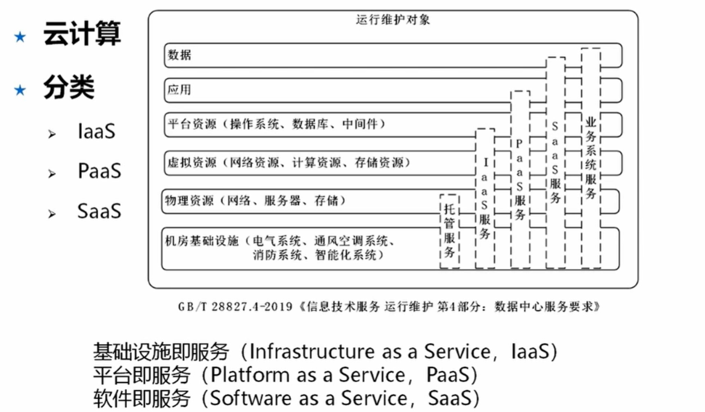

## 物联网
万物互联 特点
1. 本质的角度
   1. 互联
   2. 识别与通信
   3. 智能化

架构
1. 感知层 传感器、摄像头 
2. 网络层 无需单独建网
3. 应用层 智能化操作

关键技术
1. 传感器技术 射频识别技术RFID
2. 传感网 微电子机械系统MEMS
3. 应用系统框架 智能化控制

## 区块链
特点
1. 多中心化
2. 多方维护
3. 时序数据
4. 智能合约
5. 不可篡改
6. 开放共识
7. 安全可信

关键技术
1. 分布式账本
2. 加密算法 散列(哈希)算法 ，非对称加密算法
3. 共识机制
   1. 合规监管
   2. 性能效率
   3. 资源消耗
   4. 容错性

应用现状
1. 数字货币
2. 金融服务创新
3. 供应链管理
4. 数据安全与隐私保护

## 云计算

分类

特点
1. 超大规模
2. 高扩展性
3. 虚拟化
4. 高可靠性
5. 通用性
6. 廉价性
7. 灵活定制

关键技术
1. 虚拟化技术
2. 云存储技术 分布式存储
3. 多租户和访问控制管理
4. 云安全技术 虚拟化安全隔离、零信任验证、云WAF自动拦截DDos攻击等
   1. 云计算安全性
   2. 保障云基础设施的安全性
   3. 云安全技术服务 

## 大数据

特点
1. 规模性
2. 多样性
3. 价值密度 因为量大所以密度低
4. 速度

关键技术
1. 大数据获取技术 
   1. 采集
   2. 整合 智能抽取、匹配
   3. 清洗 正确性条件、数据约束规则
2. 分布式数据处理技术 分布式计算系统等
3. 大数据管理技术  存储（MPP架构列存储、hdfs、集成的服务器）、协同管理、安全隐私
4. 大数据应用和服务技术

## 人工智能

关键技术
1. 机器学习
2. 自然语言处理
3. 计算机视觉
4. 知识图谱
5. 等等

## 边缘计算

特点
1. 联接性 各种网络协议、不同的接口
2. 数据第一入口
3. 约束性
4. 分布性

关键技术
1. 边云协同
   1. 云计算适合 全局性、非实时、长周期、大数据处理
   2. 边缘计算 局部性、实时、短周期数据处理
2. 边缘计算的安全

应用和发展
1. 智慧园区
2. 视频监控
3. 工业物联网

## 数字孪生

关键技术
1. 建模 北斗+无人机测绘
2. 仿真 云端推演计算
3. 基于数据融合的数字线程 建立数据秒级同步，将现实数据映射到数字孪生模型，实现数据同步 

## 新一代信息技术发展

新基建
1. 加快5G商用步伐，加强人工智能、工业互联网、物联网
2. 信息基础设施 提供能力支撑
3. 融合基础设施 新技术和传统行业融合
4. 创新基础设施 科技创新的公益设施，教育等