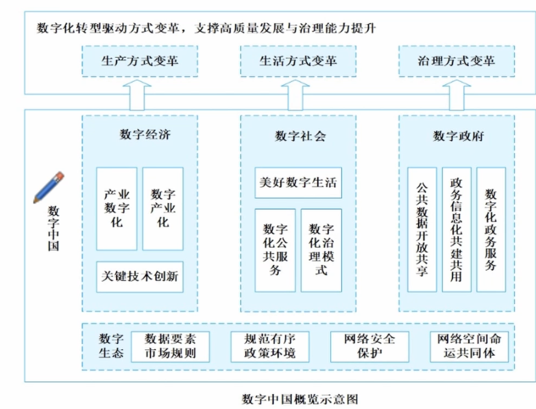
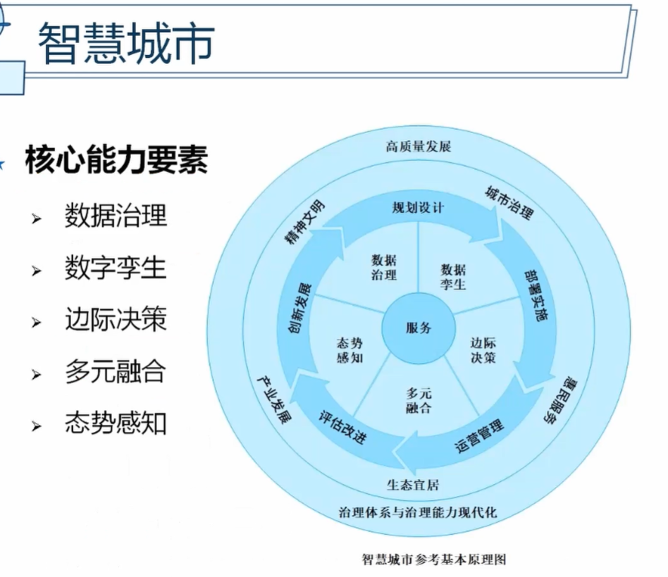

## 数字化转型
数字化比信息化程度更深
### 数字化转型驱动因素

1. 生产力飞升：第四次科技革命
   1. 第一次科技革命 经验范式
   2. 理论范式 力学等
   3. 模拟范式
   4. 数据密集型研究范式
2. 生产要素变化：数据要素的诞生
3. 信息传播效率突破：社会互联网新格局
4. 社会“智慧主体”规模：快速复制与“智能+”

### 基本原理

传统发展的问题
1. 决策瓶颈
2. 变革制约
3. 知识资产流失
4. 需求响应延迟

原理
1. 能力因子定义和数字化封装  驱动组织管理精细化
2. 基于互联网+的调度和决策
   1. 业务融合
   2. 持续坚持
   3. 文化冲突 变革会引起部分人不适应，组织要去协调冲突
   4. 效果判别
3. 转型控制  长期持续的过程

### 国家标准

数字化转型成熟度
1. 一级 按需相应 **初步**探索
2. 二级 战略统筹 **局部**实施
3. 三级 整体规划 **系统**推进
4. 四级 **量化**智能 **融合**管理
5. 五级 创新**引领** **生态**赋能

## 数字中国

### 主要内容

1. 夯实数字中国建设基础
   1. 打通数字基础设施大动脉
   2. 畅通数据资源大循环
2. 全面赋能经济社会发展
   1. 数字经济
   2. 数字政务
   3. 数字文化
   4. 数字社会
   5. 数字生态文明
3. 强化数字中国关键能力
   1. 数字技术创新体系
   2. 数字安全屏障
4. 优化数字化发展环 内外协同
   1. 公平规范的数字治理生态
   2. 开放共赢 国际合作

## 数字经济

### 新技术经济范式
1. 驱动力 发展新技术 云大物智联5G
2. 新结构 虚拟经济、无人经济等
3. 价值创造 
4. 经济增长 正反馈的闭环

### 主要内容构成
 四化驱动 + 6链融合

#### 数字产业化  通过新技术产生新的经济活动
1. 数字产品制造业
2. 数字产品服务业
3. 数字技术应用业
4. 数字要素驱动业

#### 产业数字化  传统产业通过新技术提升效率
1. 数字化效率提升业

#### 数字化治理

内涵
1. 对数据的治理
2. 运用数字技术进行治理
3. 对数字融合空间进行治理
#### 数据价值化

1. 数据资源化 
2. 数据资产化
3. 数据资本化 上市融资

#### 六链融合
1. 产业链
2. 创新链
3. 供应链
4. 要素链
5. 资金链
6. 政策链

## 数字政府

五化两通一网统管
### 数字新特征
1. 协同化  跨层级、地域、部门、系统、业务
2. 云端化  建设云平台，分散建设向集约化
3. 智能化  
4. 数据化  政务数据中台
5. 动态化  数据驱动进行演化发展

### 主要内容
1. 一网通办
2. 跨省通办
3. 一网统管

## 数字社会
### 数字民生

建设重点
1. 普惠 底层基础民生保障，解决民生资源配置不均衡问题
2. 赋能 传统民生基础设施升级，例如智慧医疗
3. 利民 人性化、公共服务场景

### 智慧城市
基本原理
1. 强调**以人为本**
2. **重点强化数据治理、数字孪生、边际决策、多元融合、态势感知5个 核心能力要素建设**
3. 智慧城市**全生命周期管理**
4. 城市治理、民生服务、生态宜居、产业经济、精神文明 **五位一体的高质量发展**
5. **持续推动**城市治理体系和治理能力现代化水平提升

### 数字乡村
核心点
1. 基建打底
2. 经济造血
3. 治理美容
4. 服务暖心
### 数字生活
主要体现
1. 工具数字化
2. 生活内容数字化
3. 生活方式数字化
## 数字生态

### 数据要素市场
产业链环节
1. 采集
2. 加工
3. 存储
4. **流通**（核心环节）
5. 分析

国民经济十四五规划中关于数据要素市场的要求
1. 建立健全市场规则
2. 统筹数据开发利用、隐私保护和公共安全
3. 建立健全数据产权交易和行业自律机制
4. 数据保护
5. 完善分类分级保护制度
6. 数据安全评估，跨境安全有序流动

### 网络安全保护
五大举措
1. 法律
2. 评估
3. 基建
4. 产学
5. 国际接轨

## 数智化发展

### 科学范式与科技革面
四种范式 
1. 经验范式
2. 理论范式
3. 模拟范式/仿真范式 计算机模型
4. 数据密集型科学发现
### 数字营商环境
营商环境评价指标体系  基安准规环
1. 数字支撑体系
2. 数据开发利用与安全
3. 市场准入
4. 市场规则
5. 创新环境

