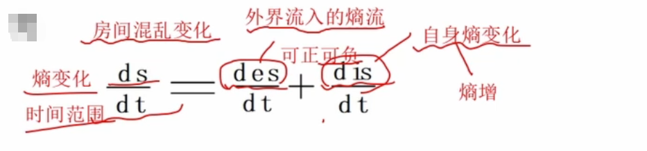

# 系统科学与哲学方法论
## 矛盾论

### 主要思想

1. 对立统一规律，是唯物辩证法最根本的规律、实质和核心
2. 唯物辩证法和形而上学，是两种根本对立的发展观
3. 矛盾的**普遍性**(矛盾无处不在，贯穿始终)和**特殊性**(不同阶段的矛盾可能不同) 
4. 主要矛盾和次要矛盾共处在统一体，可能会进行转化，例如政策的调整可能会导致原本的次要矛盾变成主要矛盾，像国产化替代
### 应用

系统规划和管理本质上也是分析并解决矛盾的过程
1. 需求与资源的矛盾
2. 敏态与稳态的矛盾
3. 安全与效率的矛盾
4. 文化与技术的矛盾
## 实践论

认识过程的飞跃
1. 第一次能动飞跃是从感性认识到理性认识
2. 第二次能动飞跃是从实践中得到理性认识，再回到实践中去
### 主要思想

1. 一切真知最终都是来源于实践
2. 实践的发展不断提出新的认识课题，提高人的认知能力
3. 实践是检验认识真理性的标准
4. 实践是把主观和客观联系起来的桥梁，具有直接现实性的品格
5. 实践是认识的目的

### 应用

1. 遵循实践性原则
2. 以实际问题为导向
3. 注重实践经验
4. 积累实践经验
5. 注意的方面
   1. 避免惯性思维
   2. 持续多次迭代
   3. 实验问题解决

## 系统论
### 主要思想

基本原理
1. 整体性原理
2. 层次性原理
3. 开放性
4. 目的性
5. 突变性 微小的变化累积后会引发质变
6. 稳定性
7. 自组织性 自发形成稳定结构
8. 相似性

系统的整体性原理
1. 强调任何系统都是一个有机的整体
2. 不是各个部分机械组合或者简单相加
3. 系统的整体功能是各要素在孤立状态下所没有的性质

### 应用

强调整体性

## 信息论

### 主要思想
信息的特性
1. 传递性
2. 共享性
3. 依附性和可处理性
4. **价值相对性** 价值因人而异
5. 时效性
6. 真伪性

信息论方法的主要特点
1. 完全撇开对象的具体运动形态，把系统的运动过程抽象为信息过程
2. 在不考虑系统内具体形态、不打开机器或活体的条件下研究系统与外界之间的输入输出关系

### 应用

1. 关注价值相对性
2. 关注真伪性，增强数据安全
3. 平衡编码效率和容错能力

## 控制论
### 主要思想
控制系统包含
1. 控制器
2. 执行器
3. 传感器

开环控制系统（程序控制系统） 例如风扇，不会根据外部环境调整自己状态
闭环控制系统 例如空调，会根据外部环境调整自己状态

###  应用
1. 综合自动化系统 追求总体最优，不是局部最优，依赖于信息集成，不是简单的技术集成
2. 计算机集成制造系统 柔性生产
3. 网络化控制系统 分散化、智能化、网络化

## 耗散结构理论

熵理论 描述事物的混乱程度，熵增表示混乱程度在增加，走向无序，熵减（负熵）表示混乱程度在减少，走向有序

### 主要思想

一个远离平衡的**开放系统**，当外界条件变化达到某一特定阈值时，系统通过不断与外界进行物质交换和能量交换，会从原来的无序状态转化为一种时间、空间或功能的有序状态，
此时形成的**远离平衡的、稳定有序的结构**称为**耗散结构**

形成维持的条件
1. 开放性   交换能量
2. 远离平衡态  不能是一潭死水
3. 非线性耦合   复杂系统
4. 涨落现象  量变触发质变

### 应用
通过引入新技术来使系统达到新的有序结构

## 协同论
### 主要思想

三大基本原理
1. 不稳定原理
2. 支配原理
   1. 慢变量  长期排练计划 
   2. 快变量  即兴发挥
3. 序参量原理 事物的演化受序参量的控制，演化的最终结构和有序程度决定于序参量 系统趋近于有序无序临界点时的值是序参量

### 应用

自组织系统的协同作用表现
1. 自适应能力  例如云计算的自动伸缩
2. 自我修复能力 例如分布式数据库
3. 自我进化能力 例如一些AI、算法

### 协同论总结

核心口诀
1. 找指挥（序参量）
2. 分快慢（支配原理）
3. 破旧立新（不稳定性）

实践意义
1. 通过序参量控制
2. 自组织设计
3. 构建弹性、智能、持续进化的复杂系统

考试贴士
1. 牢记序参量的判断标准（宏观决定性）
2. 支配原理的应用场景（长期优化策略）
3. 自组织能力的实例（云计算、分布式系统）

## 突变论
### 主要思想
质变、渐变都可实现突变

奇点理论 研究临界点

分岔现象 从一个稳定状态分岔为多个稳定状态

### 应用

## 复杂系统论
### 主要思想

导致复杂性出现的核心原因是局部互动不可测，即在整个系统中
1. 人们可以充分了解每个单元的特性
2. 但是多个单元组合成一个系统时，将呈现出单个单元所不具备的新特性
3. 复杂系统研究着眼于整体性，强调“**整体大于部分之和**”

**复杂系统的特征**
1. 非线性关系
2. 自组织性
3. 适应性演化
4. 路径依赖型

###  应用

1. 整体视角
2. 动态演化
3. 非线性思维
4. 多样性原则
5. 适应性策略

