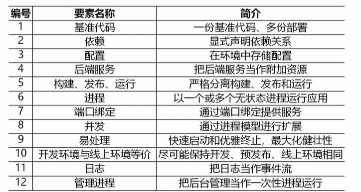

# 云原生系统规划

## 发展背景

1. 基于容器、服务网格、微服务、不可变基础设施和声明式API构建的可弹性扩展的应用
2. 基于自动化技术构建具备高容错性、易管理和编译观察的松耦合系统
3. 构建一个统一的开源云技术生态，能和云厂商提供的服务解耦

云原生的主要表现
1. 算力资源优化与高效管理
2. 敏捷开发与全流程安全
3. 数据资产话与智能业务升级
4. 数据分析与商业决策支持
5. 安全合规与高可用性保障

## 云原生技术架构 *

### 设计原则

1. 服务化原则 （微服务）
2. 弹性原则
3. 可观测
4. 韧性
5. 所有过程自动化
6. 零信任
7. 架构持续演进

### 架构模式

1. 服务化架构模式 微服务、小服务
2. Mesh化 将中间件框架从业务代码中剥离、方便切换中间件
3. Serverless 无服务器模式 适合短暂、动态分配、无状态的应用
4. 存储计算分离
5. 分布式事务
6. 可观测架构
   1. Logging 日志
   2. Tracing 链路跟踪
   3. Metrics 性能指标
7. 事件驱动架构

### 架构优势
1. 高可扩展性
2. 高可用性
3. 灵活性
4. 安全性
5. 成本效益
6. 高度自动化

## 云原生建设规划 *

1. 容器云平台构建
   1. 容器技术
   2. 微服务设计与拆分 
      1. 领域驱动设计
      2. 主数据驱动设计
2. 服务管理和治理 服务治理 k8s、CNCF推荐的ServiceMesh、spring cloud
3. 持续交付及安全 DevOps
4. 自服务敏捷响应基础设施 
   1. 基础设施资源
   2. 支撑平台
   3. 纯技术工具
5. 增强生产环境韧性和安全性

