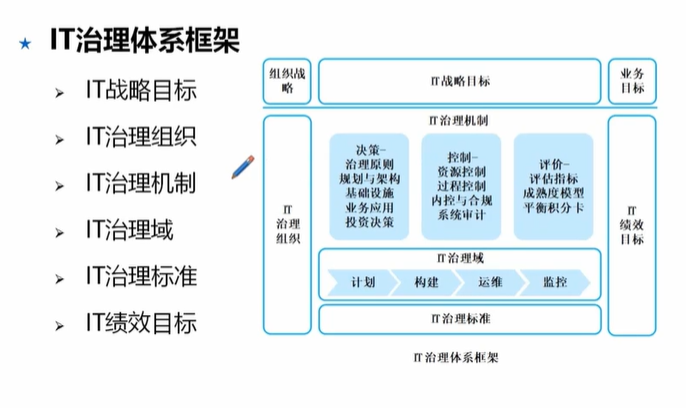
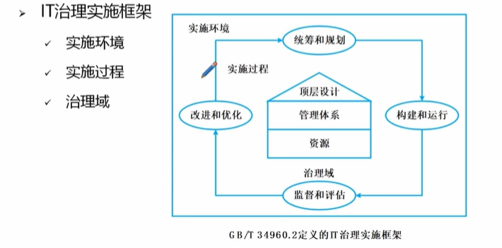
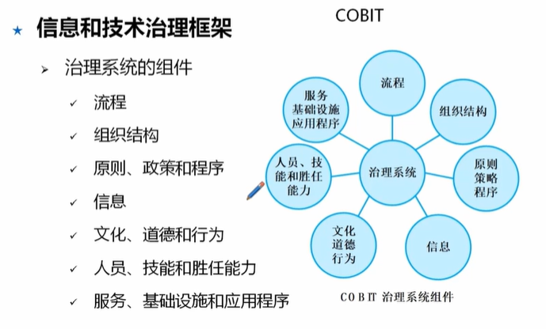
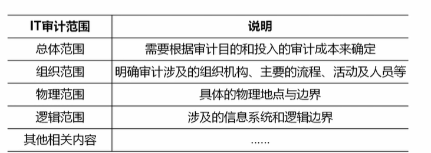
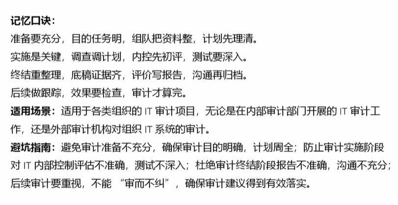

# 信息系统治理

## IT治理
### 治理基础
打破信息孤岛

IT治理价值
1. 保持IT与业务目标一致
2. 推动业务发展
3. 促使收益最大化
4. 合理利用IT资源
5. 理清风险

主要目标
1. 与业务目标一致
2. 有效利用信息与数据资源
3. 风险管理

IT治理的管理层次
1. 最高管理层 战略、资源、定方向
2. 执行管理层 中层抓执行
3. 业务与服务执行层
   1. 信息和数据服务的提供和支持  
   2. IT基础设施的建设维护
   3. IT需求的提出和响应

### 治理体系

关键决策
1. IT原则
2. IT架构
3. 基础设施
4. 业务应用需求
5. IT投资和有线顺序

IT治理体系框架

核心内容 职责明、战略配、资源优、价值达、风险防、绩效追
1. 组织职责
2. 战略匹配
3. 资源管理
4. 价值交付
5. 风险管理
6. 绩效管理

### 治理任务

统筹全局定方向、价值导向明收益、机制保障控风险、创新发展添活力、文化助推聚人心

1. 全局统筹
2. 价值导向
3. 机制保障
4. 创新发展
5. 文化助推 企业文化、积极向上

### IT治理方法与标准

IT治理模型
1. 顶层设计治理域 战略、组织、架构
2. 管理体系治理域 质量管理、项目管理、服务管理、风险管理等
3. 资源治理域 基础设施、应用系统、数据

COBIT 国际上治理框架

IT治理国际标准 

内容
1. 责任
2. 战略
3. 收购
4. 性能
5. 一致性
6. 人的行为

主要任务
1. 评估
2. 指导
3. 监督

ITSS标准框架细，资源管理齐，流程规范要牢记

COBIT治理管理分离，四十目标清，组件仙童力

ISO/IEC 六原则导航，三项任务保执行

## IT审计
定义
IT审计是根据IT审计标准的要求，对信息系统及相关的IT、内部控制和流程进行检查、评价，并发表审计意见

目标
1. IT战略与业务战略一致
2. 保护信息资产的安全及数据的完整、可靠、有效
3. 提高信息的安全性、可靠性及有效性
4. 符合法律法规及标准等要求

审计范围

IT审计风险
1. 固有风险 系统先天存在的风险
2. 控制风险 例如防火墙失效
3. 检查风险 审计时没查出来，遗漏了
4. 总体审计风险 各类审计总和

审计常用方法
1. 访谈法
2. 调查法 问卷调查
3. 检查法 查日志、配置文件
4. 观察法 看机房
5. 测试法 渗透测试、漏洞扫描
6. 程序代码检查法

审计技术
1. 风险评估技术
   1. 风险识别技术 德尔菲法、头脑风暴、SWOT
   2. 风险分析技术  定性 定量
   3. 风险评价技术 单因素、总体
   4. 风险应对技术 云计算、容灾
2. 审计抽样技术
   1. 统计抽样 方法有属性抽样、变量抽样
   2. 非统计抽样  特定属性
   3. 判断抽样 
3. 大数据审计技术
4. 审计证据
   1. 充分性
   2. 客观性
   3. 相关性
   4. 可靠性
   5. 合法性
5. 

IT审计底稿分类
1. 综合类工作底稿 综述
2. 业务类工作底稿 具体业务的问题
3. 备查类工作底稿 历史问题

审计工作底稿三级复核制度
1. 审计机构负责人
2. 部门负责人
3. 项目负责人或项目经理

### 审计流程的阶段
1. 审计准备 目标团第资料齐，计划落地不跑题
   1. 明确审计目的及任务
   2. 组建审计项目组
   3. 搜集相关信息和材料
   4. 编制审计计划
2. 审计实施 调查测试两手抓、内控漏洞全现行
   1. 调查并调整审计计划
   2. 评估IT内部控制
   3. 进行符合性测试 内部控制的运行有效性
   4. 进行实质性测试 审计证据，验证系统数据的准确性、完整性、可靠性
3. 审计终结  验收交付  证据报告双闭环，归档沟通不留尾
4. 后续审计 售后回访 跟踪整改，验证效果，防止复发

总结

### IT审计内容
分类
1. IT内部控制审计
   1. 组织层面IT控制审计  战略规划、风险管理
   2. IT一般控制审计  基础设施（操作系统、数据库、网络相关策略）
   3. 应用控制审计 业务流程（输入输出、处理控制）
2. IT专项审计
   1. 信息系统生命周期审计 规划、上线、退役等每个阶段检查
   2. 信息系统开发过程审计
   3. 运行维护审计
   4. 网络与信息股安全审计 制度、流程是否规范
   5. 信息系统项目审计 项目管理过程是否合规
   6. 数据审计 数据安全管理的政策、标准和活动

