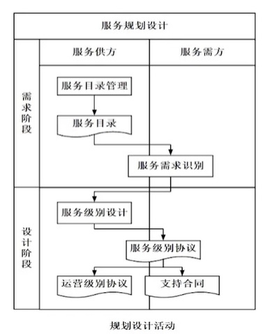
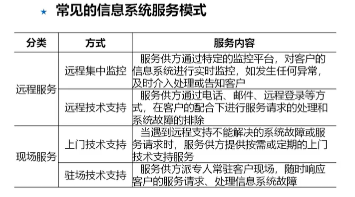
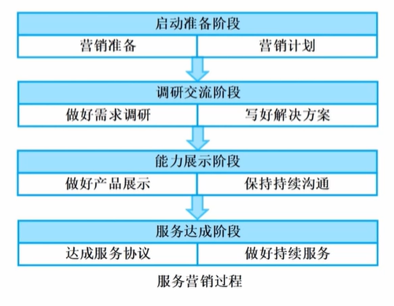
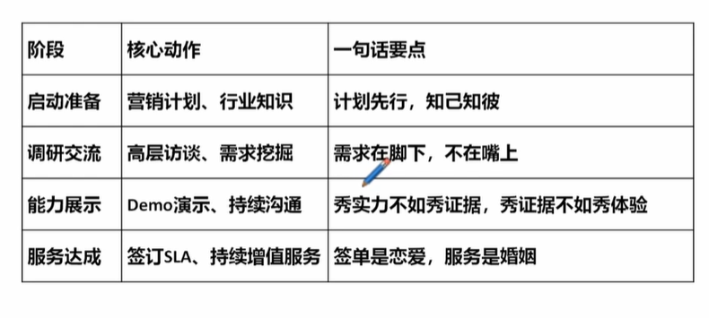
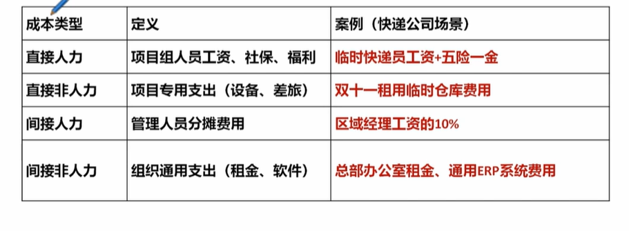
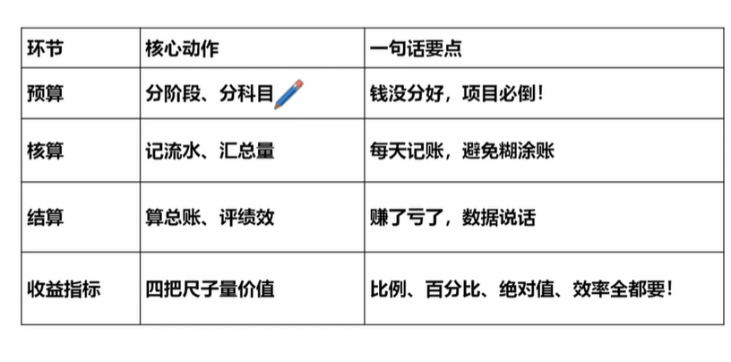
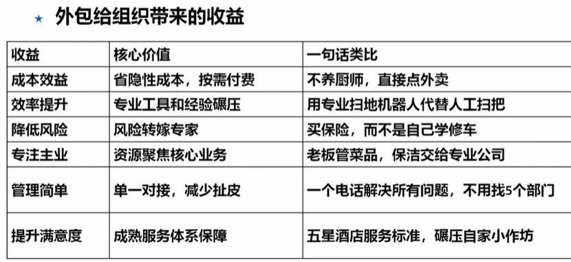
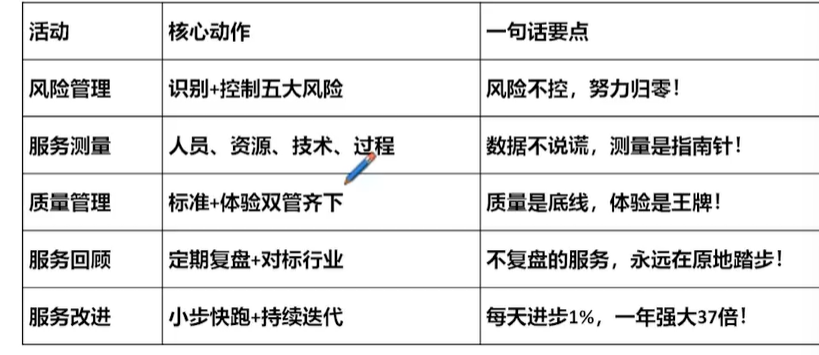
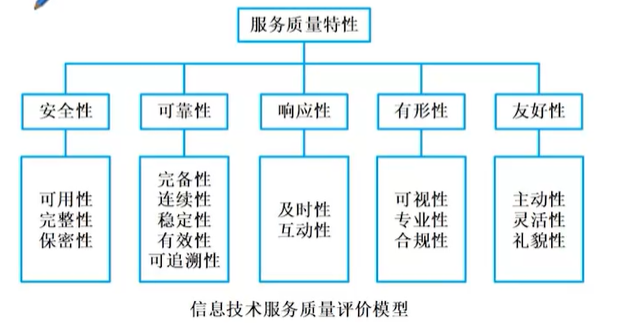
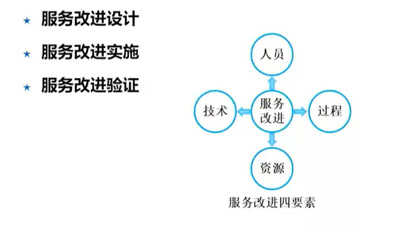

# 信息系统服务管理 *

## 服务战略规划

服务目录管理的活动
1. 成立管理小组
2. 列举服务清单
3. 确定服务类别与代码
4. 编制服务详述
5. 评审并发布服务目录
6. 完善服务目录 持续优化

服务需求识别
1. 可用性需求  宕机时间
2. 持续性需求  业务恢复能力 灾备 RTO（恢复时间目标）、RPO（数据丢失量）
3. 服务能力需求 性能 包括当前和未来需求提供资源支撑
4. 信息安全需求 保密、完整、可用性
5. 价格需求    成本+定价
6. 服务报告需求 月度报告，系统可用性、故障处理时长

服务级别设计 设计定级别：协议保执行；运营明责任；合同护权益
1. 服务级别协议（SLA） 专属化，质量承诺，服务范围、性能指标、违约责任
2. 运营级别协议（OLA） 客服服务台、运维团队的分工，内部责任链和环节时限
3. 支持合同（UC） 

## 服务设计实现

### 服务模式

要考虑的方面
1. 匹配需求
2. 资源适配
3. 灵活切换

###人员要素设计  
目标 是服务团队能最大限度满足客户需求

岗位和职责设计  管理盯需求、技术解难题、操作保执行
1. 管理岗
2. 技术支持岗
3. 操作岗

人员绩效方案设计
1. 确定绩效指标
2. 明确考核信息来源
3. 制定绩效指标计算方法
4. 定义考核周期
5. 设计绩效考核策略

人员培训方案设计的活动
1. 培训需求分析
2. 培训内容设计
3. 培训实施过程设计
4. 培训效果评价方法设计

### 资源要素设计

服务工具
1. 监控类工具、过程管理类工具（支持服务标准化和自动化）、其他工具（进程管理、补丁管理等）

服务台  用户和服务方的统一接口，整合热线电话、在线聊天、邮件

备件库 
1. 分级管理  设备关键性：核心设备、关键设备
2. 供应商管理 多供应商策略
3. 备件出入库管理
4. 备件可用性管理

知识库
1. 常见问题 解决方案
2. 确保可用、可共享
3. 选择一个合适的知识管理策略

### 技术要素设计
活动
1. 技术研发 预算分配、创新方向（自动化运维）
2. 发现问题的技术 监控指标及阈值表，模拟高并发、故障注入测试
3. 解决问题的技术
   1. 指定技术活动标准操作流程 SOP
   2. 指定应急预案
   3. 完成知识转移 老带新、定期复盘会

### 过程要素设计

1. 服务级别管理过程
   1. 主要活动
      1. 建立服务目录，签协议
      2. 建立考核评估机制 SLA完成情况、达成率
      3. 改进跟踪机制
2. 服务报告..
   1. 主要活动
      1. 确定与服务报告过程一致的活动，包括建立、审批、归档等
      2. 制定服务报告计划 包括提交方式、时间、需方接收对象等
      3. 建立服务报告模板
3. 事件  事件上报
   1. 主要活动
      1. 事件分级分类
      2. 建立事件升级机制
      3. 事件满意度
      4. 事件解决评估
4. 问题
   1. 主要活动
      1. 分级分类
      2. 导入知识库
      3. 解决评估
5. 配置
   1. 主要活动
      1. 建立配置数据库管理机制
      2. 配置项审计
6. 变更
   1. 主要活动
      1. 分类分级
      2. 变更评估，包括未批准变更等
7. 发布
   1. 主要活动
      1. 发布类型和范围管理
      2. 指定完整方案，包括发布计划、回退等
      3. 发布评估
8. 信息安全
   1. 漏洞扫描、应急演练等

## 服务运营提升
### 业务关系管理
1. 客户关系管理
   1. 活动 日常甜，定期鲜，高层要露脸，投诉变机缘，增值送甜点
   2. 风险 未能了解客户真正需求，多头对接导致需求混乱
2. 供应商关系管理
   1. 活动
      1. 供应商的选择
      2. 供应商审核及管理 定期审核及评估其响应能力、效率
      3. 供应商的协调 建立协作机制
      4. 争议处理 提前约定处理方式
      5. 合同管理
   2. 风险 协作问题、利益分配问题、供应商组织或业务变动、服务质量问题及持续性保障、供应商不配合
3. 第三方关系管理
   1. 风险 沟通不顺、利益责任分配问题、第三方得不到客户支持

### 服务营销管理
备调示成

1. 准备阶段
   1. 营销准备 客户行业知识、自身产品知识、营销知识
   2. 营销计划 预算、人员、时间节点 
2. 调研交流阶段
   1. 需求调研 战略方向、现状梳理、需求收集（显/隐性）
   2. 写好方案 对症下药、细化方案、评审确定
3. 能力展示阶段
   1. 做好产品展示
   2. 保持沟通
4. 服务达成阶段
   1. 达成服务协议
   2. 做好持续服务

 

### 服务成本度量

1. 直接人力成本
2. 直接非人力成本 交通费、差旅、采购等
3. 间接人力成本 财务、人资等工资 分摊 
4. 间接非人力成本 多个服务项目分摊

成本度量方法
1. 服务对象规模  
2. 单位工作量
3. 调整因子 个性化因素，增加系数

### 服务项目预算、核算和结算

核算 就是记账，实际开支和预算是否符合，开支是否合理

结算 算总账，和预期差距多少

### 服务外包收益

## 服务退役终止
### 沟通管理 

1. 服务终止计划编制会议
   1. 终止条件
   2. 流程
   3. 各方角色和职责
   4. 风险问题
   5. 移交标准
2. 计划评审会议
3. 移交会议 知识资产的移交，文档，常用问题等
4. 经验交流会 复盘会，成果、经验、知识等
### 风险控制
1. 数据风险 数据泄露、篡改、滥用、非法访问
2. 业务连续性风险  服务不断档，信息同步风险
3. 法律法规风险 合同漏洞、责任划分
4. 信息安全风险 保密协议

### 资源回收
1. 文件归档 服务日志、合同
2. 财务资源回收  撤销项目账户编码
3. 人力资源回收  安抚团队 人员转岗、离职
4. 基础设施资源回收  设备清点

### 信息处置
1. 信息转移和清除
2. 存储介质清除或销毁

## 服务改进与监督
风测质回改

### 服务风险管理 
1. 人员 人员流动
2. 技术 技术不匹配
3. 资源 工具失效
4. 过程 流程不规范等
5. 其他

### 服务测量
验证决策是否正确

1. 人员测量 绩效考核
2. 服务资源测量 监控、盘点资产、知识库数量质量
3. 服务技术测量 研发计划落实情况，识别研发成果、技术手册、应急预案
4. 服务过程测量 服务管控、服务执行

### 服务质量管理
安可应友形

活动
1. 服务质量策划 设定目标、明确职责、指定计划
2. 质量检查 满意度、审计报告
3. 质量改进 优化流程、技术省级、人员培训

### 服务回顾

1. 一级 不定期沟通，针对重大事件
2. 二级 月度例会
3. 三级 季度例会
4. 四级 年度回顾

### 服务改进

改进设计
1. 设定目标 SMART原则
2. 改进输入 数据驱动
3. 改进计划 明确责任人、时间、预算
4. 确认改进职责  确认结果

改进实施
1. 人员改进
2. 资源改进 升级工具
3. 技术改进 
4. 过程改进 优化流程

改进验证
1. 对照目标进行检查  评价结果、分析原因
2. 提交改进报告
