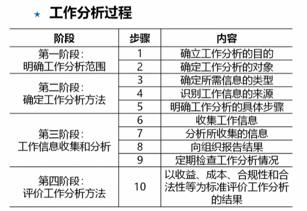
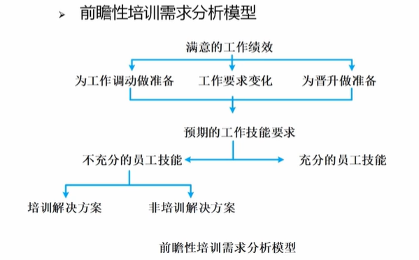

# 13.人力资源管理
## 基础

目标
1. 建立招聘和选择体系
2. 挖掘员工潜能，兼顾组织和个人目标
3. 留住优秀、淘汰差的

主要内容
1. 规划 工作分析 岗位涉及 需求预测
2. 招聘
3. 维护 薪酬激励 健康环境
4. 提升 培训、发展
5. 评价 绩效评估与反馈

## 工作分析与岗位设计
工作分析

岗位设计内容
1. 工作内容设计
2. 工作职责设计
3. 工作关系设计

岗位设计方法
1. 科学管理方法 效率优先
2. 人际关系方法 心理激励，工作丰富化
3. 工作特征模型 满足内在驱动。让工作更有趣
4. 高绩效工作体系 自组织团队

## 战略与计划
戴尔和霍得 战略
1. 诱因战略 特点 绩效薪酬为主，适合稳定
2. 投资战略 适合长期雇佣、躲技能培养，挖掘潜力
3. 参与战略  权力下放、团队协作；适合创新驱动组织

巴伦和克雷普斯战略
1. 内部劳动力市场战略 提供较多内部晋升；适合密集型组织
2. 高承诺战略 扁平化组织，通过工作成果差别体现薪酬；审核竞争性行业
3. 混合战略 综合考虑

人力资源需求预测方法
1. 集体预测方法 德尔菲法，邀请专家，匿名投票
2. 回归分析方法 历史数据建模， 业务稳定的企业
3. 转换比率分析法 关键技能员工数据推算辅助人员需求

人力资源供给预测
1. 人才盘点与技能清单
2. 管理人员置换图
3. 转移矩阵法

整体性的人力资源计划
1. 组织内部的一致性
2. 组织外部的一致性

## 招聘与录用

面试的类型
1. 非结构化面试 没有核心问题，即兴提问 涉及高层次职位
2. 半结构面试 有一定核心问题，又有追问
3. 结构化面试 有固定结构，大规模招聘

## 人员培训
培训步骤
1. 评估培训需求
2. 设定培训目标
3. 设计培训项目
4. 培训实施和评估

培训内容分析
1. 组织分析
2. 绩效分析
3. 任务分析

培训需求评估

## 组织绩效与薪酬管理

绩效考核方法
1. 员工比较类评价法
2. 关键事件法 红黑榜
3. 行为对照表法 结构化评分，列表分析各项指标 用于晋升评估
4. 等级鉴定法 多选项评分（优秀、良好、一般、差）
5. 行为锚定评价法 给何关键事件和等级评分，复杂岗位

薪酬管理
1. 薪酬体系 外部公平、内部公平
2. 工作评价
3. 薪酬等级
4. 薪酬激励
5. 薪酬调整

