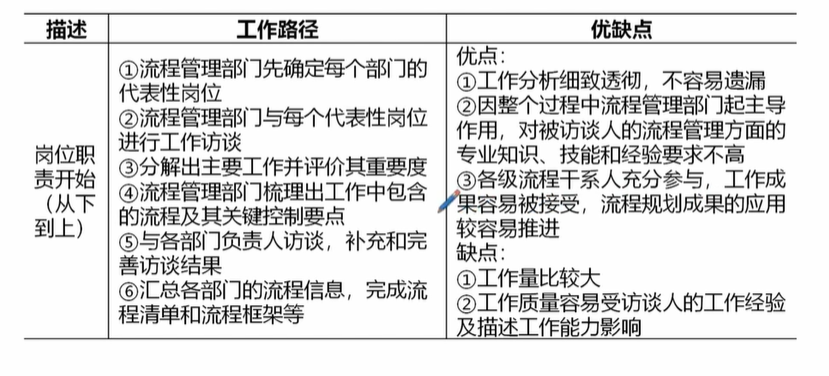
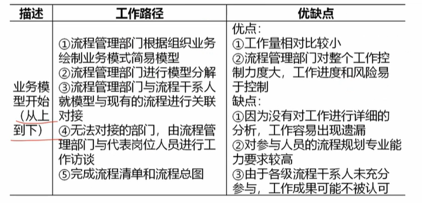
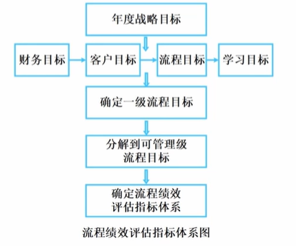
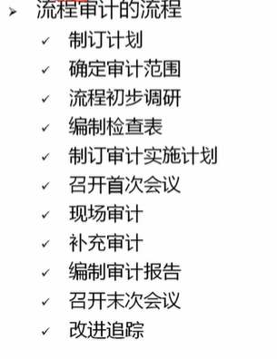

# 14. 规范与过程管理

## 管理标准化
### 标准化的基本原理
1. 统一有度原理 标准化的核心
2. 阻滞即废原理 更改、修订、废止、确认
### 简化
### 系列化 
基础版、企业版
### 组合画和模块化
### 综合标准化
### 超前标准化

## 流程规划 
### 端到端的流程
高阶流程 以战略目标达成为结束

中阶流程 从业务对象的需求出发，到他们的需求得到满足为止

### 组织流程框架
整体流程框架 纵向对齐战略，横向协同运行

### 流程规划方法 *
新手规划先下后上，老手规划先上后下

1. 岗位职责开始（从下到上） 先蹲点一线，懂业务再设计
2. 业务模型开始（从上到下） 有战略视野，再补细节漏洞

### 流程分类分级

分类
1. 战略流程 定方向
2. 运行流程 创价值
3. 支持流程 做后盾

流程的分级
1. 一级流程 端到端流程，客户服务全流程
2. 二级流程 业务流程
3. 三级流程 操作级

### 规划总结
端 端到端意思是盯着终点跑，别让流程端头

框 框架思维 有线有面 战略对齐、横向协同

分 流程分级 管理更高效

## 流程执行
保障流程执行的措施
1. 理解流程
2. 做好流程变更的推广 培训、试点、答疑
3. 新员工流程制度培训
4. 找对执行负责人
5. 流程审计及监控  稽查、考核
6. 把流程固化到信息系统中  流程自动化
7. 固化到制度中
8. 流程文化宣导

## 流程评价

流程检查方法
1. 流程稽查 查单个流程
2. 流程绩效评估指标体系
3. 流程绩效评估结果分析
4. 满意度评估  客户给流程打分
5. 流程审计 审查全部流程

流程检查结果的应用， 
1. 流程优化
2. 绩效考核
3. 过程控制 实时纠错
4. 纠正措施
5. 战略调整

## 流程持续改进

流程优化需求
1. 问题导向 找出问题
2. 绩效导向 找出差距
3. 变革导向 跟着战略走，提前布局

优化实施路径
1. 目标定位
2. 框架体系优化
3. 具体流程优化
4. 标准化落地

