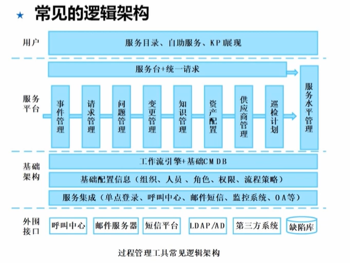

# 16.资源工具管理
## 研发与测试环境搭建和维护
遵循的原则
1. 可重现性
2. 可协作性
3. 与生产环境相似性
4. 自动化环境管理
5. 测试覆盖率
6. 灵活性
7. 环境隔离性
8. 可维护性

## 运维管理

### 监控工具
分类
1. IT基础设施监控
2. 性能监控
3. 业务运营监控

常见监控工具
1. Zabbix 跨平台能力，全面的开源分布式监控
2. Nagios 监控系统、网络和IT基础设施开源应用 告警机制
3. Prometheus 适合微服务、云环境  拉模型，适合动态环境

### 过程管理工具

常用工具
1. Jira 多个版本、比较灵活
2. ServiceHot ITSM 开箱即用，已完成国产化适配

### 自动化工具

常用工具
1. Puppet 中大型企业 C/S结构
2. SaltStack C/S模式 加入了MQ机制，适合安全性高的场景
3. Ansible 轻装上阵，基于SSH协议
4. Jenkins 持续集成工具
5. Chef 新一代自动化工具，适合云环境

### 服务台
常见服务台
1. ServiceDesk Plus 一站式服务台 故障申报-派单-解决-验收
2. ServiceHot AI
3. 云智慧服务台 
4. ChatOps 通过聊天完成运维任务

### 知识管理
常见知识库工具
1. ITSM 内置知识库 知识库依附于流程、适合强调整合的场景
2. Confluence 适合跨团队、复杂协作
3. PingCode Wiki 轻量化、简单高效，适合中小型团队

### 备件管理
常见功能
1. 库存管理
2. 备件维保服务生命周期管理 从买入到报废
3. 出入库审批
4. 备件查询与追踪

### 新型运维工具

1. AIOps ai大脑
2. DevOps 开发运维一体化
3. 云管理 多云环境统一指挥
   1. 虚拟化云CloudOs工具
   2. CMP云管理工具
   3. CSM云安全工具
   4. CPS云专业服务工具 云前移、备份服务

## 项目管理工具
1. PingCode 全生命周期 国产 敏捷/瀑布双支持
2. 禅道 开源 项目及管理 性价比高
3. Jira 功能强大，付费  国际范，事务管理，插件丰富
4. Microsoft Project 付费 传统项目，资源管理强，各种视图

