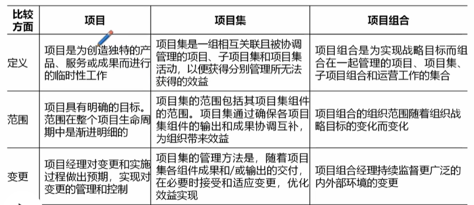
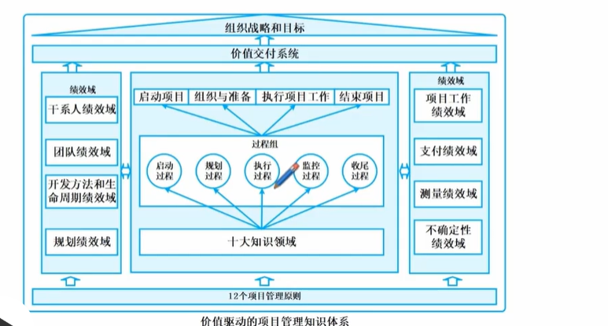

# 17.信息系统项目管理
## 基本要素

项目基础
1. 独特的产品、服务或成果
2. 临时性工作
3. 项目驱动变更
4. 项目创造业务价值
5. 项目启动背景

项目成功的标准
1. 成果目标 管理目标

### 项目内外部环境
1. 组织过程资产  可控资产
   1. 过程资产  工具、方法论、方法、模板等
   2. 治理文件  政策和流程
   3. 数据资产 以前项目的数据库、文件库等
   4. 知识资产 项目团队和其他员工的隐性知识
   5. 安保和安全 保密相关的程序和实践
2. 组织内部的事业环境因素 不可控
   1. 组织文化、结构和治理  
   2. 设施和资源的物理分布 工作地点、共享系统
   3. 基础设施 现有设施、设备
   4. 信息及时软件
   5. 资源可用性
   6. 员工能力
3. 组织外部的事业环境因素
   1. 市场条件
   2. 社会和文化
   3. 监管环境等等

### 组织系统

1. 项目导向型（混合） 项目经理权限最高
2. 职能（集中式） 各职能部门
3. 矩阵-强 项目强力
4. 矩阵-弱 职能部门强力
5. 矩阵均衡 各50%
6. 项目管理办公室（PMO） 提供资源支持、协调多个项目、监控
   1. 类型 支持型、控制型、指令型

## 项目经理的角色
### 项目经理的定义
职能经理 财务部经理等

运营经理 服务保证业务运营的高效性 

项目经理 负责领导团队实现项目目标，协调各方

### 项目经理影响范围
不要精，要通才 90%的工作是沟通协调

项目经理需要平衡的技能
1. 项目管理
   1. 针对每个项目裁剪传统工具、技术、方法
   2. 制定完整计划，并监督执行
2. 战略和商务
   1. 实现项目业务价值最大化的方式执行策略
3. 领导力
   1. 人际交往
   2. 领导者品质和技能
   3. 政策和权力

领导力风格
1. 放任型
2. 交易型
3. 服务型
4. 变革型
5. 魅力型
6. 交互型

## 价值驱动的项目管理知识体系

### 项目管理原则
勤协作、干价值、识领导、裁质量、复风险、韧变革

### 项目生命周期和项目阶段
1. 启动项目
2. 组织与准备
3. 执行项目工作
4. 结束项目

生命周期类型
1. 预测型（计划驱动型） 瀑布模型  需求稳定、明确
2. 迭代型 强调精益求精
3. 增量型 越来越多
4. 适应型（敏捷型） 小步快跑
5. 混合型 预测型和适应型结合

### 项目管理过程组

### 项目管理知识领域
多快好省、资沟风采、天地人合

### 项目绩效域
干团队、划周期、交工作、量不定 
1. 干系人
2. 团队
3. 开发方法和生命周期
4. 规划
5. 项目工作
6. 交付
7. 测量
8. 不确定性

### 价值交付系统

 