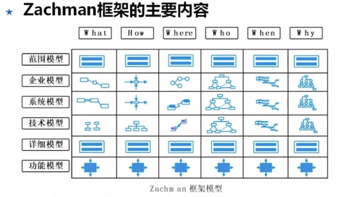

# 信息系统规划
## 4.1概述
信息系统规划的意义  （目标路径共识准，任务标准资源顺）
1. 确立目标
2. 明确建设路径
3. 达成共识
4. 确定关键任务
5. 明确标准
6. 统筹资源

特点与原则 （战整先导，柔遵保平安）
1. 战略性
2. 整体性
3. 先进性
4. 指导性
5. 柔性 适应变化
6. 遵从性 遵守法规

## 4.2主要内容
### 信息系统发展战略

发展阶段的成熟度
1. 打基础
2. 提效率
3. 做协同
4. 强决策
5. 构生态

### 主要系统及框架

系统总体框架
1. 以应用功能为主线的框架    各自采购应用系统，例如财务、OA使用不同厂家的软件各自独立发挥作用
   1. 适合中小型企业的数字化初期
   2. 缺点是数据不互通
2. 以平台能力为主线的框架  高玩 自建平台
   1. 功能灵活定制、数据共享
   2. 技术要求高、初期费用较高、适合有技术团队的大厂
3. 以互联网为主线的框架   生态玩
   1. 微服务APP 跨组织生态协同

分系统划分原则
1. 技术一致性
2. 工程一致性
3. 职能一致性
4. 数据一致性 数据活动需要作为独立且完善的系统存在 （数据中台）

### 组织体系优化

中小型单位的信息组织体系
1. 信息化管理委员会  老板牵头、各部门负责人开会
2. 信息化团队

大型单位3种类型
1. 集中式  单独成立IT部门
2. 分权式  各部门分别搞IT
3. 平衡矩阵式 前两种结合

业务领域的信息组织体系
1. 业务部门存在有既定信息技术基础的人，技术中需要学习业务

### 技术体系定义
可用安全别翻车，可靠灵活能甩锅，扩展驾驭不背锅
1. 可用性
2. 安全性
3. 可靠性
4. 灵活性
5. 可扩展性
6. 可驾驭性

### 任务体系部署

任务体系部署的主要过程  拆解目标找团队，策略计划盯到位
1. 任务拆解
2. 明确目标  具体、可测量、可实现
3. 匹配组织
4. 制定策略 约束因素、风险感知、预判应对
5. 定义计划
6. 监控实施 沟通协调机制、会议于报告机制

### 保障体系设定

1. 资源识别与评估
   1. 人 人力资源
   2. 机 机器资源
   3. 料 文档、材料
   4. 法 技术方案
   5. 环 流程、制度
   6. 测 监测工具
2. 资源关系与控制
   1. 资源优先级
   2. 规划措施
      1. 定指标
      2. 用工具
      3. 搞创新
3. 资源分配与调度
4. 资源风险与优化
   1. 资源供给的容量风险
   2. 可持续供应的终端风险
   3. 资源使用中的质量与能力风险

### 保障体系设定
1. 组织保障  管理层的决策和承诺
2. 人员保障
3. 技术保障
4. 资源保障
5. 数据保障  数据标准化
6. 安全保障

## 4.3工作要点

### 内外部需求挖掘
内部挖掘主要任务 战略流程用户查，现有系统数据抓，隐性需求别落下
1. 理解组织战略
2. 熟悉业务流程
3. 收集用户需求
4. 评估现有系统
5. 感知数字环境  现有数字资产盘点

外部需求挖掘 国家行业技术争，客户标准别硬撑
1. 国家战略
2. 行业趋势分析
3. 技术趋势研究
4. 竞争环境分析
5. 客户期望调研
6. 标准规范引用

外部需求注意事项
1. 国家战略与政策引用
2. 避免信息安全事件

整合与分析
1. 抓主要矛盾
2. 确定优先级
3. 了解干系人

### 场景化模型分析

找对战场，精准打击，锁定关键场景

模型的主要组成部分
1. 场景定义
2. 角色分析
3. 业务分析
4. 数据分析
5. 技术分析
6. 组织分析
7. 风险分析
8. 政策与法律分析

关键价值
1. 贴近实际
2. 降低风险

### 深度诊断与评估

成熟度
1. 一级 规范化
2. 二级 精细化、流程化
3. 三级 协同化
4. 四级 敏捷建设 快速响应
5. 五级 生态一体化

诊断与评估模型确立
1. 业务能力维度
2. 成熟度等级维度

诊断与评估实施
1. 计划与打分
2. 权重与计算
3. 记录与确认

### 整体与专项规划
需求整合与确认
1. 业务领域维度需求整合
2. 能力建设维度 
3. 技术发展维度 

整体规划 方式
1. 自底向上 解决业务效率 优先关注单点效率
2. 自顶向下 协同、敏捷 关注顶层设计、打通数据

专项规划
1. 明确主体
2. 技术路线细化
3. 时间轴排期

一致性检查 整体与专项计划一致等

### 持续改进
1. 跟踪组织战略
2. 感知技术发展创新
3. 关注信息安全
4. 注重用户体验
5. 建立监测和评估机制

## 4.4常用方法

### 战略目标集转移法（SST）

组织战略集
1. 使命
2. 目标
3. 战略

信息系统战略集
1. 系统目标
2. 约束
3. 建设战略

信息系统战略规划过程
1. 识别和解释组织战略集
   1. 画出组织利益相关方的结构  找人
   2. 确定相关方的要求  抓痛点
   3. 定任务 对齐战略
2. 验证与优先级

### 企业信息系统规划法（BSP）
核心是通过业务流程驱动IT架构设计

定义管理目标
1. 目标采集
2. 目标树绘制
3. 指标量化

定义管理功能
1. 识别主要管理活动
2. 定义管理功能并进行分组时BSP的核心
   1. 识别资源
   2. 根据资源生命周期识别功能
   3. 汇总分析

定义数据类
1. 实体法 核心业务实体
2. 功能法 功能的输入输出

定义信息结构 系统框架 功能矩阵

### 关键成功因素法（CSF）

成功因素的来源
1. 产业结构
2. 竞争策略
3. 环境因素
4. 暂时因素

主要特征
1. 内部型 针对组织机构内部的活动
2. 外部型 与组织的对外活动有关
3. 监控型 对现实情况的详细考察
4. 建立型 与组织未来计划的变化有关

**实施步骤** 定目标 找因素 定关键 找指标
1. 确定组织的战略目标
2. 识别组织的所有成功因素
3. 确定组织的关键成功因素
4. 识别各关键成功因素的绩效指标和标准以及测量绩效的数据

CSF的应用精髓
1. 核心口诀 **聚焦关键，量化指标 动态迭代**
2. 适用场景 战略目标清晰、资源有限需优先分配、高层主导的规划场景
3. 避坑指南
   1. 避免一刀切，不同部门的CSF可能冲突
   2. 避免静态化 CSF需要动态调整

### 价值链分析法 （VCA）

基本观点
1. 价值为王
2. 活动二分法 分为基本活动（直接创造价值）和支持性活动（财务、行政等部门的活动）
3. 基本活动和支持性活动是联动的，构成价值链
4. 效率和竞争优势来自价值活动的有效组合、价值链优化

VCA价值应用
1. 识别价值链
2. 找增值点
3. 挖减值点
4. 技术赋能

应用精髓
1. 核心口诀 二四四步价值链，基本支持两条线，增值减值双刀剪，技术赋能关键点
2. 适用场景 信息系统规划优先级排序、业务流程优化、数字化转型战略制定
3. 避坑指南
   1. 忽视支持活动
   2. 数据收集不充分
   3. 忽略减值环节

### Zachman框架
通过二维矩阵破解复杂系统设计的盲区问题

主要内容
1. 规划人员关注范围模型，看到企业发展方向、宗旨、系统边界
2. 系统所有者关注企业模型 看到的是企业的结构、处理及组织等
3. 架构师关注系统模型
4. 构造人员关注技术模型
5. 集成工作者（开发）关注详细模型
6. 使用人员（用户）关注功能模型

实施步骤
1. 定愿景
2. 诊现状
3. 绘蓝图
4. 找差距

应用精髓
1. 核心口诀 六问横切六层纵，矩阵织网无漏洞，愿景现状蓝图碰，架构落地不踩空
2. 使用场景 数字化转型顶层设计、复杂系统整合、跨部门协同项目
3. 避坑指南
   1. 角色视角混淆
   2. 维度确实
   3. 步骤跳跃

