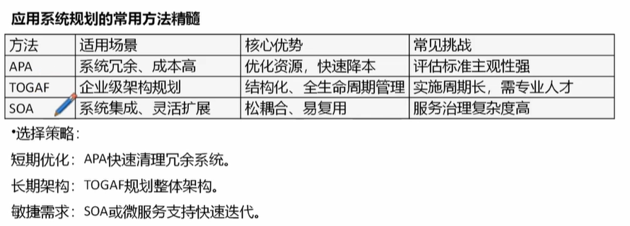
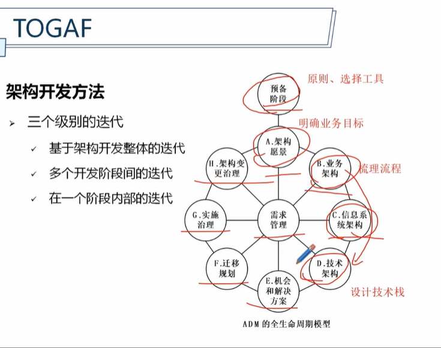

# 应用系统规划
## 5.1基础知识
###基本概念

1. **抽象**
   1. 业务抽象
   2. 过程抽象
   3. 数据抽象
   4. 技术抽象
2. **体系架构**
   1. 架构特性 组件划分和交互规则，动态模型（灵活变化），高内聚、低耦合
3. **模式** 是一种最佳实践的表达方式
   1. 创建型模式
   2. 结构型模式
   3. 行为型模式
4. **关注点分离** 复杂问题分解化
5. 模块化
6. 信息隐蔽 封装
7. 功能独立 
8. 求精 自顶向下设计
9. 重构
   
### 基础架构
分层体系架构
1. 界面交互层  注重用户体验
2. 业务处理层  规则引擎驻地
3. 数据处理层  SQL优化 优化效率
4. 数据存储层

以数据为中心的架构
1. 以数据处理、统计、汇总为业务特征的应用系统
2. 先规划设计好数据环境 再按照系统对数据的业务应用划分各个子系统

客户机/服务器架构
1. 2层C/S架构（早期） 客户机既负责页面又负责业务，服务端是数据库
2. 3层C/S架构  客户端/应用服务器/数据库服务器
3. B/S架构

组件分布架构
1. CORBA 跨平台首选
2. DCOM windows体系
3. EJB java企业方案

核心口诀： 四层筋骨撑大厦，C/S进化三重跨，组件分布中间架，选型先看生态码

## * 5.2主要内容
### 生命周期选择 
瀑布模型
1. 阶段间具有顺序性和依赖性
2. 推迟实现的观点
3. 质量保证的观点  强调文档驱动
4. 适合需求稳定明确的项目，减少控制变更

V模型
1. 强调测试的早期介入和双向验证

迭代模型  需求不明确，演化、增量，快速交付最小可用产品

敏捷方法 更快迭代，小步快跑，频繁交付，客户全程参与，拥抱变化，自组织团队
核心价值
1. 个体和互动高于流程和工具
2. 工作的软件高于详尽的文档
3. 客户合作高于合同谈判
4. 响应变化高于遵循计划

生命周期模型选择
1. 需求明确性
2. 项目规模
3. 风险容忍度

核心口诀：瀑布顺序稳，V测双验证，迭代分步走，敏捷拥抱变

### 体系结构定义
结构化设计方法 自顶向下分解 强调流程化和文档化

面向数据流的定义方法 要点
1. 适合概要设计阶段
2. 把数据流图映射为系统结构图
3. 数据流类型
   1. 变换型数据流 输入、处理、输出
   2. 事务型数据流 数据出发不同的处理分支

面向数据结构的定义方法
1. 根据数据结构定义程序结构
2. 详细设计阶段
3. Jackson方法  顺序、选择、循环结构，兼顾输入与输出
4. Warnier方法 仅考虑输入输出

核心口诀：结构分两派，数据流主导概要，数据结构管详细；层次图看整体，结构图显调用

使用场景：
1. 面向数据流 适合需求明确 流程清晰的中大型系统
2. 面向数据结构方法 适合数据处理逻辑复杂 数据结构主导的系统，如报表生成工具、数据库系统

### 接口定义
接口分类 
1. 用户接口 界面、命令
2. 外部接口
3. 内部接口

用户接口 

设计原则
1. 置于用户控制之下
2. 减少记忆负担，简洁
3. 保持界面一致

要考虑的问题
1. 系统响应时间
2. 用户求助机制
3. 出错信息
4. 命令方式

核心口诀：接口分三类，用户内外别；界面三原则，控制减负一致性，设计四问题，响应帮助错误命令
 

### 数据定义

数据库的定义过程步骤
1. 需求分析
2. 定义概念模型 ER图
3. 定义逻辑模型 建表、字段
4. 定义物理数据库 优化索引、分区等                                                                        
5. 验证

### 构件定义

## 5.3主要过程
### 初步调研

目标
1. 识别问题
2. 界定范围
3. 评估可行性基础

内容
1. 组织概况
2. 组织环境
3. 现行系统概况
4. 各方面对新系统的态度
5. 系统研制工作的资源情况

### 可行性研究

可行性研究的内容
1. 经济可行性
2. 技术可行性
3. 社会可行性 法律法规、用户能否接受等
4. 管理可行性

经济可行性
1. 投资、效益分析或成本、效益分析
2. 分析该系统是否值得建设
3. 总成本
   1. 建设成本
   2. 运行成本
4. 总效益
   1. 直接经济效益
   2. 间接社会效益

技术可行性
1. 成熟技术优先
2. 团队能力匹配
3. 技术风险可控

社会可行性
1. 法律、法规
2. 用户适应性
3. 文化冲突

管理可行性
1. 高层决心
2. 部门协作
3. 制度配套

可行性研究报告的主要内容
1. 建设任务的提出
2. 系统的目标
3. 初步调研概况
4. 初步实施方案与比较
5. 可行性研究
6. 结论

### 详细调研

目标
1. 全面摸清现状
2. 精准定位问题
3. 收集基础数据

内容
1. 收集信息
2. 系统需求建模
3. 需求优先级划分
4. 构建系统原型 检验可行性
5. 产生和评估候选方案
6. 和管理部门一起复查建议

调研方法
1. 资料收集
2. 调研表
3. 座谈会
4. 深度访谈
5. 实践参与

### 系统分析

任务 明确功能边界和逻辑模型

过程
1. 问题分析 需求调研和痛点定位
   1. 原型法
   2. JAD会议 联合需求讨论
   3. 观摩法
2. 需求分析 需求分类和建模
   1. 分类
      1. 功能性需求
      2. 非功能性需求（性能、安全、可靠性）
   2. 需求分析方法
      1. 面向过程的结构型方法
      2. 面向数据的信息工程方法
      3. 基于UML的用例驱动方法
      4. 基于敏捷过程的用户故事
3. 需求定义 系统说明书、需求跟踪矩阵（双向跟踪）

系统说明书 特征
1. 正确性
2. 完整性
3. 一致性
4. 无二义性
5. 可修改性
6. 可跟踪性
### 系统设计

内容
1. 总体设计（概要设计） 系统框架，架构图、部署图
2. 详细设计 包括
   1. 代码（编码规则） 
   2. 数据库 ER图转表结构 
   3. 界面 
   4. 安全 等

评价与衡量系统设计目标实现程度的主要指标
1. 可靠性
2. 可变更性（可修改性）  通过模块化设计来实现
3. 效率
4. 通用性
5. 工作质量

设计原则
1. 系统性原则
2. 灵活性
3. 可靠性
4. 经济性
5. 管理可接受原则

## 5.4常用方法

### 应用系统组合法 APA
用于评估和管理组织应用系统的方法

列清单、评价值、分类优、去实施

步骤
1. 应用系统清单  所有系统，记录功能 技术平台 频率
2. 评估应用系统
   1. 业务价值
   2. 技术健康
   3. 风险
3. 分析应用系统组合
4. 指定优化策略

### TOGAF

### 面向服务的架构 SOA

关键点
1. 服务松耦合
2. 接口标准化
3. 粗粒度

## 5.5软件工厂

### 传统开发对比

敏捷流水线，安全协同建

1. 敏捷交付
2. 流水线作业
3. 安全可靠
4. 协同开发

### 建设方法

流程、团队建设

### 资源部署

合理分配 最大化效率

### 业务管理

标准化流程，提升质量和交付效率

### 体系保障
质量管理 、流程规范、持续改进、完善文档

