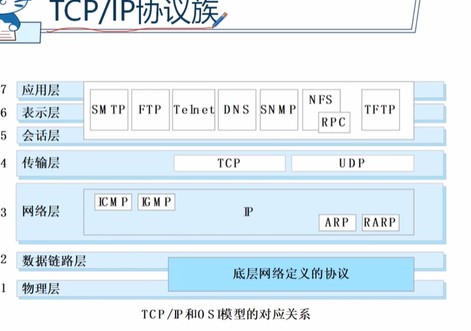
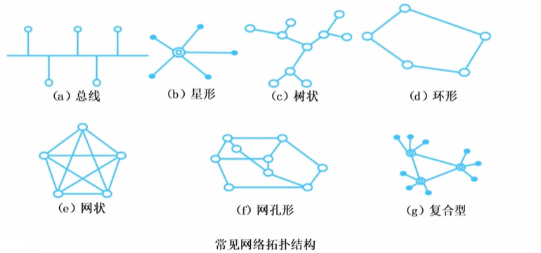
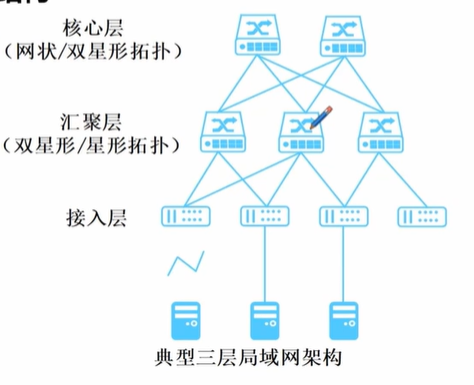

# 网络环境规划
## 网络架构和主要技术

一般体系框架模型
1. 网络传输平台
   1. 负责数据传输
   2. 关注点是高效、高质量、准确、安全地传输数据
   3. 包括传输、路由、交换、有线和无线接入等
2. 网络和应用服务平台
   1. 负责网络管理服务和业务应用层管理、业务逻辑和信息数据处理
   2. 包括DNS 地址分配系统
3. 安全服务平台
   1. 防火墙、入侵检测、漏洞扫描等
4. 网络管理和维护平台
5. 环境系统
   1. 机房建设、监控、综合布线等

OSI七层模型 理论模型
物数网传会表应

TCP/IP协议族
应用层三合一，传输保驾两兄弟（UDP、TCP） ，网络规划走全国（IP协议等），链路物理是基础

IPv4 2^32个ip
1. A类地址 大型网络
2. B类地址 中型网络
3. C类地址 小型网络

私有地址 了解
1. 10.0.0.0-10.255.255.255
2. 172.16.0.0-172.31.255.255
3. 192.168.0.0-192.168.255.255

IPv4路由类型
1. 直连路由 路由器直接连接
2. 静态路由 固定路由
3. 动态路由 

IPv6 2^128个ip

### 传输平台一般架构和主要技术

网络传输媒介
1. 有线媒介 光纤、双绞线等
2. 无线媒介 长波、短波等 

网络传输技术
1. 基于光纤同步数字序列（SDH）等
2. 基于同轴电缆的混合光纤同轴电缆（HFC）
3. 基于无线媒介的WIFI、5G移动通信

常见网络拓扑结构
1. 总线网络拓扑 适合小型网络
2. 星形/双星 中心节点压力大
3. 树状 上级节点出问题会影响下级
4. 环形 扩容节点需要停网
5. 网状 稳定但建设成本高
6. 复合型/层级

## 广域网规划

### 一般架构

运营商一般架构
1. 全国骨干网 跨省、国际
2. 省级骨干网 省内、城市间
3. 城域网 城市内
4. 接入网

典型的城域网、大型企业
1. 核心层 
2. 汇聚层
3. 接入层

### 主要技术
集中在TCP/IP领域 以及基于TCP/IP的多协议标记交换（MPLS）技术、虚拟专用网络（VPN）技术

### 主要内容

1. 建设背景
2. 需求分析
3. 项目预算
4. 技术方向
5. 网络拓扑结构设计
6. IP地址等逻辑资源规划（IPv4资源有限）

## 局域网规划
### 一般架构
构成
1. 计算机设备 服务器等
2. 网络连接设备 网卡等
3. 网络传输介质 网线、光纤等

三层结构
1. 核心层
2. 汇聚层
3. 接入层

### 主要技术

虚拟局域网（VLAN）
划分方法
1. 按照端口划分（固定终端环境）
2. 按照MAC地址划分  移动设备较多情况
3. 基于网络层协议划分
4. IP组播划分
5. 按策略划分 组合方式，灵活

### 重点关注内容

1. **VLAN 划分**
2. **VLAN编号**  1-4096个网络，大型网络需要规划使用
3. VLAN 路由设计
4. STP（生成树协议）设计  防止广播风暴
5. DHCP（动态主机配置协议）设计 小型、大型网络有区别

## 无线网规划

### 移动通信技术
5G的三大类应用场景
1. 增强移动宽带
2. 超高可靠低时延通信 主要面向工业控制、自动驾驶等对时延和可靠性极高要求的需求
3. 海量机器类通信 智慧城市、智能家居等传感、采集的需求

5G系统网络架构为总线式微服务架构

### NB-LoT 物联网

短距离无线传输技术  Wi-Fi 蓝牙

广域无线传输技术 NB-LoT 远距离传输

### 无线局域网

瘦AP + AC 适合大型无线网络，集中式管理

胖AP适合小型无线网络，分布式管理

重点内容
1. 无线频率规划
2. 传输覆盖范围规划
3. 传输容量规划
4. 基站站址规划
5. 组网规划

## 网络整体规划的重点事项

网络管理5大功能
1. 故障管理
2. 配置管理
3. 性能管理
4. 计费管理
5. 安全管理

网络管理系统功能体系
1. 网元/网络层 
2. 管理应用层 
3. 表示层 界面

### 网络安全设计和安全管理
网络安全的设备和手段
1. 防火墙是基本的防护设备
2. 利用VLAN等技术进行安全域划分（分区）
3. 网络入侵检测和防护
4. 网络安全审计

### 机房建设内容
1. 机房装修  防静电地板、金属屏蔽墙、钢架吊顶等
2. 空调系统  精密空调
3. 电气系统  配电、备用电、发电
4. 接地和防雷系统
5. 消防系统
6. 环境监控系统 烟雾报警等
7. 节能降耗系统

### 节能降耗

1. 机房选址 自然降温
2. 机房内部规划布局、机柜布局
3. 各种设备本身
4. 基于人工智能 例如动态调整能源

