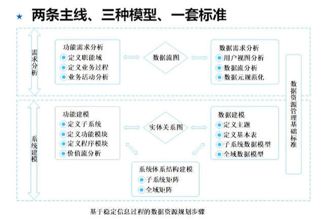
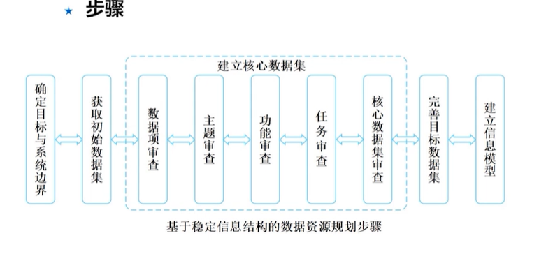
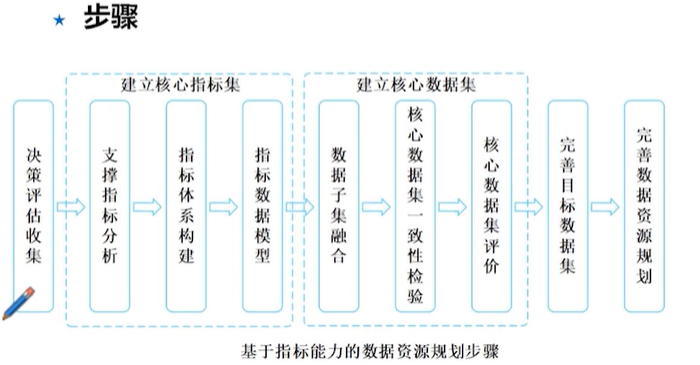
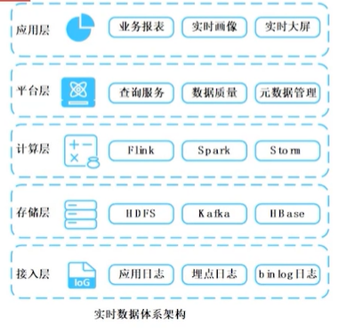
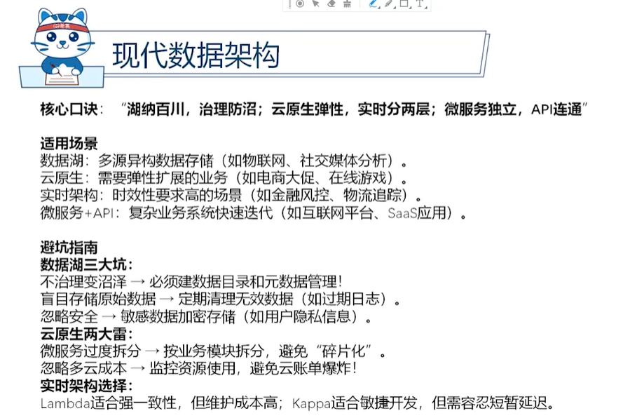

# 8.数据资源规划

## 概述

数据资源的定义
1. 具有或预期具有价值的数据，多以电子形式存在
2. 能够参与社会生产经营活动
3. 将无序、混乱的原始数据开发为有序、有使用价值的数据资源
   1. 数据采集、聚合、加工处理
   2. 结构化数据、非结构化

数据资源的特征
1. 无形性和可复制性
2. 非竞争性和弱排他性
3. 时效性
4. 依附性
5. 垄断性

数据资源的发展阶段
1. 数据资源化 将无序、混乱的原始数据开发为有序、有使用价值的资源过程
2. 数据资产化 形成可供组织应用或交易的数据产品
3. 数据资本化 上市

数据资源规划的作用
1. 提质增效
2. 缓解数据孤岛问题
3. 标准化与共享
4. 市场化发展

## 数据资源规划的方法
### 基于稳定信息过程的方法
适用于业务固定场景，前期数据积累较少的情况

优点：理论成熟 易理解 实现难度不大

缺点：步骤繁杂 涉及因素多 数据稳定性较差 

两条主线
1. 业务流程
2. 数据流程

三种模型
1. 业务逻辑模型
2. 数据模型
3. 关联模型

一套标准
1. 建立数据标准 确保一致性

步骤 勘界组、模标库、分布验
1. 可行性分析 包括资源、操作、技术可行性
2. 确定目标和范围
3. 准备
4. 业务活动研究
5. 建立业务逻辑模型
6. 导出并建立数据模型
7. 建立管理标准
8. 设计主题数据库
9. 数据的分布分析
10. 制定方案
11. 审核、评价方案

### 基于稳定信息结构的方法
适用于业务多变，前期数据积累较多的情况

优点 理论较成熟 实施周期较短 数据稳定性好

缺点 是全局设计后置 初期工作量大 并行工作组织难度大

1. 确定目标与系统边界
2. 获取初始数据集 宁多勿少
3. 建立核心数据集
   1. 数据项审查
   2. 主题审查
   3. 功能审查
   4. 任务审查
   5. 核心数据集审查 与目标及功能的对比，数据项覆盖率、主题冗余率
4. 完善目标数据集
5. 建立信息模型

### 基于指标能力的方法

适用于决策驱动场景，前期数据积累较少的情况

优点：直接支撑决策需求、设计思路清晰、数据稳定性好

缺点：实现案例少 实施难度大 对设计人员要求高

## 数据架构
### 数据架构定义与目标

数据架构
1. 有效的管理数据
2. 有效的管理存储和使用数据的系统

主要职责
1. 技术赋能业务
2. 需求翻译官
3. 复杂数据治理
4. 业务IT对齐
5. 为企业改革、转型提供支撑

### 数据模型

概念模型 业务流程概念或实体，构建1对N的关系

逻辑模型 人类语言的实体、属性设计

物理模型 机器语言存储、索引、数据处理

构建方法
1. 自上而下
2. 自下而上
3. 两种结合

### 数据流设计
常见的方式
1. 二维矩阵
2. 数据流图

### 数据架构演化的驱动因素
影响架构的因素
1. 技术发展与进步
2. 业务量快速增长
3. 业务需求变化
4. 法律法规

### 传统数据架构

集中式数据架构 一个中心，统一管理 适合小型企业、低并发

分布式数据架构

### 现代数据架构

数据湖  原始数据仓库+灵活治理

云原生  高可扩展性
1. 容器编排工具
2. 微服务框架
3. 无服务器计算
4. 多云数据管道
5. 实时分析和流处理
6. 大数据存储和处理

实时数据架构

Lambda架构 实时、离线两条线
Kappa架构 全流处理，适合快速迭代

数据应用架构 特点 独立部署、快速迭代、统一API

## 数据标准化
### 建立数据标准体系
1. 指导标准 总纲、顶层设计
2. 通用标准 跨部门公约
   1. 数据类标准  元数据、分类编码、数据内容
   2. 服务类标准  API接口规范
   3. 管理与建设类标准 上线流程、安全规范等
3. 专用标准 例如金融行业标准

### 元数据标准化
描述数据的数据

元数据的结构
1. 内容结构 核心元素、管理元素、扩展元素
2. 句法结构 格式规范
3. 语义结构 统一语义

元数据的作用
1. 描述
2. 定位
3. 寻找或发掘
4. 评价
5. 选择

### 数据元标准化
数据元：数据的最小单位

组成  商品-价格- 0-100之间
1. 对象类
2. 特性
3. 表示

命名规则
1. 语义规则
2. 句法规则  顺序
3. 唯一性规则 同一环境下禁止同名不同意

数据元的表示格式和值域
1. 数据类型  数值 字符串 日期等
2. 数据表示  格式
3. 值域

### 数据分类与编码标准化

分类的基本原则
1. 稳定性 抓本质属性
2. 系统性 层次清晰
3. 可扩充性 留白设计
4. 综合实用性 贴合业务
5. 兼容性 遵循标准

数据编码的基本原则
1. 唯一性  一物一码
2. 匹配性  结构对应分类
3. 可扩充性 预留备用码段
4. 简洁性 避免冗余

## 数据管理
### 数据治理
定义
1. 在管理数据资产的过程中行使权力和管控
2. 包括计划、监控和实施

数据治理活动
1. 规划组织的数据治理  对齐业务、范围定义
2. 指定数据治理战略
   1. 章程  数据治理白皮书
   2. 运营框架和职责
   3. 实施路线图
   4. 为成功运营指定计划 渐进式推进、解决数据孤岛、优化数据质量
3. 实施数据治理

嵌入数据治理 将数据治理嵌入到业务流程中，例如将数据标准纳入KPI、定期审计等

### 数据质量
一致完整有效、唯一合理可靠；预防根因治理、全生命周期保

数据质量维度
1. 一致性
2. 完整性
3. 合理性
4. 唯一性
5. 有效性

目标

原则
1. 全生命周期管理 
2. 预防优先  在数据录入的入口开始控制驳回低质量数据
3. 根因修正  找根本原因

数据质量活动  
1. 定义高质量数据
2. 定义数据质量战略
3. 识别关键数据和业务规则
4. 执行初始数据质量评估
5. 识别改进方向并确定优先级
6. 定义改进目标
7. 开发和部署数据质量操作

### 数据安全

原则
1. 协同合作
2. 企业统筹
3. 主动管理

数据安全活动  识需、定规、评险、控权、审效
1. 识别安全需求
2. 指定安全制度
3. 定义安全细则
4. 评估安全风险
5. 实施控制和规程

