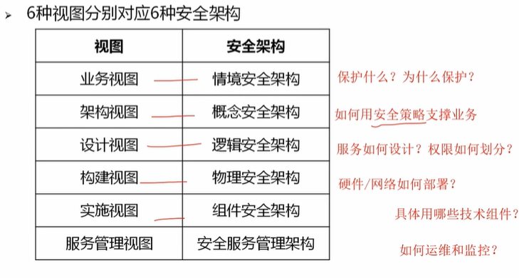
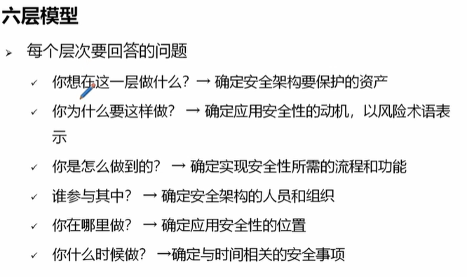
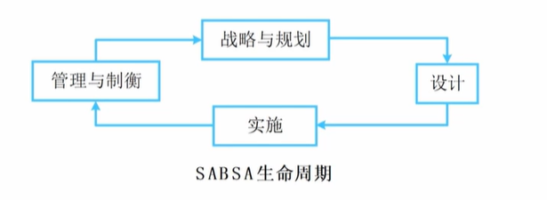
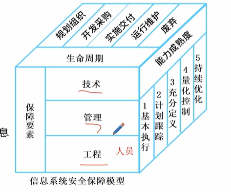
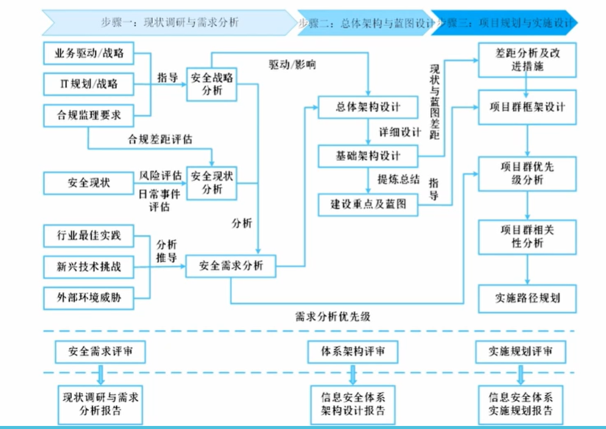

#9 数据安全规划

## 概述

信息安全基本属性
1. 保密性
2. 完整性
3. 可用性
4. 可控性 
5. 不可否认性 行为追踪、数字证书等

信息安全面临的威胁 外部攻击、内部泄露、物理风险、技术漏洞
1. 物理环境安全威胁
2. 通信链路
3. 网络系统
4. 操作系统
5. 应用系统
6. 管理系统

信息规划的原则
1. 系统性 多层防护
2. 适用性 与业务融合
3. 时效性 有计划的进行
4. 确定性 SMART原则
5. 可行性 渐进式落地
6. 易用性
7. 合规性

注意事项
1. 追求有效益的安全 成本与效益的平衡
2. 信息安全战略的校准 组织整体战略、IT战略、信息安全战略的保持一致
3. 基于业务的风险理解
4. 识别出合规性要求

## 信息安全架构 *

架构的内容
1. 系统安全架构  从源头设计安全
2. 安全技术体系架构 构建统一的安全基础设施 包括防火墙、IDS、IPS
3. 审计架构 独立监督、储蓄改进  日志审计、合规检查

商业应用安全架构 SABSA

SABSA 生命周期

信息系统安全保障模型

安全能力成熟度等级
1. 基本执行级  个人经验，缺乏规范流程
2. 计划跟踪级 主动计划措施
3. 充分定义级 标准化流程
4. 量化控制级  数据驱动
5. 持续优化级

## 信息安全规划的主要内容 *

关注利益相关方的安全诉求
1. 不同利益方之间可能有相互竞争的关系
2. 认真考虑利益相关方的诉求，甚至要考虑隐性、口是心非的诉求

合理的组织框架
1. 最高管理层 指定战略，审批预算
2. 协调机构  跨部门工作、政策落地
3. 内部组织
4. 外部联系 

等保等级

公民、法人
1. 自主保护级
2. 指导保护级

国家安全
3. 监督保护级
4. 强制保护级
5. 专控保护级

等保的实施方法
1. 安全定级
2. 基本安全要求分析
3. 系统特定安全要求分析
4. 风险评估
5. 改进和选择安全措施
6. 实施安全保护

信息安全主要技术
1. 身份认证
2. 访问控制
   1. 自主访问控制 个人用户共享文件等
   2. 基于角色的访问控制
   3. 基于规则的访问控制 ip白名单、时间策略等
   4. 强制访问控制 涉密、军事单位等
3. 入侵检测
   1. 实时入侵检测 IDS（入侵检测、被动防御） IPS（入侵防护系统、主动防护）
   2. 事后入侵检测 日志分析、取证工具 
4. 防火墙
5. 网闸 数据摆渡、物理隔离，单向数据传输
6. 防病毒
   1. 预防
   2. 检测清除
   3. 恢复机制
7. 数据加密技术

运营体系规划

常用的安全控制方法
1. 因需可知和最小特权
2. 职责分离和责任
3. 其他
   1. 双人控制
   2. 岗位轮换
   3. 强制休假
   4. 特权账户管理
4. 安全培训与意识提升
5. 应急响应
6. 事后总结与改进

## 信息安全规划案例

规划步骤
1. 现状调研与需求分析  风险评估、合规差距分析、业务需求匹配
2. 信息安全总体架构与蓝图设计  分层防御、技术融合
3. 规划与实施设计  分阶段推进、资源分配

